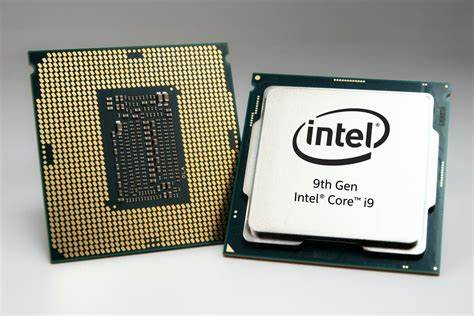
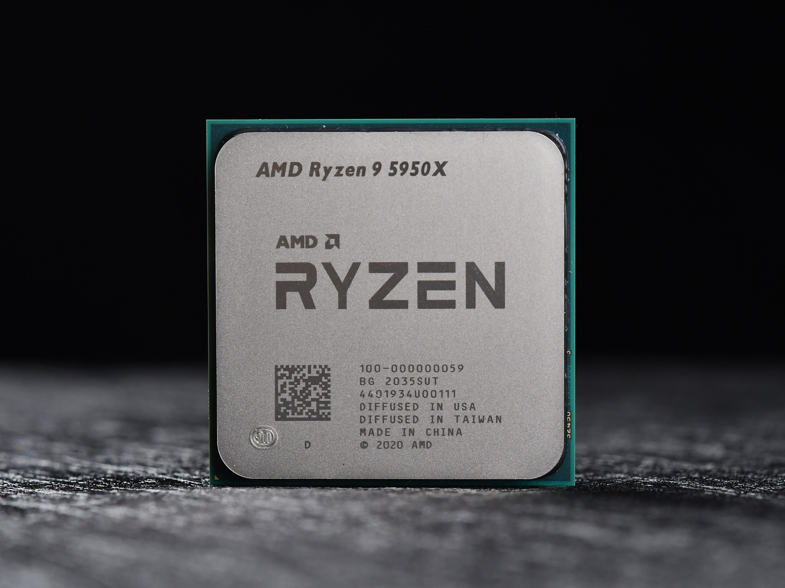
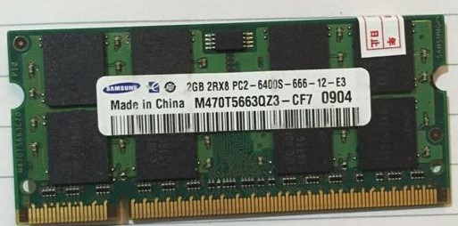
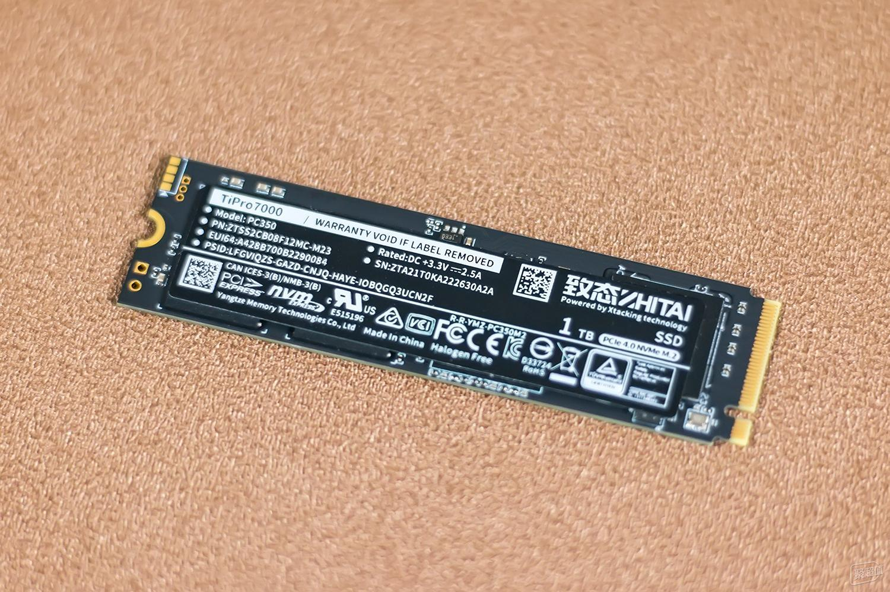
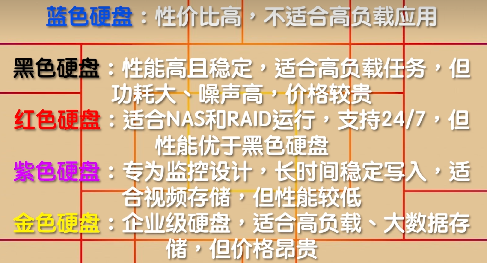
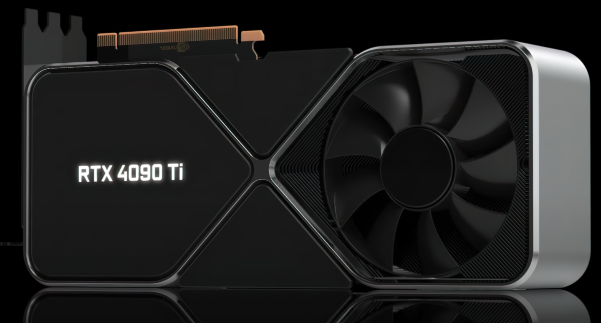
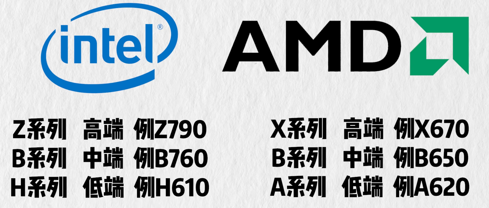
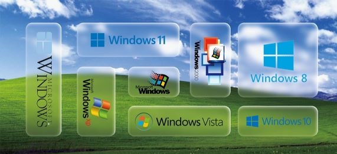
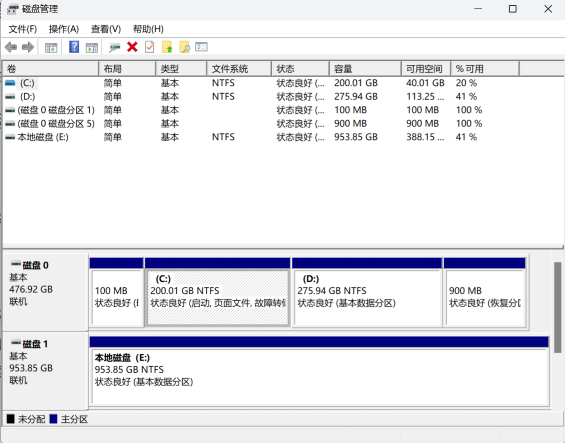

## PC硬件简介

### 前言：

介绍计算机基本组成部分

推荐视频：[计算机硬件基础_哔哩哔哩_bilibili](https://www.bilibili.com/video/BV1TL4y1N7ZM/?spm_id_from=333.999.0.0&vd_source=6bb92a819dfdcd7bd3bc4e88195b918d)

### CPU

计算机进行数据运算的核心，主流的PC芯片由英特尔和超威两家公司提供。

Intel（英特尔）:
	目前个人计算机主要使用酷睿（core）系列之前还有奔腾和赛扬（已淘汰）



酷睿每一代CPU分为四个等级：

-  i3只适合轻度办公

-  i5有一点性能可以玩小型游戏
-  i7性能比较卓越可以游戏或者设计
-  i9最顶

后面的数字前两位一般代表代号（近几年就是13，14），然后三位是SKU值，数越大性能越好，最后就是后缀。

- Y表示续航款性能比较拉跨
- U表示有点续航，可以用来办公
- G表示核显比较强的
- H表示焊接上去不可拆卸载
- K有超频表示可以放个大招提升性能
- F没有核显，一般自己配电脑有独显可以考虑这种有性价比
- E表示嵌入式cpu

AMD（超威）
一般就是锐龙系列（还有其他一堆龙不过都和英特尔的奔腾一样不太行了），和英特尔类似第一个数字代表的含义与i3,i5一样数字越大越好，后面的7000/5000的数字表示第几代。



后缀：

- U：低电压，性能弱些但功耗低，通常出现在轻薄本中，举例型号：R7-5700U；
- H：标压，性能强，通常出现在游戏本中，举例型号：R5-5600H；
- HX：一般使用在AMD高端发烧级CPU上，至尊版，举例型号：R9-5980HX；
- HS：相当于H功耗略低，通常出现在轻薄全能本，性能较强，举例型号：R7 5800HS、R5 5600HS

ps.amd在7000系列开始使用zen4架构，这是AMD崛起的开端。

我们常常听说CPU是多少核多少线程的？为什么要这样描述CPU呢？其实线程表示CPU能够同时并行处理的任务数，内核就相当于人脑的脑仁，一个CPU内核包括了执行基本运算和逻辑操作所需的硬件组件，一般一个内核对应一个线程，但是现在也有一核多线程的技术，使逻辑内核比物理内核数翻倍，处理多任务能力提升。这样你就知道核心越多的CPU能够同时处理的任务数量就越多，因而性能就越强。

在购买CPU的时候会发现有些CPU打着散片的标签，往往会比盒装的CPU便宜几十块钱，这些所谓的散片其实就是从第三方渠道流出的CPU，这些CPU质量上并没有问题，只是来路并不明确而没有保修，如果预算实在有限可以选择（CPU用坏的概率很小）。

### 内存

RAM：

随机存取存储器，我们通常称为运行内存，用于存放正在运行应用的数据 。特点是数据断电丢失但是数据的写入和读取速度快（相较于磁盘和固态）因此被选作CPU直接交互的存储空间，通俗来讲内存越大可以同时打开的软件越多，如果内存满了就打不开新的任务了，一般有笔记本有16G,32G。

DDR:

DDR的全称为Double Data Rate SDRAM（双倍速率的SDRAM）是RAM的一种顾名思义，常说的内存颗粒就是DDR。（买内存条时商家所说的DDR3，DDR4就是不同代的DDR，自然的代数越高性能越强，买的时候还要看看主板支不支持相应代数的DDR。）



单通道&双通道

通俗来讲就是插几根内存条，比如说主板上有两个内存插槽，插两根8GB的内存条肯定比插一条16GB的内存条速率要快。

- 单通道：只能进行单向传输数据，要么就输出，要么输入。
- 双通道：可以同时输出和输入，带宽增加一倍，提升临时数据的传输速度、对吃内存的程序提升显著，两只手打拳肯定快。
- 四通道：双通道的双倍快乐下再翻倍

带宽描述的是数据传输的速率，理论上通道数越多，带宽提升越大，计算公式如下：

```
内存速度（带宽）=内存等效频率*内存位宽/8
```

### 硬盘

计算机的数据存储器，用于永久存储大量数据，掉电不丢失。一般分为机械硬盘和固态硬盘。

- 机械硬盘仅有的优点就是便宜，数据安全性高。
- 固态硬盘除了贵点没啥缺点。

固态是由存储颗粒组成的，一般有以下两种颗粒：

- TLC : 每个存储单元可以存储3位数据。TLC固态硬盘在速度和耐用性方面表现不错，而且成本适中，使其成为用户的理想选择。
- QLC : 每个存储单元可以存储4位数据。这种技术可以提供更高的存储密度，意味着更低的成本和更大的存储容量。然而，这也导致写入速度较慢和寿命较短。

相较之下相同存储空间下QLC便宜，TLC性能好。




笔记本上已经基本上没有磁盘了，虽然磁盘读写速度不如固态，但是"贵在便宜"，量大管饱，在服务器，监控等对存储空间需求大的地方仍有应用，以下是不同类型的硬:




### 电源

笔记本都有自己的电源适配器，台式机根据自己的cpu和显卡的配置在网上查找推荐瓦数。通俗来说，电源就像一个马车夫瓦数越高拉的货越多。（如果要是自己组装电脑功耗需要提前考虑，你也不想在宿舍电脑一开机就跳闸吧）

### 显卡

显卡是做图像数据的处理的，没有显卡你电脑显示器就无法显示画面，一般的CPU内部都有集成显卡，但是通常需要配备独立显卡来满足更高的性能要求，现在个人计算机主流的显卡大多都是英伟达的，英伟达的显卡大体有三个系列：

- GeForce主要应用于游戏娱乐领域
- Quadro主要用于专业可视化设计和创作，
- Tesla更偏重于深度学习、人工智能和高性能计算

GeForce系列主要有GTX（最高端）和GT（次高端）类型，在20系列时英伟达推出了RTX，具有实时光线追踪功能。拿常见的`3050ti`，`4060`显卡举例：30 40 是代号后面的50 60是一代中的不同型号，数越大性能越强，后缀还有ti,super表示加强版。



### 主板

主板的选择主要依据所选择的CPU的类型，因为不同的CPU使用不同的芯片组所以就要求使用不同的主板。一般来说PC的CPU无非就是Intel和AMD两家生产的，所以主板也都按照两家的芯片组生产，目前的（2024年）主流主板型号，如下图：



型号中间数字为`1，6，9`为Intel家的主板，`2，5，7`为AMD家的主板，可以根据所选用的CPU去搜寻相对应的主板型号，高端的主板能够提供超频等玩法。御三家厂商为华硕，微星和技嘉。

我们还需要知道上述重要部件如何接入主板，因此对主板上的接口应该有一定了解：[带你了解主板各接口及功能介绍](https://www.bilibili.com/video/BV1bS4y1X77q/?vd_source=6bb92a819dfdcd7bd3bc4e88195b918d)

接口：

- SATA接口，用来接机械硬盘的接口
- PCI-E接口，扩展性极强，可以插显卡的PCI-E X16的那个物理接口，或	者插网卡，声卡的那个PCI-E X1那个物理接口，都是属于一类的物理接口，这类接口只跑PCI-E通道。
- M.2接口，主流用于接入SSD的物理接口的名称，M.2物理接口上，可以	跑PCI-E或者SATA通道，具体区别于主板或硬盘支持情况。

通道：

- PCI-E通道：速率丰富，适合各种不同速率要求的硬件，上至显卡，下至声卡。
- SATA通道：以前用于接硬盘，光驱。
- SAS通道：企业级别硬盘用的通道。
- FC通道：光纤通道。

协议：

- IDE协议：机械硬盘时代，用于数据操作，传输的协议
- AHCI协议：仍然是机械硬盘时代的主流数据传输协议，例如使用SATA通道。优化后的效率相比IDE提升10-30%。
- NVMe协议: 由于机械硬盘和固态硬盘的工作模式发生巨大变化，需要一种全新的针对固态的传输层协议，NVMe因运而生，设计是跑在PCI-E通道上的。


### 机箱

看个人喜好吧，注重散热就行。

belike：


## Windows操作简介

### 前言

计算机的正常运作除了依托于硬件更离不开操作系统的调度，相信大多数人第一次接触的计算机操作系统都是Windows，Windows操作系统。它就像一扇计算机上的窗户，让我们能够看到计算机的方方面面。

推荐视频：[Windows11教学：计算机基础实战](https://www.bilibili.com/video/BV1vR4y1Q7iF/?spm_id_from=333.999.0.0)

### **历史常识**

现在使用的Windows系统是以图形用户界面为基础研发的操作系统，而图形用户界面（GUI）最早由施乐（一家研发打印机的公司提出），后来被apple拿去优化做出了当时很惊艳的图形界面，再后来微软也根据这个做出了Windows系统。

比较经典的windows系统：

- Windows XP 	2001
- Windows 7   	 2009
- Windows 10 	 2015
- Windows 11	  2021



### **环境变量**

环境变量顾名思义就是个变量，用于存放特定程序的地址。每一个程序在计算机中存放的位置都有一个绝对路径，但是每台电脑的特定程序绝对路径可能都不一样，操作系统调用程序的时候就很麻烦。所以给一个“变量”去“赋值”，让这个变量去代表这个程序的绝对路径，这样一来就方便程序通过环境变量调用程序。这也就是为什么有的时候移动了程序的位置后程序就无法运行了，这就是因为程序的绝对路径已经发生改变，但是“变量”的值还没变所以程序在使用“变量”调用程序时就会找不到文件的位置，进而使程序无法正常运行。

在Windows系统中，有两种环境变量：**用户变量**和**系统变量**。(环境变量没有区分大小写，例如path跟PATH是一样的。)

两者的区别：

- 系统变量对所有用户有效，用户变量只对当前用户有效。
- 用户环境变量存储用户特定的配置信息，系统环境变量存储全局配置信息。
- 用户环境变量只对当前用户有效，需要重新登录才能生效（重新加载环境即可生效）；系统环境变量对所有用户有效，修改会立即生效。
- **用户变量的优先级比系统变量高**，也就是说如果用户变量和系统变量同名时，用户变量会覆盖上系统变量。
- 系统变量和用户变量都有path变量，但是它的值是用户变量中的值与系统变量中的值的叠加。 

举例：

 %TEMP%这个环境变量表示的就是电脑存放临时文件的绝对路径，不管你的临时文件是存放在C盘还是D盘只要在文件资源管理器路径栏里输入%TEMP%，它就会跳转到你存放临时文件的位置。

**绝对路径和相对路径：**

- ​	绝对路径：从根目录为起点到某一个目录的路径。

- ​	相对路径：一个目录为起点到另外一个的目录的路径。


例如：

​            		 ┍ A文件夹

​          C -|

​            	 	┕ B文件夹

- 绝对路径： C:\A文件夹

- 相对路径（如果你在A文件夹时）： ..\B文件夹  （‘..\’向上一级意思）


### **注册表**

INI文件:

在说注册表之前先来讲一讲什么是INI文件，INI文件是`Initialization file`的缩写，即为初始化文件，是Windows系统配置文件所采用的存储格式，统管Windows的各项配置。就是说你一个程序的需要的一些初始化参数都存放在这个文件里，程序在运行时会自动调用文件里的参数来完成初始化。

为什么要用INI文件？如果我们的程序没有任何配置文件时，这样的程序对外是全封闭的，一旦程序需要修改一些参数必须要修改程序代码本身并重新编译，这样很不好，所以要用INI文件，让程序出厂后还能根据需要进行必要的配置。

但是这样的话每一个程序都会有一个对应的INI文件，程序一多就不方便管理，所以注册表就应运而生，用于存放各个程序的初始化参数。**因此注册表就是一个层次化的数据库，用于存储系统和应用程序的设置信息。**

注册表的结构：

注册表中，所有的数据都是通过一种树状结构以键和子键的方式组织起来的。每个键包含一组特定的信息，每个键的键名都是和它所包含的信息相关联的。

键值由三部分组成： 名称、类型、数据。

键值类型由常用的6种组成：

- 字符串值（REG_SZ）

- 二进制值（REG_BINARY）
- 32位值（4个字节）（REG_DWORD）
- 64位值（5个字节）（REG_QWORD）
- 多字符串值（REG_MULTI_SZ）
- 可扩充字符串值（REG_EXPAND_SZ）

注册表的根键共有5个，且全为大写。
1.HKEY_CLASSES_ROOT：

​	包含当前登录用户的配置信息。用户的文件夹、屏幕颜色和“控制面板”设置都存储在这里。

2.HKEY_USERS：

​	包含计算机上的所有以活动方式加载的用户配置文件。

3.HKEY_LOCAL_MACHINE：

​	包含特定于计算机的配置信息（用于任何用户）。此项有时缩写“HKLM”。

4.HKEY_CLASSES_ROOT：

​	HKEY_CLASSES_ROOT预定义项包含了启动应用程序所需的全部信息。

5.HKEY_CURRENT_CONFIG

​	包含有关本地计算机在系统启动时使用的硬件配置文件的信息。

打开注册表的方法：win+R 输入regedi。

还可以通过注册表实现程序开机自启动程序，感兴趣可自行查询配置方法。

### **运行库**

运行库就是程序在运行时所需要的库函数，可以理解为程序运行的工具，基本上所有程序运行都需要用到是由所有程序共用的，因此程序可以删除但是运行库不可以（你删了其它程序用个寂寞）。缺少了运行库有些程序就会打不开，所以需要到网上下载完善语和运行库。

常见运行库：

- Visual Basic Virtual Machine (5.1)
- Visual Basic Virtual Machine (6.0)

- Microsoft C Runtime Library 2002

- Microsoft C Runtime Library 2003

- Microsoft Visual C++2005 SP1

- Microsoft Visual C++2008 SP1

- Microsoft Visual C++2010 SP1

- Microsoft Visual C++2012 UP4

- Microsoft Visual C++2013

- Microsoft Visual C++2019

- Mcr0 soft Visual C+2015-2022

- Microsoft Universal C Runtime

- Microsoft Visual Studio 2010 Tools For Office Runtime


如果打开程序时提醒你“缺少xxx.dll文件”就是缺少对应的运行库上网自行下载即可。

运行库一般是DLL文件，  **DLL(Dynamic Link Library)文件为动态链接库文件，又称“应用程序拓展”，是软件文件类型。**

在Windows中，许多应用程序并不是一个完整的可执行文件，它们被分割成一些相对独立的动态链接库，即DLL文件，放置于系统中。当我们执行某一个程序时，相应的DLL文件就会被调用。一个应用程序可使用多个DLL文件，一个DLL文件也可能被不同的应用程序使用，这样的DLL文件被称为共享DLL文件。

运行库就是程序在运行时才会被动态加载的dll文件，而且不同程序可能会加载相同的dll文件，这样就使得文件更小。相对应的还有静态版（LIB）运行库，但是静态版必须在编译的时候需要把C和C++运行库复制到目标程序中（.exe），所以产生的可执行文件会比较大。

### **Windows服务**

`Microsoft Windows `服务（即以前的 NT 服务）就是一种可以在你的电脑上长时间运行的程序，和普通的应用程序不同的地方它像是一种系统的“基础服务”一样，可以在计算机启动时自动启动，可以暂停和重新启动而且不显示任何用户界面。同时它可以供同一台计算机上的不同用户使用。

首先Windows服务和普通应用一样是是一个应用程序，一个后台进程。但它又十分特殊，特殊在以下几点：  

　　1.它通常在系统启动时用户登录Windows之前由NET kernel中的SCM（Service Control manager）加载，并一般在系统启动时自动开启的。  

　　2.Windows服务独立于特定用户之上，也就是说它可以被一台计算机上任何用户所共用。   

如果一个应用需要长时间的后台运行，并且独立于某个特定用户控制台，我们可以考虑把它写成Windows服务。它通常没有界面（没有硬性限制，可以编写有界面的Windows服务），通常随机启动，随机关闭而关闭，但也可以随用户需要手动启动。

服务列表打开方法：win+R 输入services.msc

### **磁盘分区**

Windows的磁盘空间通过盘符进行划分，可以通过磁盘管理工具来划分磁盘空间，右键win图标打开“磁盘管理”右键磁盘可以点击压缩卷进行压缩，如果磁盘有空闲空间可以进行新建卷和扩展卷（扩展卷时空闲空间必须和目标扩展盘相邻）。
一般C盘是系统盘，需要预留足够的空间，否则可能会造成计算机卡顿，如果需要进行c盘扩容可以使用傲梅分区助手。




### **系统盘清理**

首先系统盘最好是留足够的空间，毕竟要是不够用了去扩容还要费不少事，其次软件能装在其他盘就尽量放在其他盘，实在不行再放在系统盘。

**1.c盘关闭睡眠**
这个功能对Windows系统比较鸡肋，即使休眠还是会有电量损耗，所以建议关闭
具体操作：
右键开始菜单；选择终端管理员；输入 powercfg -h off 回车即可关闭。
如果想要打开同一样的操作输入 powercfg -h on即可。 

**2.删除Windows.old文件夹**
Windows.old文件夹是Windows中保存上一个Windows安装的所有文件的临时文件夹。它是在重装系统或升级系统时，为了保留旧系统的文件而自动创建的。它的作用是方便用户退回旧系统或恢复旧系统的文件。
一般来说只有升级过系统才有，而且这个文件在系统盘内是隐藏文件，Windows也会在系统升级一个月后把它删除掉，Windows.old文件夹可以手动删除，也可以使用磁盘清理工具进行清除。

搜索disk打开磁盘清理即可清理。

**3.关闭备份**

解释一下什么是系统还原点，这个东西就像一个时光机，如果你在未来遭遇不测就可以回到当初你设置的时间点从新来过，它是通过在指定的时间收集当前重要的系统文件（像驱动程序，注册表，系统文件，已安装程序等）保存下来，如果系统文件损坏，就可以将计算机恢复到还原备份的结点。当然这么做会占用c盘内存，如果c盘空间不足可以删除系统还原点。

设置里搜索系统保护->创建还原点->配置里删除还原点，也可以创建还原点。

**4.关闭bit-locker**
据说这玩意没什么用。

**5.软件的调整和配置**

steam默认下载路径；

adobe暂存盘更改；

微信,QQ聊天记录更改；

**6.c盘分析工具**
  SpaceSniffer

### **重置系统和重做系统**

**（1）重置系统：**
		    电脑文件太乱了，你想恢复出厂设置就可以重置系统，前提是你的电脑还可以正常开机。在设置系统恢复里设置，重置系统时只会对系统盘重置，可以选择保留个人文件（就是用户文件夹里的东西），还可以选在云下载（从官网上下载最新的系统）或者本地下载（还是下载当前版本），后面的设置如果选择删除所有驱动器那么你的电脑就会被彻底净化（所有盘都被清空）。

**（2）重做系统：**
			电脑蓝屏了，开不了机。这时就需要用U盘重装系统，在U盘中烧录系统，开机时进入BIOS切换U盘启动。（BIOS 是计算机启动时加载的第一个软件，BIOS 的设置直接关系到电脑是否可以正常启动，并影响到之后的使用效率。Windows 操作系统，也是在 BIOS 的引导下进行工作的） 


### **装系统**

可以从微软官方网站获取windows系统的下载文件，不过需要密钥激活，安装时可以先跳过。
也可以从下面这个网站上获取你需要的操作系统：	[MSDN, 我告诉你 - 做一个安静的工具站](https://msdn.itellyou.cn/)

准备一个8G左右的空U盘（装系统时会格式化硬盘）然后把系统的镜像文件下载进去，在电脑启动时进入BIOS选择U盘启动（不同主板的进入BIOS选项的按键不同详情网上查阅），然后根据引导进行安装。

