### 8051概述

#### 8051单片机定义

8051单片机是一类兼容Intel 8051的指令集和基本结构的八位单片机家族总称。

按照生产厂商分类：

- Intel（英特尔）： 最初的8051，但现在已不是主流。
- Atmel（爱特梅尔，现被Microchip收购）： 最经典、应用最广的**AT89C51/AT89S51**系列。
- NXP（恩智浦）： 收购了Philips（飞利浦）的半导-体部门，其**P89V51**等系列也非常流行。
- STC（宏晶科技）： 中国大陆最流行的增强型51单片机，使用增强型内核每个机器周期只需1个时钟周期。

按照内核分类：

- 传统8051内核：如AT89S51，使用传统内核每个机器周期包含12个时钟周期。
- 增强型8051内核：如大多数STC单片机、C8051F等，每个机器周期只需1个时钟周期。

*PS.相较于传统8051单片机增强型会扩展更多的功能，但基础的功能模块并不改变，本教程无特殊说明使用传统8051内核。*

#### 8051结构

`intel 8051`单片机结构如下：

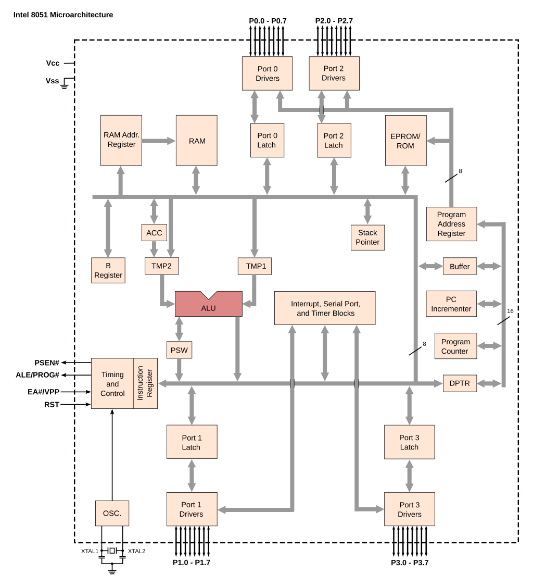

1.运算器：运算器由算数逻辑单元为核心，加上**累加器ACC**，**暂存寄存器TMP**和**程序状态字寄存器PSW**组成。

2.控制器：控制器包括定时控制逻辑，指令寄存器，指令译码器，程序计数器PC，数据指针DPTR，堆栈指针SP，地址寄存器和地址缓冲器等。


#### 8051存储器结构

8051单片机具有16位的地址线，最大寻址范围为64kb，采用哈佛架构数据与代码分别存储在数据寄存器（RAM）与程序寄存器（ROM）当中，RAM与ROM两种存储器各自享有独立的地址空间（均为64kb），单片机内部自带256字节RAM，与4kb的ROM，均可通过P0与P1端口进行外部存储器拓展。

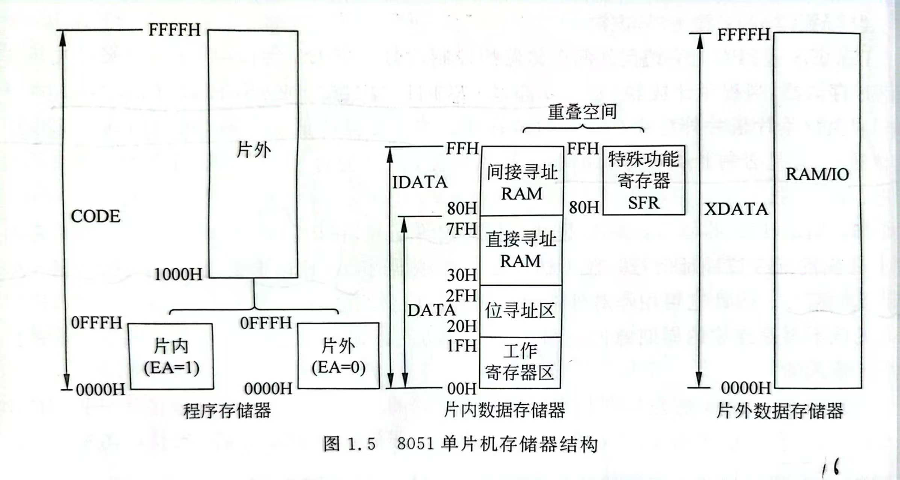

256字节的片内存储器空间被划分为四部分：

- 0~31字节是四组工作寄存器，每组包含R0~R7八个八位寄存器。
- 32~47字节是位寻址区域(BDATA)，该区域内每个字节可以直接访问每一位，声明的bit变量就存储在这里。
- 47~127字节是普通的数据存储空间，可以直接/间接访问。
- 128~255字节直接访问是特殊功能寄存器（SFR）的地址，间接访问是普通的数据存储空间。

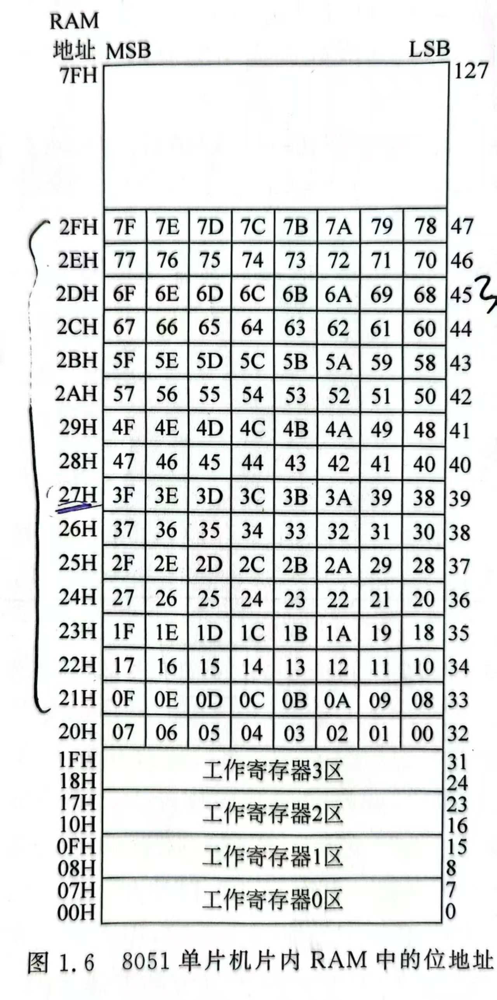


#### 8051单片机引脚

**51一般有40个引脚分为以下三类：**

1. 电源和时钟引脚：如Vcc、GND、XTAL1、XTAL2(接晶振)。
2. 编程控制引脚：如RST、PSEN、ALE/PROG、EA/VPP。
3. I/O口引脚：如P0、Pl、P2、P3,4组8位I/O口。

**特殊引脚介绍：**

| 引脚     | 功能                                                         | 接法                                                         |
| -------- | ------------------------------------------------------------ | ------------------------------------------------------------ |
| Vcc      | 供电。                                                       | 传统型号使用**5V**供电。如Intel 8051, Atmel AT89C51, AT89S51, STC89C51, STC89C52RC等。一些新型号支持更大的供电范围，常见为 3.0V ~ 3.6V 或 2.0V ~ 5.5V。 |
| GND      | 地。                                                         | 接地。                                                       |
| XTAL1    | 晶体振荡器输入/外部时钟源输入。                              | 使用内部振荡电路时接在石英晶体两侧。CMOS外接时钟源输入，NMOS接VSS。 |
| XTAL2    | 晶体振荡器输出。                                             | 使用内部振荡电路时接在石英晶体两侧。CMOS外不接，NMOS接外部时钟输入。 |
| RST      | 复位引脚。                                                   | **高电平**有效。                                             |
| PSEN     | **外部程序存储器读选通**引脚。                               | **低电平有效**，不用外部存储器是可以浮空接高电平。           |
| ALE/PROG | 地址锁存使能 / 编程脉冲（支持ISP功能的单片机用不到）。       | 访问外部存储结构的时候发送一个**高电平脉冲**用于锁存P0发送的低八位地址，不访问时输出1/6时钟频率的脉冲信号。 |
| EA/VPP   | **选择程序存储器来源**/ 编程电压（支持ISP功能的单片机用不到）。 | **保持低电平访问程序存储器时只访问外部程序存储器**，高电平访问内部程序存储器，使用超过片内大小的地址再访问外部。 |

**IO端口介绍：**对于所有端口读引脚需要先写1再读取，读端口直接读取即可。

- P0端口说明：P0组的IO是三态口，可以作为输入/输出端口，也可做为拓展寻址时的低8位地址/8位数据总线，也正是如此P0没有设计上拉电阻只能进行开漏输出所以需要外接上拉电阻来提高驱动能力。

- P1端口说明：P1口为准双向口，作为输出口时锁存器写1输出高电平，写0输出低电平；作为输入口时有读端口和读引脚两种操作，读端口时只是读取锁存器上的值，读引脚的时候需要先向锁存器写1（关闭MOS）再进行读取，这是才是真正读到引脚上的电平。
- P2端口说明：P2口有两个功能作为准双向口和拓展寻址时高八位地址总线。
- P3端口说明：P3口为多功能口，除了通用IO口之外每一位都有它的第二功能。

| 引脚 | 第二功能符号 | 功能名称               | 详细说明                                                     |
| :--- | :----------- | :--------------------- | :----------------------------------------------------------- |
| P3.0 | RXD          | 串行接收               | 用于**接收**来自其他设备的串行数据。                         |
| P3.1 | TXD          | 串行发送               | 用于**发送**串行数据到其他设备。                             |
| P3.2 | INT0         | 外部中断0              | 外部中断源0的输入引脚。                                      |
| P3.3 | INT1         | 外部中断1              | 外部中断源1的输入引脚。                                      |
| P3.4 | T0           | 定时器/计数器0外部输入 | 定时器0的外部计数脉冲输入引脚。                              |
| P3.5 | T1           | 定时器/计数器1外部输入 | 定时器1的外部计数脉冲输入引脚。                              |
| P3.6 | WR           | 外部数据存储器写选通   | 当单片机向**外部数据存储器（RAM）** 写入数据时，<br />此引脚会输出一个**低电平脉冲**，作为写命令信号。 |
| P3.7 | RD           | 外部数据存储器读选通   | 当单片机从**外部数据存储器（RAM）** 读取数据时，<br />此引脚会输出一个**低电平脉冲**，作为读命令信号。 |

**IO口内部逻辑图：**

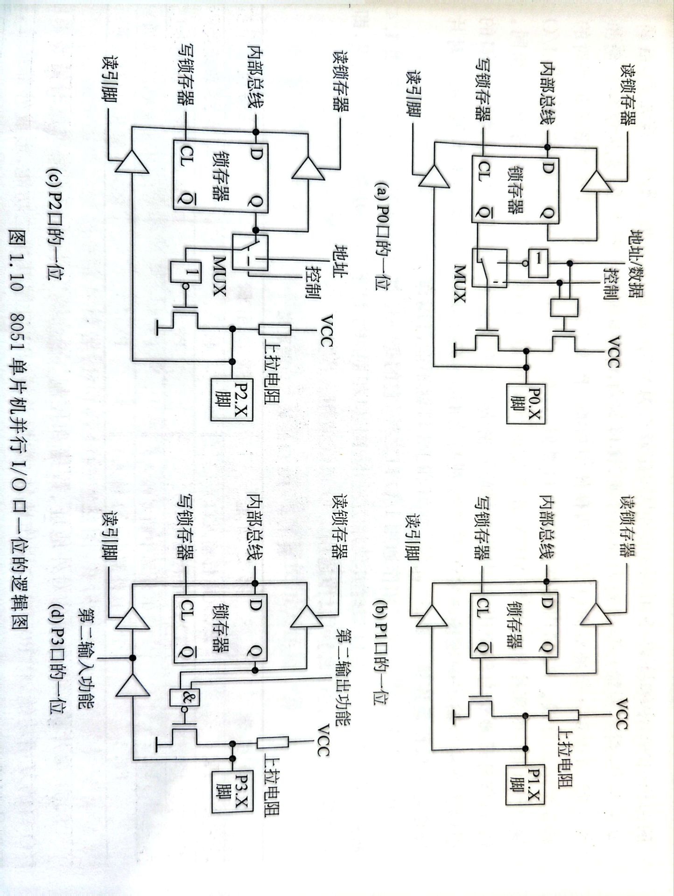


**封装与引脚定义：**

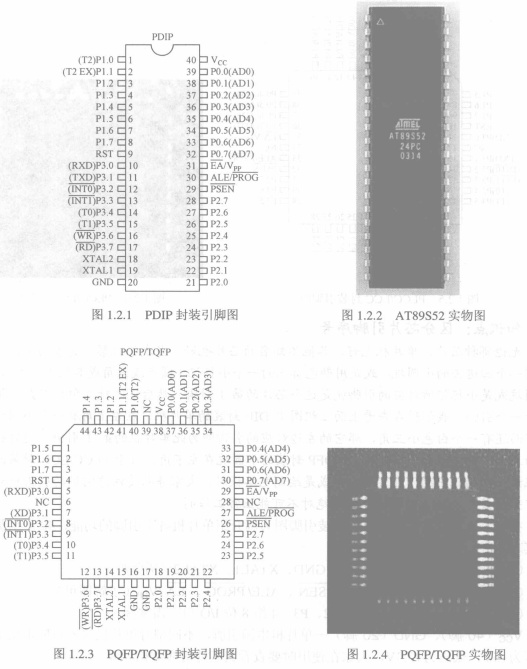

### 指令系统

注意：立即数是前面带有`#`的数字，汇编中的16进制数字后缀`H`。

#### 寻址方式

对于程序寄存器ROM只能通过MOVC进行变址访问，对于片内的高128字节RAM只能间接访问，对于片外RAM存储器拓展IO只能同MOVX访问。

```assembly
MOV A, 3AH		#直接寻址：将16进制地址3A处的数据放入寄存器A当中。
MOV A, #3AH 	#立即寻址: 将立即数3A放入寄存器A。
MOV A, @R0  	#寄存器间接寻址：将寄存器R0存放的地址的数据存入A，不能访问特殊功能寄存器，间接寻址只能使用 R0 ，R1或者DPTR。
MOV A, R0 		#寄存器直接寻址：将工作寄存器R0中的数据直接存入A。
MOV 30H, @R1
MOV @R0, @R1 	#❌（两个间接地址之间不能直接 MOV）

#MOVX访问外部数据存储器，只能通过累加器A与外部数据存储器做交换
MOVX A, @DPTR      
MOVX @DPTR, A  
MOVX A, @R0        
MOVX A, @R1        
MOVX @R0, A        
MOVX @R1, A  

#MOVC 只能从外部程序寄存器读入
; 形式1：使用DPTR作为基址
MOVC A, @A+DPTR    

; 形式2：使用PC作为基址  
MOVC A, @A+PC     

MOV C, 20H #直接位寻址，后面跟的是位地址
```


#### PSW寄存器： 

称为程序状态字，是一个可以位寻址的特殊功能寄存器，地址是`0xD0`。PSW各位定义如下：

| 位序 | 7               | 6              | 5                | 4                   | 3                   | 2          | 1      | 0              |
| :--- | :-------------- | :------------- | :--------------- | :------------------ | :------------------ | :--------- | :----- | :------------- |
| 标志 | `CY`            | `AC`           | `F0`             | `RS1`               | `RS0`               | `OV`       | `-`    | `P`            |
| 功能 | 进位/借位标志位 | 辅助进位标志位 | 用户自定义标志位 | 工作寄存器组选择位1 | 工作寄存器组选择位0 | 溢出标志位 | 保留位 | **奇偶校验位** |

在执行加减法的过程中，如果位7有进位或借位则CY置1（用于判断无符号数运算的溢出），如果位3有进位则AC（为BCD码设置）置1，**如果位7和位6中有一位进位/借位另一位没有**则OV置为1否则置为0（**判断有符号数的溢出**），1的个数为奇数个则P为1。

#### 算数运算指令

```assembly

#普通加法指令：将累加器A的内容与后面的数据相加并将结果存入A,可以加寄存器中的值，一个地址中的值，寄存器中的地址中的值，或一个立即数
ADD A, R0
ADD A, adress
ADD A, @R0
ADD A, #num

#带进位加法指令：操作对象类型与上述指令相同，运算时需要带上上次进位标志CY
ADDC A, R0

#加一指令：操作对象类型与上述指令相同，操作单个对象。
INC A

#带进位的减法指令：操作对象类型与上述指令相同，将A与后面的数据相减并将结果存入A
SUBB A, R0

#减一指令
DEC A
```

### C51

C51是针对8051系列单片机的C语言版本，在标准C（ANSI C）基础上进行了扩展。

#### 存储类型关键字

变量/指针声明时可通过关键字指定存放/指向的地址。

```C
// 不同存储类型的变量声明
unsigned char data var1;        // 内部RAM直接寻址
unsigned int idata var2;        // 内部RAM间接寻址  
unsigned char bdata flags;      // 位寻址区
unsigned char xdata buffer[100]; // 外部RAM
unsigned char code table[256];  // 程序存储器（常量）
unsigned char pdata io_port;    // 分页外部RAM

// 通用指针（3字节）：存储类型+地址
unsigned char *gp;              // 3字节，可指向任何位置

// 存储类型指针（1-2字节）：编译器知道类型
unsigned char data *dp;         // 1字节，指向data
unsigned char xdata *xp;        // 2字节，指向xdata
unsigned char code *cp;         // 2字节，指向code

// 指针转换
unsigned char xdata *xp;
unsigned char *gp;
gp = (unsigned char *)xp;       // xdata指针转通用指针
xp = (unsigned char xdata *)gp; // 通用指针转xdata指针
```


| 关键字  | 对应存储空间      | 地址范围          | 访问方式    | 大小        |
| :------ | :---------------- | :---------------- | :---------- | :---------- |
| `data`  | 内部RAM直接寻址区 | 0x00-0x7F         | 直接寻址    | 128字节     |
| `idata` | 内部RAM间接寻址区 | 0x00-0xFF         | 间接寻址    | **256**字节 |
| `bdata` | 内部RAM位寻址区   | 0x20-0x2F         | 位/字节寻址 | 16字节      |
| `xdata` | 外部RAM           | 0x0000-0xFFFF     | 间接寻址    | 64KB        |
| `pdata` | 分页外部RAM       | 0x00-0xFF（每页） | 分页寻址    | 256字节/页  |
| `code`  | 程序存储器ROM     | 0x0000-0xFFFF     | MOVC指令    | 64KB        |

如果定义变量时没有指出变量的存储类型，则编译器将按照设置的编译模式来确定变量的默认存储器空间。

1. SMALL模式（默认）：使用`#pragma small ` 设置，所有变量默认在data区。
   优点：访问最快
   缺点：data区只有128字节
2. COMPACT模式：使用`#pragma compact`设置，所有变量默认在pdata区。
   优点：256字节空间
   缺点：较慢的分页访问
3. LARGE模式：使用`#pragma large`  设置，所有变量默认在xdata区。
   优点：64KB空间
   缺点：访问最慢

#### 位操作与特殊功能寄存器访问

- `bit`关键字可以在`bdata`区域内定义位变量。
- `sbit`关键字用于定义可位寻址变量（特殊功能寄存器或者定义在bdata区域内的变量）的每一位。
- `sfr/sfr16`关键字用于定义特殊功能寄存器，`sfr16`用于16位寄存器。

```c

bit flage;			//定义占用一位的变量

sfr P0 = 0x80;      // 定义SFR（8位特殊功能寄存器）P0端口，地址80H
int bdata ibase;	//定义一个bata区域的变量
sbit P0_0 = P0^0;   // 定义SFR中的位（可位寻址的位），P0.0引脚
sbit mybit = ibase^0;//定义一个bata区域的变量的第零位
```


#### 绝对地址访问

两种方式访问任意地址的数据：

```c
// 1. 使用_at_关键字（变量定位到绝对地址）
unsigned char xdata buffer[100] _at_ 0x1000;  // 在xdata的1000H处
unsigned char data special _at_ 0x30;         // 在data的30H处

// 2. 使用宏需要引用<absacc.h>（绝对地址访问头文件）
//一个字节
#define PORT_A XBYTE[0x8000]    // 外部地址8000H（xdata）
#define PORT_B DBYTE[0x90]      // 内部地址90H（data）
#define PORT_C PBYTE[0xFF]    // 外部地址ffH（pdata）只能访问低256字节
#define CONST_VAL CBYTE[0x100]  // 程序地址100H（code）
//两字节
#define PORT_A XWORD[0x8000]
#define PORT_B PWORD[0xF0]
#define PORT_C DWORD[0x8000]

// 使用
PORT_A = 0x55;                  // 写入外部8000H
unsigned char val = PORT_B;     // 读取内部90H
unsigned char cmd = CONST_VAL;  // 读取程序100H
```


#### 函数拓展

```c
//1.中断服务函数通过 interrupt 关键字指明哪个中断的服务函数， using 关键字指定使用的工作寄存器组
void uart_isr(void) interrupt 4 using 1  // 4对应串口的中断服务函数，使用寄存器组1不会破坏主程序的寄存器
{}

// 2.使用large small指定参数和局部变量的存储位置
void func(void) small  // small模式：参数和局部变量在data区，更快但data区有限
{}
void func(void) large  // large模式：参数和局部变量在xdata区，较慢但空间大
{}

//3.可重入函数需要用 reentrant 关键字声明
int factorial(int n) reentrant  
{
    if(n <= 1) return 1;
    return n * factorial(n-1);  // 递归调用，没有关键字的函数不能递归调用
}

void process_data(char *buf) reentrant//用在可能被多个任务/中断同时调用的函数可以被中断打断并再次进入
{}

//4.指定函数参数的存储模式
void copy_data(unsigned char xdata *dest, unsigned char code *src, unsigned int len) 
{}
```


### 中断系统

#### 中断类型

8051中断系统由TCON，SCON，IE，IP寄存器控制，具有五个中断源，除自然优先级外最多可设计设置两级优先级：

| 中断源    | 中断向量地址 | 标志/请求位 | 控制/使能位 | 优先级控制 | 中断号 |
| :-------- | :----------- | :---------- | :---------- | :--------- | ------ |
| 外部中断0 | 0003H        | IE0         | EX0         | PX0        | 0      |
| 定时器0   | 000BH        | TF0         | ET0         | PT0        | 1      |
| 外部中断1 | 0013H        | IE1         | EX1         | PX1        | 2      |
| 定时器1   | 001BH        | TF1         | ET1         | PT1        | 3      |
| 串口中断  | 0023H        | RI/TI       | ES          | PS         | 4      |

#### 中断触发

​	使用中断需要在初始化阶段先将中断使能寄存器（IE）中的对应使能位置1，则发生中断事件的时候才会成功触发中断让单片机去执行中断向量地址处的程序，并且硬件会自动将对应中断的标志位置1。

- 外部中断0/1通过**TCON寄存器**的**IT0/1**位设置中断触发方式（置0低电平触发，置1下降沿触发），使用**`P3.2`与`P3.3`**作为外部中断0/1信号输入端口，中断信号之后标志位**IE0/1**自动置1，处理器跳转到服务函数后自动置0。
- 定时器0/1中断触发方式为计数寄存器溢出，发生溢出事件之后TCON寄存器的标志位**TF0/1**自动置1，处理器跳转到服务函数后自动置0。
- 串口中断可以由**接收或者发送完成一帧数据**触发，一帧数据收发完成之后会将SCON寄存器的**RI/TI**标志位置1，处理器跳转到服务函数之后**需要手动将标志位清0**。

#### 中断优先级

​	多个中断同时发生时处理器需要根据中断优先级来依此响应中断。

- 自然优先级是根据中断号排序的，中断号越小自然优先级越高。
- 设置的优先级是通过IP寄存器设置的，通过将IP寄存器中中断对应位置1设置为高优先级，高优先级的中断可以打断低优先级的中断实现中断的嵌套。
- 通过IP设置的优先级是比自然优先级级别高的，设置的优先级相同时才会比较自然优先级，自然优先级不能实现优先级的嵌套。

#### IE（中断使能寄存器）

地址0xA8（可位寻址），需要将EA与对应位置一才能使能中断。

| 位   | 符号            | 名称            | 功能                           | 复位值 |
| :--- | :-------------- | :-------------- | :----------------------------- | :----- |
| 7    | EA              | 总中断使能      | 1=允许所有中断，0=禁止所有中断 | 0      |
| 6    | -               | 保留            | 通常为0                        | 0      |
| 5    | ET2（增强型51） | 定时器2中断使能 | 1=允许T2中断                   | 0      |
| 4    | ES              | 串口中断使能    | 1=允许串口中断                 | 0      |
| 3    | ET1             | 定时器1中断使能 | 1=允许T1中断                   | 0      |
| 2    | EX1             | 外部中断1使能   | 1=允许外部中断1                | 0      |
| 1    | ET0             | 定时器0中断使能 | 1=允许T0中断                   | 0      |
| 0    | EX0             | 外部中断0使能   | 1=允许外部中断0                | 0      |

#### IP（中断优先级寄存器）

地址0xB8（可位寻址）

| 位   | 符号            | 名称            | 功能       | 复位值 |
| :--- | :-------------- | :-------------- | :--------- | :----- |
| 7    | -               | 保留            | 通常为0    | 0      |
| 6    | -               | 保留            | 通常为0    | 0      |
| 5    | PT2（增强型51） | 定时器2优先级   | 1=高优先级 | 0      |
| 4    | PS              | 串口中断优先级  | 1=高优先级 | 0      |
| 3    | PT1             | 定时器1优先级   | 1=高优先级 | 0      |
| 2    | PX1             | 外部中断1优先级 | 1=高优先级 | 0      |
| 1    | PT0             | 定时器0优先级   | 1=高优先级 | 0      |
| 0    | PX0             | 外部中断0优先级 | 1=高优先级 | 0      |


8051中断系统结构：

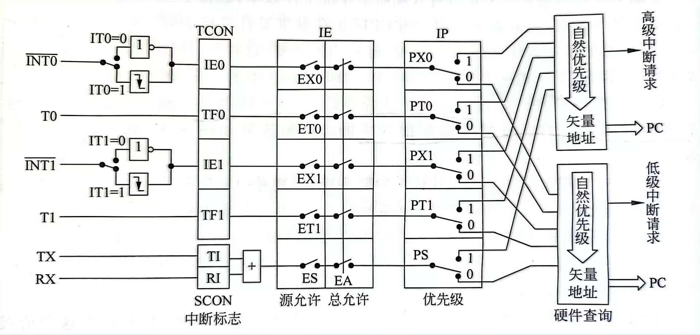


### 定时器

#### 定时器设置

8051内置两个16位定时器（TIM0与TIM1），THx与TLx两个八位寄存器组成16位计数器，通过TCON与TMOD寄存器控制，TMOD的门控位用于设置定时器是否受**P3.2/P3.3**端口处的电平控制（高电平开始计时），C/T位用于设置计数信号的来源是晶振频率的1/12还是端口**P3.4/3.5**输入的脉冲（高电平为外部脉冲），M1与M0用于设置工作模式，定时器具有三种工作模式：

- 模式0：13位计数模式（为了兼容旧型号的代码），计数**0~8191**（计算使用8192），由**TLx的低5位和THx的8位**组成。计数频率为晶振频率的1/12，或者等于外部输入脉冲频率，溢出后需要手动重新装载初值。
- 模式1：16位计数模式，计数0~65535（计算使用65536），由TLx的8位和THx的8位组成。计数频率为**晶振频率的1/12**，或者等于外部输入脉冲频率，溢出后需要**手动重新装载**初值。
- 模式2：8位计数模式，计数0~255（计算使用256），使用TLx计数，THx存重装载的**初始值**，能够再溢出之后自动装载初始值。

定时器在使用的时候需要现按照需要进行工作模式的设置，中断的开启，最后将TCON寄存器中的TRx位置一才能使定时器在正常工作。

PS.特定于定时器0还有模式3，及将定时器0设置为两个八位定时器，这个模式会占用定时器1的中断资源，一般在定时器1作为串口的波特率发生器时才会使用。

```c
void timerinit() //定时器中断初始化函数
{
    TMOD=0x11; //0001 0001 设置为工作模式1
    EA=1; 
    ET1=1;//开启中断
    TH1=(65536-50000)/256;
    TL1=(65536-50000)%256; //一个计数周期-->50ms
    TR1=1;	//定时器1启动  
}

void timer1()interrupt 3 using 0 //Timer1 中断服务函数
{ 
    TH1=(65536-50000)/256; 
    TL1=(65536-50000)%256; //重装载值
    //其他工作
}
```


#### TCON（运行控制寄存器）

地址0x88（**可位寻址**）

| 位   | 符号  | 名称        | 功能                                               | 复位值 |
| :-- | :-- | :-------- | :----------------------------------------------- | :-- |
| 7   | TF1 | 定时器1溢出标志  | T1溢出时硬件置1，中断响应后**硬件清零**（或软件清零）                   | 0   |
| 6   | TR1 | 定时器1运行控制  | 1=启动T1，0=停止T1                                    | 0   |
| 5   | TF0 | 定时器0溢出标志  | T0溢出时硬件置1，中断响应后**硬件清零**（或软件清零）                   | 0   |
| 4   | TR0 | 定时器0运行控制  | 1=启动T0，0=停止T0                                    | 0   |
| 3   | IE1 | 外部中断1标志   | 检测到INT1有效边沿时硬件置1，中断响应后**硬件清零**（IT1=1时）或电平触发时保持原样 | 0   |
| 2   | IT1 | 外部中断1触发方式 | 1=**下降沿触发**，0=**低**电平触发                          | 0   |
| 1   | IE0 | 外部中断0标志   | 检测到INT0有效边沿时硬件置1，中断响应后**硬件清零**（IT0=1时）或电平触发时保持原样 | 0   |
| 0   | IT0 | 外部中断0触发方式 | 1=**下降沿触发**，0=**低**电平触发                          | 0   |

#### TMOD（方式控制寄存器）

物理地址：0x89（**不可位寻址**）

| 位    | 符号 | 对应定时器 | 功能                                             | 复位值 |
| :---- | :--- | :--------- | :----------------------------------------------- | :----- |
| **7** | GATE | 定时器1    | 门控位，置1时外部中断1引脚为**高电平**定时器启动 | 0      |
| **6** | C/T  | 定时器1    | 1计数器/0定时器选择                              | 0      |
| **5** | M1   | 定时器1    | 模式选择位1                                      | 0      |
| **4** | M0   | 定时器1    | 模式选择位0                                      | 0      |
| **3** | GATE | 定时器0    | 门控位，置1时外部中断0引脚为**高电平**定时器启动 | 0      |
| **2** | C/T  | 定时器0    | 1计数器/0定时器选择                              | 0      |
| **1** | M1   | 定时器0    | 模式选择位1                                      | 0      |
| **0** | M0   | 定时器0    | 模式选择位0                                      | 0      |


### 串口

#### 串口设置

8051内部具有一个串口可以进行串行数据的收发，输入输出引脚分别是P3.0与P3.1，通过SCON，PCON寄存器配置它的工作方式，有三种模式：

- 模式0：作为同步位移模式，这个模式下**数据通过RXD引脚输入输出**，**TXD引脚用于时钟的同步**，**波特率固定为晶振振荡频率的12分之一**，主要应用于I/O拓展。

- 模式1：八位异步接受发送，这个模式下一帧数据有10位，包括一位**起始位（0）一位停止位（1）**和八位数据位,，接收时**停止位会被存放在SCON的D2位**，波特率由定时器1的溢出率决定（定时器需要工作在模式2，不开启中断）。

  

- 模式2：九位异步接受发送，这个模式下一帧数据有11位，相较于方式1多了一位由SCON的TB8位决定的第九个数据位，。

- 模式3：九位异步接受发送，这个模式相较于模式2只是波特率由定时器1设置，。

串口将数据寄存器中的数据放入缓存区需要满足三个条件，否则会将数据丢弃：

- REN = 1，表明允许接收数据。
- RI = 0，表明上一次存放在SBUF的数据已经被取走。
- SM2 = 0或者接收到的第九位数据为1，用于多主机通信。

多机通信的时候串口需要工作在模式2/3设置SM2为1，每个主机都有一个属于自己的地址，**数据的第9位为1代表这帧数据是地址帧反之为数据帧**，当主机收到了自己的地址就会将SM2置0用于接受下面的数据帧，如果没有收到自己的地址就会将SM2值1来屏蔽之后的数据帧。

初始化串口：

```C
void Serialinit() 
{ 
	SCON=0x50; //0101 0000 设置为模式1接受使能
	PCON=0x00;
	TMOD=0x20; 
	TH1 =0xf3; //时钟频率为12MHz，计算2400波特率
	TL1 =0xf3;
	TR1 =1;
	TI =1; //使用标准输入输出函数时需要将发送中断标志位置1
}
```


#### SCON（串口控制寄存器）

地址0x98（可位寻址）

| **位** | **符号** | **名称**     | **功能**                            | **复位值** |
| :----- | :------- | :----------- | :---------------------------------- | :--------- |
| 7      | SM0      | 串口模式位0  | 与SM1共同决定工作模式               | 0          |
| 6      | SM1      | 串口模式位1  | 与SM0共同决定工作模式               | 0          |
| 5      | SM2      | 多机通信使能 | 1=多机通信模式，0=普通模式          | 0          |
| 4      | REN      | 接收使能     | 1=允许接收，0=禁止接收              | 0          |
| 3      | TB8      | 发送第9位    | 模式2/3时，要发送的第9位数据        | 0          |
| 2      | RB8      | 接收第9位    | 模式2/3时，接收到的第9位数据        | 0          |
| 1      | TI       | 发送中断标志 | 发送完成时硬件置1，**必须软件清零** | 0          |
| 0      | RI       | 接收中断标志 | 接收完成时硬件置1，**必须软件清零** | 0          |

#### PCON（电源控制寄存器）

地址：0x87（不可位寻址）

| 位   | 符号 | 名称             | 功能                     | 复位值 |
| :--- | :--- | :--------------- | :----------------------- | :----- |
| 7    | SMOD | 串口波特率倍增位 | 1=波特率×2，0=波特率正常 | 0      |
| 6    | -    | 保留位           | 通常为0                  | 0      |
| 5    | -    | 保留位           | 通常为0                  | 0      |
| 4    | -    | 保留位           | 通常为0                  | 0      |
| 3    | GF1  | 通用标志位1      | 用户自定义标志           | 0      |
| 2    | GF0  | 通用标志位0      | 用户自定义标志           | 0      |
| 1    | PD   | 掉电模式位       | 1=进入掉电模式           | 0      |
| 0    | IDL  | 空闲模式位       | 1=进入空闲模式           | 0      |


### 接口拓展

外拓存储器示意图：

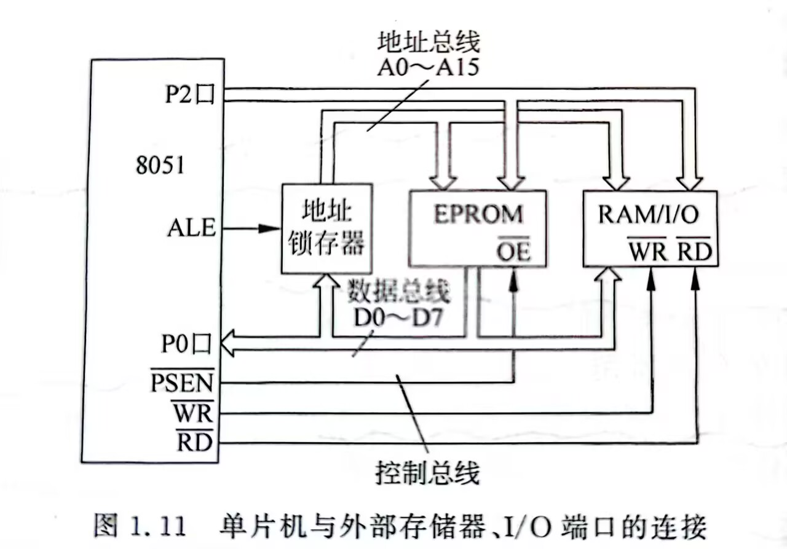


### 8255A

8255A为通用可编程并行IO接口芯片，具有3个8位并行IO端口（A,B,C），C端口可以 分为两个4位并行IO使用，用于拓展系统IO。8255A通过方式控制字来设置三个端口的工作状态，当方式控制字第八位为1时用于设置三个端口的工作状态，当第八位为0时用于按位设置C端口的值。

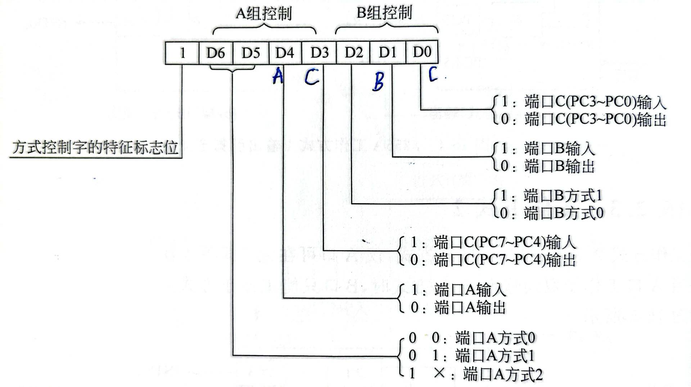

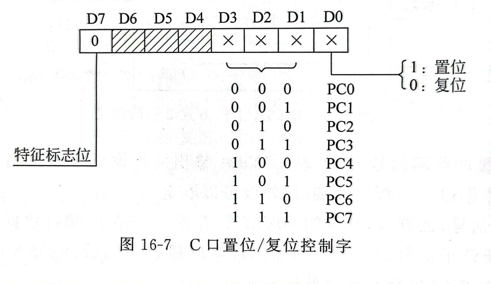


- **A1A0 = 00**：选择A口数据寄存器
- **A1A0 = 01**：选择B口数据寄存器
- **A1A0 = 10**：选择C口数据寄存器
- **A1A0 = 11**：选择控制寄存器

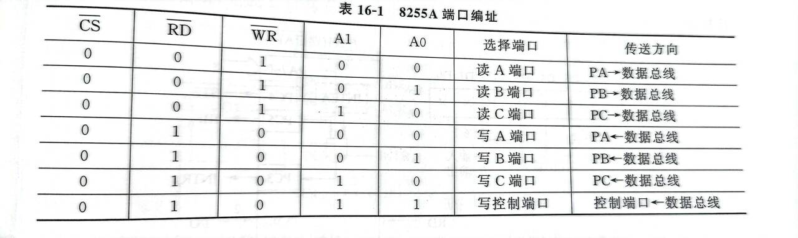

三种工作方式：

- 工作方式0：基本输入输出方式，ABC三个端口均可设置为输入或者输出。
- 工作方式1：选通输入输出方式，AB端口可设置，该模式下C端口作为AB端口的控制线与状态线。
- 工作方式2：双向输入输出方式 ，仅有A端口可用。


| 引脚        | 作用                                                         |
| ----------- | ------------------------------------------------------------ |
| PA 7 ～ PA0 | 8 位三态输入/输出，可编程设定为输入/输出或双向方式。         |
| PB7 ～ PB0  | 8位三态输入/输出，可编程设定为输入/输出。                    |
| PC7 ～ PC0  | 8 位三态输入/输出，可编程设定为输入、输出，或作为端口 A 和端口 B 的输入/输出状态线与控制线。 |
| D7 ~ DO     | 8 位三态输入/输出，双向三态数据线，连接系统数据总线，实现 CPU 和 8255A 之间的数据、命令、状态传输。 |
| RESET       | 8255A 复位信号，高电平有效。                                 |
| A1 、 A0    | 地址输入， 8255A 内部端口选择信号线，选择 8255A的 A 口、 B 口、 C 口和控制寄存器 |
| /RD         | 输入，读控制信号                                             |
| /WR         | 输入，写控制信号                                             |
| /CS         | 输入，片选信号，低电平有效。                                 |

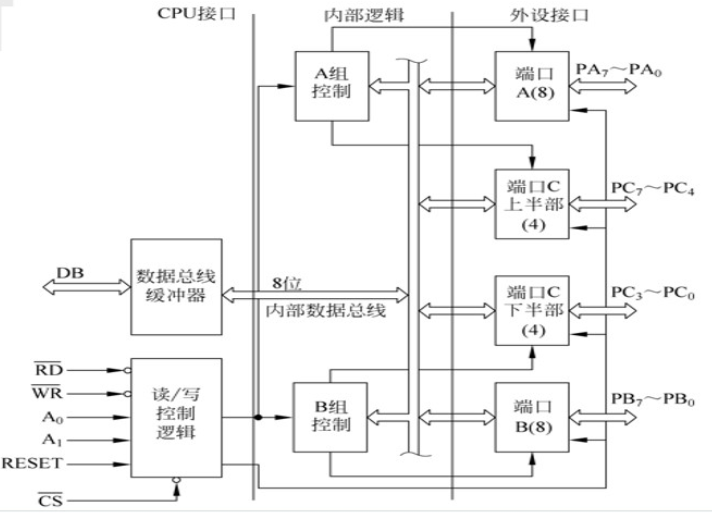

### ADC0809

ADC0809 为 CMOS 工艺 **8 位**逐次逼近 ADC，数字量输出带三态锁存，可直接和系统数据总线连接，转换时间为**100us**，5V供电模拟量输入范围**0~5V**。驱动ADC0809时，先通过**地址总线发送地址来选择转换8路模拟量中的哪一路**，然后向ALE发送高电平锁存地址信号，再输出 START 脉冲信号启动转换。**转换完成后 EOC 输出一个脉冲，输出允许信号 OE 打开三态缓冲器**将转换结果送系统数据总线，一次 A / D 转换程完成。

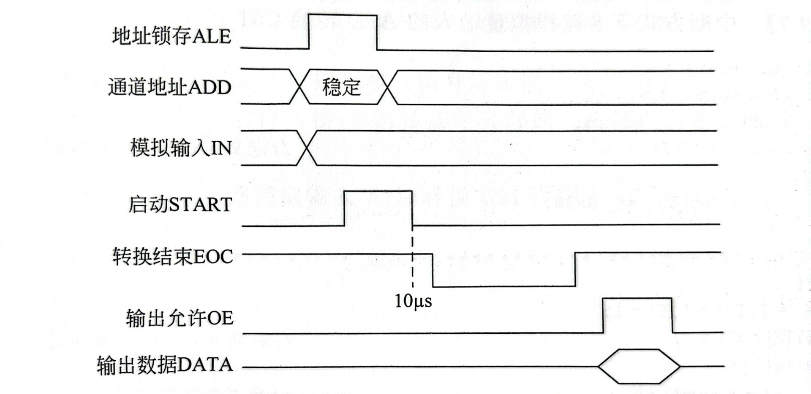

| 引脚           | 作用                                                       |
| -------------- | ---------------------------------------------------------- |
| VCC/GND        | 电源/地，+5~+15供电。                                      |
| IN7--INO       | 8 路模拟量输入。                                           |
| START          | 脉冲启动信号，上升沿复位8089，**下降沿启动AD转换**。       |
| EOC            | 转换结束信号，转换开始时变为低电平，转换结束时变回高电平。 |
| CLOCK          | 外部时钟输入，最高640kHz。                                 |
| ALE            | 通道地址锁存，高电平有效。                                 |
| ADDA/ADDB/ADDC | 通道选择地址线，选择转换8路模拟量中的哪一路                |
| OE             | 输出允许信号，**高电平**有效。                             |


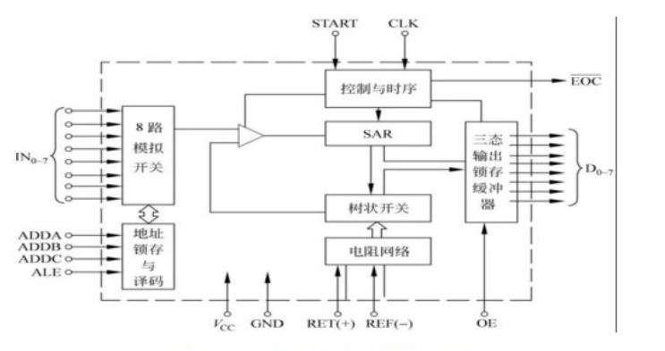


### DAC0832

DAC0832 为 8 位电流型 D / A 转换器，片内具有两级数据锁存，可编程实现**双缓冲、单缓冲和直通** 3 种数字量输入方式，工作时将数字量输入DI0~DI7然后依此选通输入寄存器与DAC寄存器。要转化的数字量存入DAC寄存器后，DAC自动启动转换通过IOUT1/IOUT2输出电流模拟量。 

1. 直通方式： `ILE=1&/CS=0&/WR1=0&/WR2=0&/XFER=0`, **5 个控制端均始终有效**，则写入数字量时，直接启动 D / A 转换。
2. 单缓冲方式： 8 位输入寄存器和 8 位 DAC 寄存器任意一个处于直通方式，另一个处于受控方式。
3. 双缓冲方式．两级锁存器均处于受控方式，单独控制，实现双缓冲。

| 引脚        | 功能                                                         |
| ----------- | ------------------------------------------------------------ |
| DIO-D17     | 8 位数字输入，TTL 电平，可与系统数据总线直接连接。           |
| ILE         | **输入锁存器允许信号，高电平有效。**                         |
| /CS         | 片选信号，低电平有效。                                       |
| /WR1        | 写信号1低电平有效，**输入锁存器**写信号。                    |
| /WR2        | 写信号 2 ，低电平有效， **DAC 锁存器**写信号，启动转换。     |
| /XFER       | 数据传送控制信号，低电平有效。**当/ WR2 与/XFER 同时有效时**，输入寄存器数据被装入 DAC 寄存器。 |
| VCC         | 芯片电源，+ 5V 、+ 15VC                                      |
| IOUT1/IOUT2 | 电流输出端，两者之和为常数。                                 |
| AGND/DGND   | 模拟信号地/数字信号地。                                      |
| RFB         | **反馈信号输入端，与外接运放一起工作来形成稳定电压**。       |
| VREF        | 基准电压输入-10V~10V                                         |


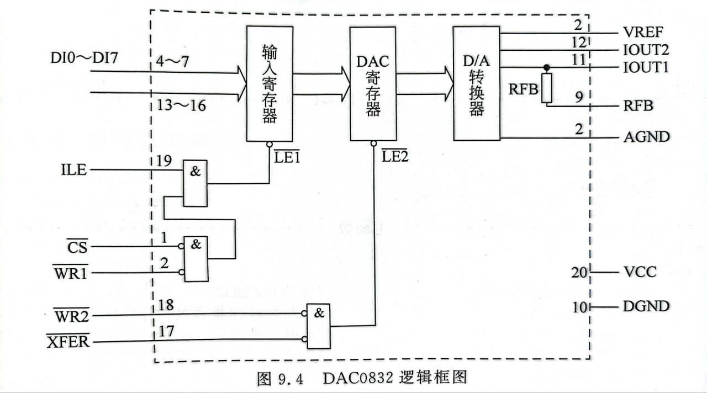


### 74LS244

功能：8 位三态缓冲器，用于**数据总线驱动或隔离**。

引脚：

- 1A1–1A4, 2A1–2A4：输入（接外部数据线或 P0 口）
- 1Y1–1Y4, 2Y1–2Y4：输出（接 8051 数据总线）
- 1G, 2G：两组（各 4 位）的输出使能（低电平有效）

工作过程：

1. 当 G 为低电平时，输出 Y 等于输入 A。
2. 当 G 为高电平时，输出为高阻态（断开）。

### 74LS373

功能：8 位锁存器，用于**锁存低 8 位地址**。

引脚：

- D0–D7：数据输入（接 8051 的 P0 口）
- Q0–Q7：锁存输出（接外部存储器或 I/O 的低 8 位地址线）
- G（或 LE，Latch Enable）：锁存使能
- OE（Output Enable）：输出使能（通常接地，一直使能输出）

工作过程：

1. 当 **G（LE）为高电平**时，Q 输出跟随 D 输入（透明模式）。
2. 当 **G（LE）从高变低**时，D 端的数据被锁存到 Q 输出，之后 D 变化不影响 Q。
3. 在 8051 系统中，**G 通常接 ALE（地址锁存允许）**。在访问外部存储器时，8051 的 P0 口先输出低 8 位地址，然后 ALE 发出一个正脉冲，在 ALE 下降沿将地址锁存到 74LS373 中。
4. **OE 接地**，表示输出一直有效

### 6264

8K*8（8k字节）的SRAM数据存储器，**13位地址线**，两个片选引脚均为**低电平**时被选中**WE接WR，OE接RD**。

| 引脚  | 符号      | 功能                   |
| :---- | :-------- | :--------------------- |
| 1     | CS1       | 片选 1（低电平有效）   |
| 2     | A12       | 地址线 12（高位地址）  |
| 3–10  | A7–A0     | 地址线低 8 位          |
| 11    | I/O1      | 数据 I/O 1             |
| 12–19 | I/O2–I/O8 | 数据 I/O 2–8           |
| 20    | GND       | 地                     |
| 21–23 | A8–A10    | 地址线 8–10            |
| 24    | A11       | 地址线 11              |
| 25    | CS2       | 片选 2（低电平有效）   |
| 26    | WE        | 写使能（低电平有效）   |
| 27    | OE        | 输出使能（低电平有效） |
| 28    | VCC       | +5 V 电源              |

### 2764

8K*8（8k字节）的EPROM程序存储器，紫外线擦除擦除后位变为1，51的PSEN引脚接OE（低电平有效）引脚用于发送读信号，片选也是低电平有效，

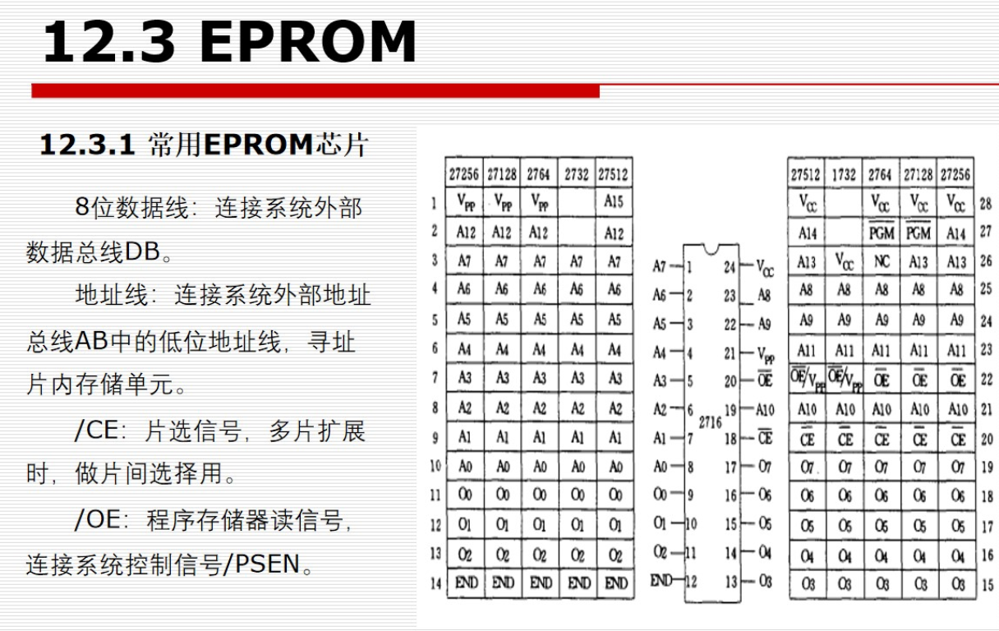
