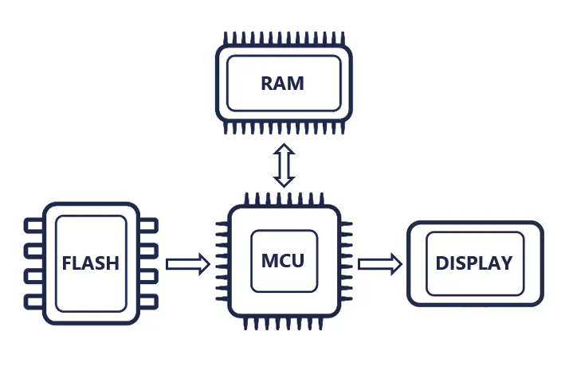
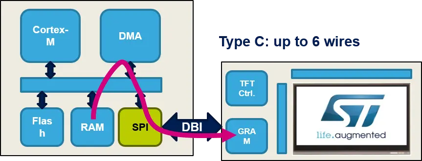
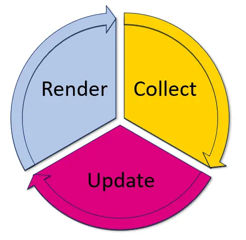
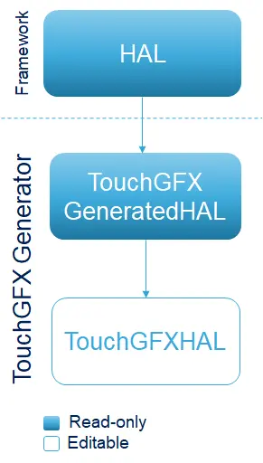
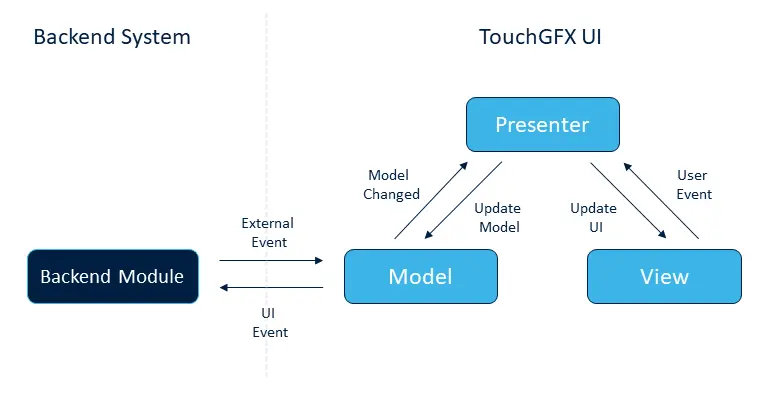

## 前言

TouchGFX 是一款适用于 STM32 MCU 的嵌入式 UI 框架，提供了便捷的 UI 设计软件，多种帧缓存策略以及详尽的开发文档。本文以 26 年战队使用的遥控器工程为例，简单讲解如何在战队模板的基础上搭建 TouchGFX  工程方便后续队员上手使用。

[TouchGFX文档 ](https://support.touchgfx.com/zh-CN/docs/introduction/welcome)

[26遥控项目仓库](https://github.com/XJU-Hurricane-Team/26RemoteCtrl)


## 硬件选型

### 硬件概述
在开发嵌入式 UI 的过程中首先需要根据硬件条件考虑软件设计，通常需要考虑四个方面：

- 屏幕：驱动芯片，屏幕尺寸，传输接口。
- MCU：MCU资源大小，主频，接口带宽。
- RAM：用于设置帧缓存区，帧缓存区也可能在 MCU 内部 RAM 中。
- FLASH：用于存储字库，图片，视频。



如上图所示完整的工作流程为： MCU 负责加载 FLASH 当中的字库，图片等资源，经由 UI 引擎渲染出要显现的内容，MCU 将渲染结果写入 RAM 当中的缓存区，再由通信接口（LTDC，FMC，SPI）将缓存区的内容传输给屏幕完成显示。

### 例程分析

遥控的屏幕采用`240*320`分辨率 SPI 接口 St7789 主控的 LCD 屏，按照色深为 16bpp （RGB565）的情况计算，每一帧画面所需要的存储空间为 150kb 。主控芯片为 STM32F429VET6 （ROM：1024.0KB RAM1：192.0KB RAM2：64.0kb）在没有拓展 SDRAM 的情况下仅使用内部 RAM 作为缓存区实现单帧缓存较为困难，因此采用[部分帧缓存策略](https://support.touchgfx.com/zh-CN/docs/basic-concepts/framebuffer#display-with-gram-partial-buffering)。F4 主频为180MHz，APB2总线的时钟频率为90MHz， SPI 接口在2分频的情况下最高传输速率为`45Mbit/s`，单帧传输事件为 26.7ms，考虑到不可能跑满带宽因此实际的刷新率应该在 30Hz 左右。



## 初始配置

### CubeMX配置

初始化过程需要在 CubeMX 当中配置，首先需要初始化传输接口，注意需要开启 DMA 和 DMA 中断。


注意 DMA 的`Data Width`要设置为半字宽度。


开启 CRC 和 DMA2D（如果 MCU 有的话）。


添加 TouchGFX 组件，这里使用组件版本为4.26.1。


这里根据前面硬件选型部分的分析进行选择，需要注意接口是SPI 的情况下`interface`选择`Custom`，`Number of Blocks`是指缓存区的块数，`Block Size`是每块缓存区的大小。战队模板当中的 FreeRTOS 是手动添加的因此这里的`Real-Time Operating System`选项我们选择`Custom`后续需要手动进行代码配置，如果想要 CubeMX 直接生成可以选择`CMSIS-V2`。由于我们使用的 LCD 模块没有引出 [TE 引脚](https://support.touchgfx.com/zh-CN/docs/development/scenarios/touchgfx-on-lowcost-hardware#tearing-effect)所以`Partial Framebuffer VSync`选项不开启。

配置成功后即可生成代码，如果使用的是战队模板需要取消`cleanup`脚本的执行。


### 工程配置

点击生成代码后在`\CubeMX\TouchGFX`目录下会生成如下文件，点击红框中的文件即可打开[TouchGFX Designer](https://www.st.com.cn/zh/development-tools/touchgfxdesigner.html) 进行 [UI 设计](https://support.touchgfx.com/zh-CN/docs/category/designer-user-guide)。


在`\CubeMX\Middlewares\ST\tougfx`路径下会生成如下文件，这些是 TouchGFX 的核心库文件。

打开 EIDE 按照下图添加文件到工程


注意这里`touchgfx_core_wchar32.lib`为 TouchGFX 框架的核心库，仅提供二进制库文件，需要根据工程使用的编译器类型选择适配的库文件，所有库文件都存放在`\CubeMX\Middlewares\ST\touchgfx\lib\core\cortex_m4f`路径下，这里例程使用是 AC6 编译器选择图中的库文件。

添加包含的目录：


## 框架说明

### 图形引擎

TouchGFX 框架中使用[图形引擎](https://support.touchgfx.com/zh-CN/docs/basic-concepts/graphics-engine)绘制需要显示图形，它的工作方式分为三步循环执行：

- **采集事件**：采集触摸屏事件、物理按钮按下事件和来自后台系统的消息等。
- **更新场景模型**：对采集的事件做出响应，更新模型的位置、动画、色彩和图像等。
- **渲染场景模型**：重绘模型中已更新的部分，并使之显示在显示屏上。



由于引擎没有源码其内部对于我们来说是个黑盒，我们只需要关心引擎如何启动，循环执行需要什么条件，以及渲染后的数据如何传递给屏幕即可。

### TouchGFX AL 

[TouchGFX抽象层（AL）](https://support.touchgfx.com/zh-CN/docs/development/touchgfx-hal-development/touchgfx-al-development-introduction)是位于用户代码与 TouchGFX 引擎之间的软件组件， 其主要任务是将引擎与底层硬件和操作系统相结合。TouchGFX 抽象层使用 C++ 编写，通过类的继承分为如下三层：

- `HAL`：祖父类，是整个框架的基础，类的声明在`CubeMX\Middlewares\ST\touchgfx\framework\include\touchgfx\hal\HAL.hpp`文件当中，方法的实现编译在 TouchGFX 的核心库当中无法直接查看，这个类无需我们手动修改，由 CubeMX 自动添加。

- `TouchGFXGeneratedHAL` ：父类，继承于`HAL`类，类的声明位于`CubeMX\TouchGFX\target\generated\TouchGFXGeneratedHAL.hpp`文件中，这个类由TouchGFX Generator 根据项目配置自动生成，定义了项目配置所需要的函数，这个类不需要用户手动修改，但其成员函数中调用了需要用户手动实现的函数。

- `TouchGFXHAL`：子类，继承于`TouchGFXGeneratedHAL`，声明于`CubeMX\TouchGFX\target\TouchGFXHAL.hpp`，这个类在第一次由TouchGFX Generator 根据项目配置自动生成，用户可以在此基础上根据自己的需求更改这个类，框架初始化时声明的也是这个类的对象。




## 代码配置

### RTOS 设置

`CubeMX\TouchGFX\target\OSWrappers.cpp`这个文件中包含了引擎运行过程中所需要的同步接口。由于在 CubeMX 初始化部分我们选择的 RTOS 为`Custom`，因此文件当中的接口函数实现均为空，需要我们手动添加实现。

当前工程使用 FreeRTOS ，因此采用二值信号量 + 队列来完成 TouchGFX 的同步需求，关键如下函数的实现：

- `OSWrappers::initialize()`：创建并初始化帧缓存信号量 `frame_buffer_sem`，同时创建长度为 1 的 VSync 队列 `vsync_queue`。
- `takeFrameBufferSemaphore()/giveFrameBufferSemaphore()`：用于在渲染与传输阶段互斥访问帧缓存块。
- `waitForVSync()/signalVSync()`：引擎主循环阻塞等待下一次 VSync，定时器中断到来时通过队列唤醒。
- `taskYield()`：在需要短暂让出 CPU 时调用 `taskYIELD()`，避免 UI 线程忙等。

这套封装的作用可以简单理解为：
- **信号量**负责“这个缓存块现在能不能被画/被传”。
- **队列**负责“这一帧什么时候开始（VSync）”。

如果在 CubeMX 中选择 `CMSIS-V2`，这些逻辑会自动生成，如果和例程一样选择手动实现可以参考例程。

### 屏幕传输

为了使框架适用于任意硬件，需要用户手动实现以下在`TouchGFXGeneratedHAL.cpp`中声明的函数：

```c
/* 判断是否正在传输缓存块 */
extern "C" int touchgfxDisplayDriverTransmitActive(); 
/* 传输数据块到屏幕指定位置 */ 
extern "C" void touchgfxDisplayDriverTransmitBlock(const uint8_t* pixels, uint16_t x, uint16_t y, uint16_t w, uint16_t h);
```

同时需要手动在合适位置调用以下在`TouchGFXGeneratedHAL.cpp`中定义的函数：

```c
/* 在传输完成函数中调用启动新一轮调用 */ 
extern "C"
void DisplayDriver_TransferCompleteCallback()
{
    // After completed transmission start new transfer if blocks are ready.
    touchgfx::startNewTransfer();
}
/* 发送引擎同步信号，当渲引擎接收到此信号后启动新一轮渲染 */
extern "C"
void touchgfxSignalVSync(void)
{
    /* VSync has occurred, increment TouchGFX engine vsync counter */
    touchgfx::HAL::getInstance()->vSync();
    /* VSync has occurred, signal TouchGFX engine */
    touchgfx::OSWrappers::signalVSync();
}
```

例程中在屏幕驱动文件下调用与实现了上述函数。`DisplayDriver_TransferCompleteCallback()`函数在传输完成回调函数中调用以启动新一轮传输，`touchgfxSignalVSync(void)`函数由定时器中断回调函数定时调用，调用频率为`30Hz`。注意`touchgfxDisplayDriverShouldTransferBlock()`这个函数只有在 CubeMX 中启用 `Partial Framebuffer VSync`选项时才需要实现。

完整传输链路如下：

1. TouchGFX 引擎完成一个块的绘制后，调用 `TouchGFXGeneratedHAL::flushFrameBuffer()`。
2. `flushFrameBuffer()` 内部将块标记为可传输，并在总线空闲时调用 `touchgfxDisplayDriverTransmitBlock()`。
3. 在 `st77xx.c` 中由 `ST77xx_Bitmap()` 设置窗口并启动 `HAL_SPI_Transmit_DMA()`。
4. DMA 传输完成后进入 `HAL_SPI_TxCpltCallback()`，恢复 SPI 配置、拉高 CS，并调用 `DisplayDriver_TransferCompleteCallback()`。
5. `DisplayDriver_TransferCompleteCallback()` 内部调用 `touchgfx::startNewTransfer()`，释放已发送块并继续发送下一个已就绪块。


### 引擎启动

CubeMX 生成的代码中会在 main 函数中自动调用`MX_TouchGFX_Init()`去执行 TouchGFX 框架初始化，想要启动图形引擎只需要创建任务调用`MX_TouchGFX_Process()`函数即可，该函数内部执行引擎循环。

``` c
/**
 * @brief TouchGFX_Task: TouchGFX processing task.
 * @param pvParameters Start parameters.
 */

void TouchGFX_Task(void *pvParameters) {
    UNUSED(pvParameters);
    MX_TouchGFX_Process();
}
```

其中 `MX_TouchGFX_Init()` 内部会调用到 `TouchGFXHAL::initialize()`，例程当中这里做了三件和硬件强相关的事情：

- 创建传输同步信号量 `g_touchgfxTransferSem`。
- 调用 `ST77xx_Init()` 完成屏幕初始化。
- 启动 `TIM2` 中断，周期性触发 `touchgfxSignalVSync()` 给引擎提供 VSync 节拍。


## UI 设置

### MVP 架构说明

TouchGFX 使用经典 MVP（Model-View-Presenter）架构。

- **Model（数据层）**：负责采集后端任务发送来的数据，存储 UI 模型的数据。
- **Presenter（中间层）**：负责将 Model 中采集到的数据更新到 View，同时将 View 层中的事件传递给 Model。
- **View（显示层）**：每一个屏幕对应一个 View 对象，存储着所有要显示的内容。

这样的架构带来的好处是：界面资源可以频繁在 Designer 里迭代，而业务逻辑可以稳定留在用户代码中，降低重新生成代码时的冲突风险。



在例程中 MVP 架构按照下述方式工作：

- 在 `Model.cpp` 负责采集数据中从 `ui_msg_queue` 非阻塞读取底层消息（遥控器、R1、R2 状态），完成数据聚合。
- 在 `screenPresenter.cpp` 中接收 Model 回调，把业务数据写入 View 的显示字段。
- 在`screenView.cpp` 中把字段格式化为文本并 `invalidate()`，触发局部重绘，将需要显示的信息显示在屏幕上。


