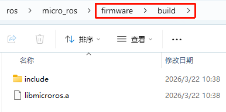
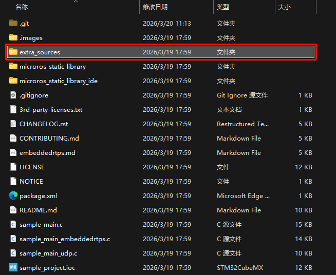

### 简介

micro-ROS 运行在嵌入式设备上，旨在与 Linux 设备上运行的ROS2节点进行通信。

结构如下图：


### 准备工作

交叉工具链下载

```bash
# 下载GNU for ARM 工具链，注意 Humble 建议使用 gcc13.2 ，14版本与教程有兼容性问题。
wget https://developer.arm.com/-/media/Files/downloads/gnu/13.2.rel1/binrel/arm-gnu-toolchain-13.2.rel1-x86_64-arm-none-eabi.tar.xz
# 解压
tar -xf arm-gnu-toolchain-13.2.rel1-x86_64-arm-none-eabi.tar.xz
# 移动到 /opt 文件夹下，不需要的时候直接删除文件夹
sudo mv arm-gnu-toolchain-13.2.Rel1-x86_64-arm-none-eabi /opt/
# 在.bashrc中添加路径
export PATH=$PATH:/opt/arm-gnu-toolchain-13.2.rel1-x86_64-arm-none-eabi/bin
# 查看版本检查是否添加成功
arm-none-eabi-gcc -v
```

rosdep 换源

```bash
# 编辑镜像源文件
sudo vim /etc/ros/rosdep/sources.list.d/20-default.list

# 将里面所有的镜像源注释掉，替换为下面内容：清华镜像源
yaml https://mirrors.tuna.tsinghua.edu.cn/rosdistro/rosdep/osx-homebrew.yaml osx
yaml https://mirrors.tuna.tsinghua.edu.cn/rosdistro/rosdep/base.yaml
yaml https://mirrors.tuna.tsinghua.edu.cn/rosdistro/rosdep/python.yaml
yaml https://mirrors.tuna.tsinghua.edu.cn/rosdistro/rosdep/ruby.yaml
gbpdistro https://mirrors.tuna.tsinghua.edu.cn/rosdistro/releases/fuerte.yaml fuerte

# 保存退出后更新
rosdep update
```


### 构建 micro-ROS 工作区

micro-ROS 通过 micro_ros_setup 包构建

```bash
# 激活 ROS2 环境
source /opt/ros/$ROS_DISTRO/setup.bash
# 创建工作区
mkdir uros_ws && cd uros_ws
# 拉取构建环境
git clone -b $ROS_DISTRO https://github.com/micro-ROS/micro_ros_setup.git src/micro_ros_setup
# 下载环境依赖，确保 rosdep 已经换源
rosdep update && rosdep install --from-paths src --ignore-src -y 
# 构建
colcon build
# 加载环境变量
source install/local_setup.bash
# 构建基本库环境，这一步网络不好容易失败，失败后删除 firmware 文件夹换热点重试
ros2 run micro_ros_setup create_firmware_ws.sh generate_lib
```


### 自定义消息类型

```bash
# 类似ROS2自定义接口
cd firmware/mcu_ws
# 创建自定义消息包
ros2 pkg create --build-type ament_cmake my_custom_message
cd my_custom_message
mkdir msg
# 创建自定义消息类型
touch msg/MyCustomMessage.msg
```

在`MyCustomMessage.msg`文件中编写自定义信息

```txt
bool bool_test
byte byte_test
char char_test
int64 int64_test
uint64 uint64_test
geometry_msgs/Point32 point32_test
```

在`CMakeLists.txt`文件中添加构建项目

```cmake
...
find_package(rosidl_default_generators REQUIRED)

rosidl_generate_interfaces(${PROJECT_NAME}
  "msg/MyCustomMessage.msg"
  DEPENDENCIES geometry_msgs
 )
...
```

在`package.xml`中添加包依赖

```xml
...
<build_depend>rosidl_default_generators</build_depend>
<exec_depend>rosidl_default_runtime</exec_depend>
<member_of_group>rosidl_interface_packages</member_of_group>
<depend>geometry_msgs</depend>
...
```

构建消息

```bash
#工作区根目录执行
ros2 run micro_ros_setup build_firmware.shmcu_ws
```


### 编译库文件

```bash
# 创建编译配置文件，文件内容见参考内容
touch my_custom_toolchain.cmake
touch my_custom_colcon.meta

# 编译库文件，编译成功后库文件在
ros2 run micro_ros_setup build_firmware.sh $(pwd)/my_custom_toolchain.cmake $(pwd)/my_custom_colcon.meta
```


my_custom_toolchain.cmake 参考：给编译器看的配置文件

```cmake
set(CMAKE_SYSTEM_NAME Generic)
set(CMAKE_CROSSCOMPILING 1)
set(CMAKE_TRY_COMPILE_TARGET_TYPE STATIC_LIBRARY)

# 1. 设置编译器名称 (请确保你在终端输入 arm-none-eabi-gcc -v 能看到版本)
set(CMAKE_C_COMPILER arm-none-eabi-gcc)
set(CMAKE_CXX_COMPILER arm-none-eabi-g++)

set(CMAKE_C_COMPILER_WORKS 1 CACHE INTERNAL "")
set(CMAKE_CXX_COMPILER_WORKS 1 CACHE INTERNAL "")

# 2. 设置编译参数 (针对 Cortex-M4F)
set(FLAGS "-O2 -ffunction-sections -fdata-sections -fno-exceptions -mcpu=cortex-m4 -mthumb -mfloat-abi=hard -mfpu=fpv4-sp-d16" CACHE STRING "" FORCE)

# 3. 把参数应用到 C 和 C++ 编译器
set(CMAKE_C_FLAGS_INIT "-std=c11 ${FLAGS} -DCLOCK_MONOTONIC=0 -D'__attribute__(x)='" CACHE STRING "" FORCE)
set(CMAKE_CXX_FLAGS_INIT "-std=c++11 ${FLAGS} -fno-rtti -DCLOCK_MONOTONIC=0 -D'__attribute__(x)='" CACHE STRING "" FORCE)

set(__BIG_ENDIAN__ 0)
```

my_custom_colcon.meta 参考：给 colcon build 构建工具看的配置文件。

```json
{
    "names": {
        "tracetools": {
            "cmake-args": [
                "-DTRACETOOLS_DISABLED=ON",
                "-DTRACETOOLS_STATUS_CHECKING_TOOL=OFF"
            ]
        },
        "rosidl_typesupport": {
            "cmake-args": [
                "-DROSIDL_TYPESUPPORT_SINGLE_TYPESUPPORT=ON"
            ]
        },
        "rcl": {
            "cmake-args": [
                "-DBUILD_TESTING=OFF",
                "-DRCL_COMMAND_LINE_ENABLED=OFF",
                "-DRCL_LOGGING_ENABLED=OFF"
            ]
        }, 
        "rcutils": {
            "cmake-args": [
                "-DENABLE_TESTING=OFF",
                "-DRCUTILS_NO_FILESYSTEM=ON",
                "-DRCUTILS_NO_THREAD_SUPPORT=ON",
                "-DRCUTILS_NO_64_ATOMIC=ON",
                "-DRCUTILS_AVOID_DYNAMIC_ALLOCATION=ON"
            ]
        },
        "microxrcedds_client": {
            "cmake-args": [
                "-DUCLIENT_PIC=OFF",
                "-DUCLIENT_PROFILE_UDP=OFF",
                "-DUCLIENT_PROFILE_TCP=OFF",
                "-DUCLIENT_PROFILE_DISCOVERY=OFF",
                "-DUCLIENT_PROFILE_SERIAL=OFF",
                "-DUCLIENT_PROFILE_STREAM_FRAMING=ON",
                "-DUCLIENT_PROFILE_CUSTOM_TRANSPORT=ON"
            ]
        },
        "rmw_microxrcedds": {
            "cmake-args": [
                "-DRMW_UXRCE_MAX_NODES=5",
                "-DRMW_UXRCE_MAX_PUBLISHERS=5",
                "-DRMW_UXRCE_MAX_SUBSCRIPTIONS=5",
                "-DRMW_UXRCE_MAX_SERVICES=4",
                "-DRMW_UXRCE_MAX_CLIENTS=4",
                "-DRMW_UXRCE_MAX_HISTORY=4",
                "-DRMW_UXRCE_TRANSPORT=custom"
            ]
        }
    }
}
```


编译成功之后`firmware/buid`路径下有以下文件，这就是我们需要的 mirco-ROS 库。




### 加入STM32工程

```bash
# 拉取官方 CubeMX 例程
git clone https://github.com/micro-ROS/micro_ros_stm32cubemx_utils.git
```

拉取下来项目目录如下图所示：




`extra_sources`文件夹内存放的是 micro-ROS 与 STM32 HAL 库之间的适配层代码，这里选择串口通信，将以下源代码文件添加到你的项目中：

- `extra_sources/microros_time.c`
- `extra_sources/microros_allocators.c`
- `extra_sources/custom_memory_manager.c`
- `extra_sources/microros_transports/dma_transport.c`。


### 代理端构建

```bash
# 在工作区运行以下代码
ros2 run micro_ros_setup create_agent_ws.sh
# 构建代理
ros2 run micro_ros_setup build_agent.sh
source install/local_setup.bash
# 运行代理
ros2 run micro_ros_agent micro_ros_agent
```


### 参考文档

[指定硬件构建micro-ROS固件](https://micro.ros.org/docs/tutorials/core/first_application_rtos/freertos/)

[自定义micro-ROSROS消息](https://micro.ros.org/docs/tutorials/advanced/create_new_type/)

[创建自定义静态micro-ROS库 ](https://micro.ros.org/docs/tutorials/advanced/create_custom_static_library/)

