## bxCAN

本文以 STM32F4xx 系列为例介绍基本扩展控制器区域网络（bxCAN）。

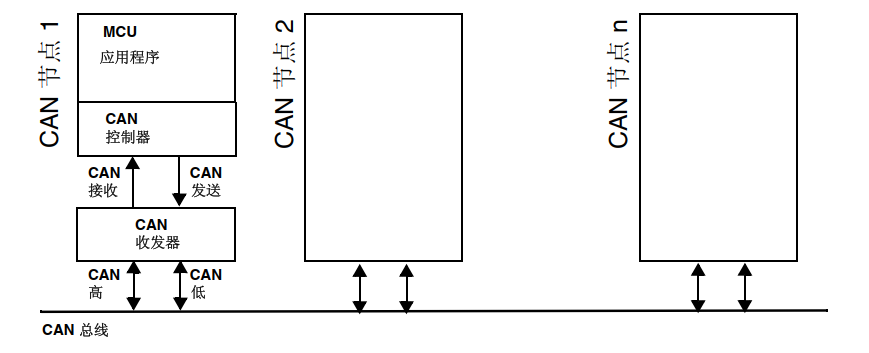

### 帧格式

CAN 总线上使用差分信号传递信息，因此 CAN 控制器发送的逻辑电平需要通过 CAN 收发器转化差分信号，其中0为显性电平，1为隐性电平。ISO11898 标准的高速 CAN 通信速率为 125Kbps~1Mbps，同时总线上最远两端需要接 120Ω 终端电阻来进行阻抗匹配。

CAN 协议有以下5中类型的帧，数据帧和遥控帧有标准格式和扩展格式两种格式。标准格式有 11 个位的标识符（ID），扩展格式有 29 个位的 标识符（ID）。  

| 帧类型 | 帧用途                                         |
| ------ | ---------------------------------------------- |
| 数据帧 | 用于发送单元向接收单元传送数据的帧             |
| 远程帧 | 用于接收单元向具有相同ID的发送单元请求数据的帧 |
| 错误帧 | 用于当检测出错误时向其它单元通知错误的帧       |
| 过载帧 | 用于接收单元通知其尚未做好接收准备的帧         |
| 间隔帧 | 用于将数据帧及遥控帧与前面的帧分离开来的帧     |

最核心的是数据帧，分为七段：

- 帧起始：表示数据帧开始的段，一位隐性电平。  
- 仲裁段：表示该帧优先级的段。由消息的标识符+RTR位组成  ，当两个 CAN 节点同时向总线上发送数据时连续发送显性位多的消息赢得总线控制权，RTR位用于标识是否是远程帧（0为数据帧，1为远程帧）。
- 控制段：表示数据的字节数及保留位的段。IDE位用于表示是否位扩展帧（0为标准帧，1为扩展帧），扩展帧标识符长度为29位，标准帧标识符长度为11位。DLC 4bit 用于表明数据段的长度。SRR位为代替远程请求位，为隐性位，它代替了标准帧中的 RTR 位。r0 和 r1 为保留位，必须全部以显性电平发送，但是接收端可以为任意电平。  
- 数据段：数据的内容，一帧可发送 0~8 个字节的数据。
- CRC 段：检查帧的传输错误的段。
- ACK 段：表示确认正常接收的段，发送单元发送2个位的隐性位，而接收到正确消息的单元在发送显性位，通知发送单元正常接收结束，这个过程叫发送 ACK  。
- 帧结束：表示数据帧结束的段，由 7 个位的隐性位组成。

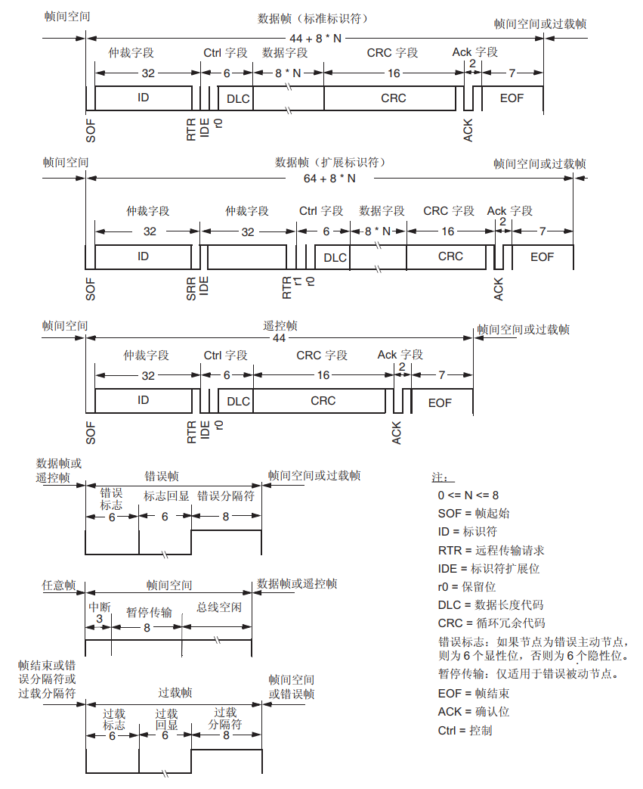

### 位时序

bxCAN 中一位被分为了三个时间段，每个时间段由若干个时间片组成：

- 同步段 (SYNC_SEG)：电平的显隐性跳变应发生在该时间段，固定1个时间片长度。
- 位段 1 (BS1) ：定义采样点的位置，持续长度为1到16个时间片，以补偿不同网络节点间的正相位漂移。（包括 CAN 标准的 PROP_SEG 和 PHASE_SEG1 ）
- 位段 2 (BS2)：定义发送点的位置，持续长度为1到8个时间片，以补偿负相位漂移 。（包括 CAN 标准的 PHASE_SEG2  ）

再同步跳转宽度 (SJW) 定义位段加长或缩短的上限，它可以在 1 到 4 个时间片之间调整。实际传输过程中时序可能不完全同步，这时需要通过 SJW 调整BS1与BS2的长度来修正。

- 在 BS1 而不是 SYNC_SEG 中检测到有效边沿，则 BS1 会延长最多 SJW， 以便延迟采样点。
- 在 BS2 而不是 SYNC_SEG 中检测到有效边沿，则 BS2 会缩短最多 SJW， 以便提前发送点。

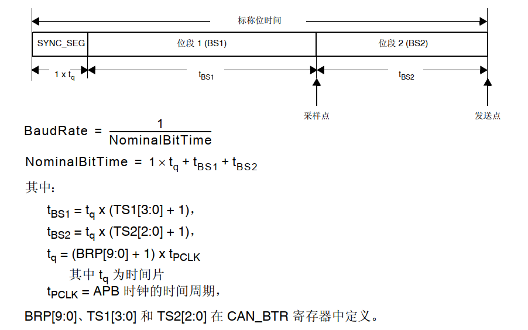

### CAN控制器结构

 STM32F4xx 系列 MCU 有两个 CAN 控制器，分为CAN1（主CAN）和CAN2（从CAN）。两个 CAN 具有各自独立的发送邮箱与接收队列，共用28个筛选器，通过软件配置进行分配。CAN2 作为从 CAN 无法独立工作必须在CAN1初始化的条件下才能正常访问 SRAM 存储器。  

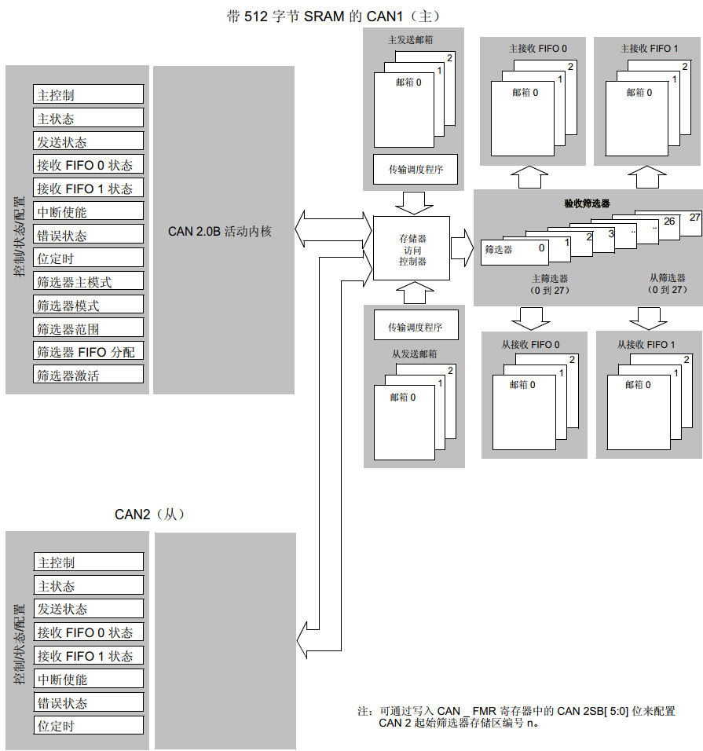

### 工作模式

bxCAN 的硬件有三种工作模式：

- 睡眠模式：mcu 复位后的默认模式，该模式下时钟停止但仍可访问邮箱。
- 正常模式：该模式下 CAN 正常工作。
- 初始化模式：该模式下才能进行软件初始化。

在初始化模式下可配置三种测试模式：

- 静默：该模式下不会发送显性位，正常接收总线上消息，可用于分析 CAN 总线上的流量  。
- 回环：该模式将其自身发送的消息作为接收的消息来处理并存储，消息也会发送到总线上 。
- 静默回环：该模式将其自身发送的消息作为接收的消息来处理并存储 ，同时不会向总线上发送显性位。

### 发送处理 

bxCAN 具有三个发送邮箱，每个邮箱能够缓存一条待发送的消息。软件仅需将要发送的消息放入空闲的邮箱当中，当邮箱有消息存入时由空闲状态转为挂起态。当其中的消息具有最高的优先级时则为已安排状态，硬件将会把消息发送到总线上，成功传输后邮箱自动为清空。

这里有两种优先级确立方式：

- 按标识符 ：标识符值最低的消息具有最高的优先级。如果标识符值相等，则首先安排发送编号较小的邮箱。  
- 按发送请求顺序：按照请求发送的先后确定优先级，此时三个邮箱相当于三级队列，遵循先进先出原则。

如果总线发生传输错误导致消息没有成功传输，默认会自动重传（可以设置NART 位为1禁止自动重传）。如果始终无法将消息发送出去，邮箱则会被占满导致新消息无法发送。

可以通过将 CAN_TSR 寄存器的 ABRQ 位置1，来中止发送请求，中止后邮箱均为空闲状态。

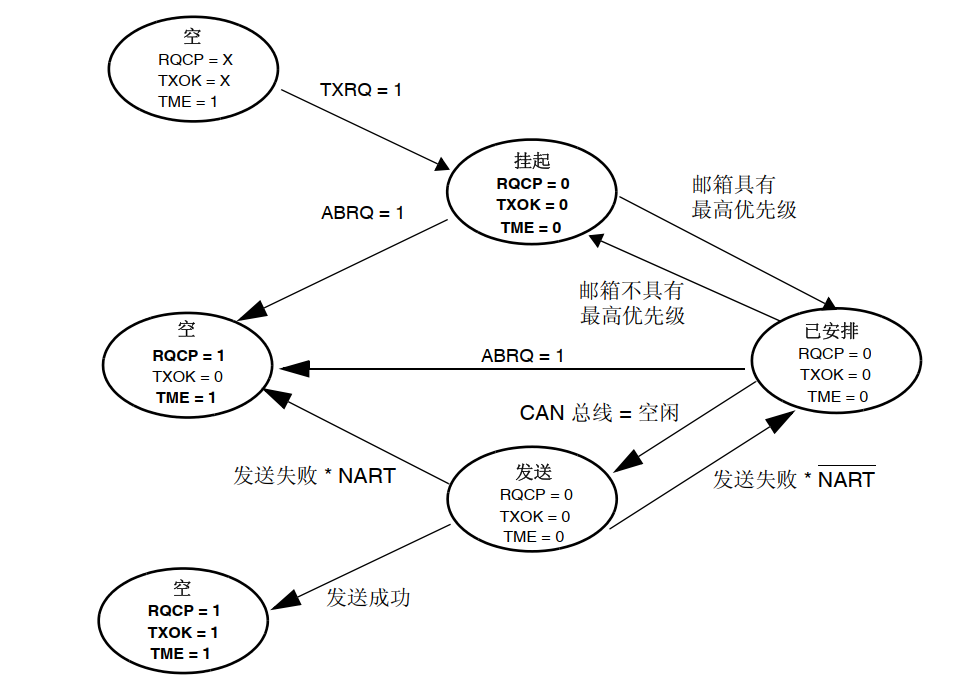

### 接收处理

硬件提供了两个接收邮箱，每个接收邮箱允许访问一个深度为3级的 FIFO。当消息依据 CAN 协议正确接收，且通过标识符过滤器后将被存入与过滤器绑定的 FIFO 中。FIFO 中的消息遵循先进先出原则，消息被读取之后对应位变回空闲状态。

当 FIFO 被存满时，若不即使读取消息，再接收到消息会发生上溢造成消息的丢失。丢失的消息取决于 FIFO 的配置  ：

-  如果禁止 FIFO 锁定功能（CAN_MCR 寄存器的 RFLM 位清零），则新传入的消息将覆盖FIFO 中存储的最后一条消息。在这种情况下，应用程序将始终能访问到最新的消息。
-  如果使能 FIFO 锁定功能（CAN_MCR 寄存器的 RFLM 位置 1），则将丢弃最新的消息，软件将提供 FIFO 中最早的三条消息。

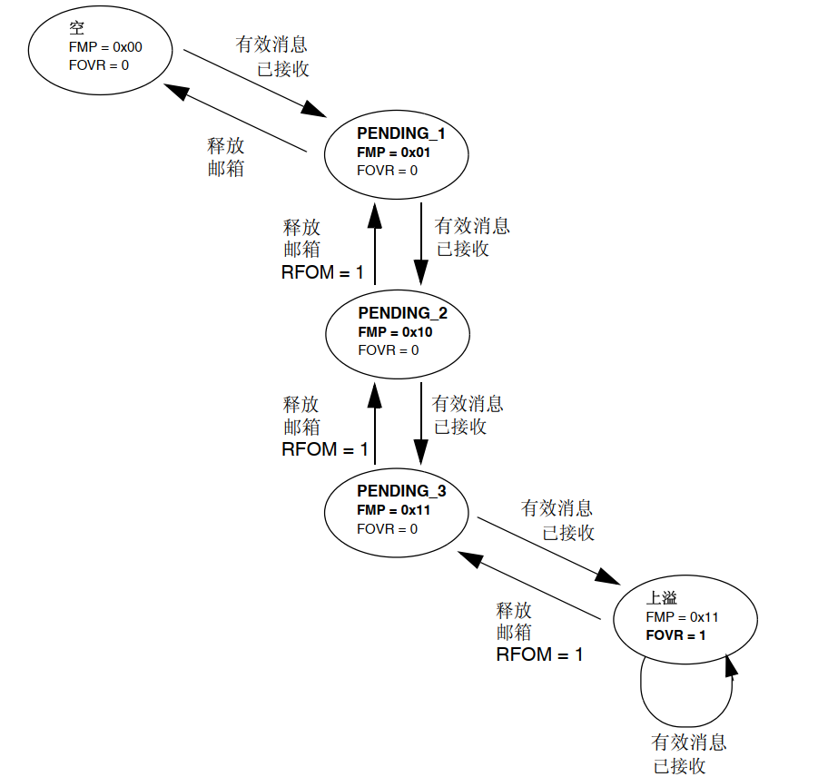

接收与发送邮箱，由寄存器组成。

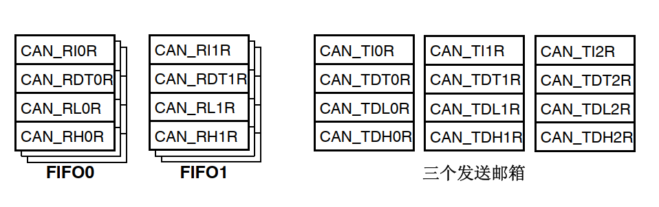

### 标识符过滤器

总线上的消息通过广播的形式发送给每个节点，通过采用标识符过滤的方式，即可在无需软件干预的条件下丢弃不需要的消息。bxCAN 控制器为应用程序提供了28个（单个CAN仅能使用前14个）可配置且可调整的筛选器组 (27- 0)，每个筛选器组均包含两个 32 位寄存器（CAN_FxR0 和 CAN_FxR1）。

每组过滤器可配置为32/16位模式，每种模式都有以下两种匹配方式：

- 掩码模式：在掩码模式下，标识符寄存器与掩码寄存器关联，用以指示标识符的哪些位“必须匹配”，哪些位“无关”，用于筛选一组标识符。 
- 标识符列表模式：在标识符列表模式下，掩码寄存器用作标识符寄存器。仅有完全匹配的标识符才能通过过滤器，用于筛选选择单个标识符。

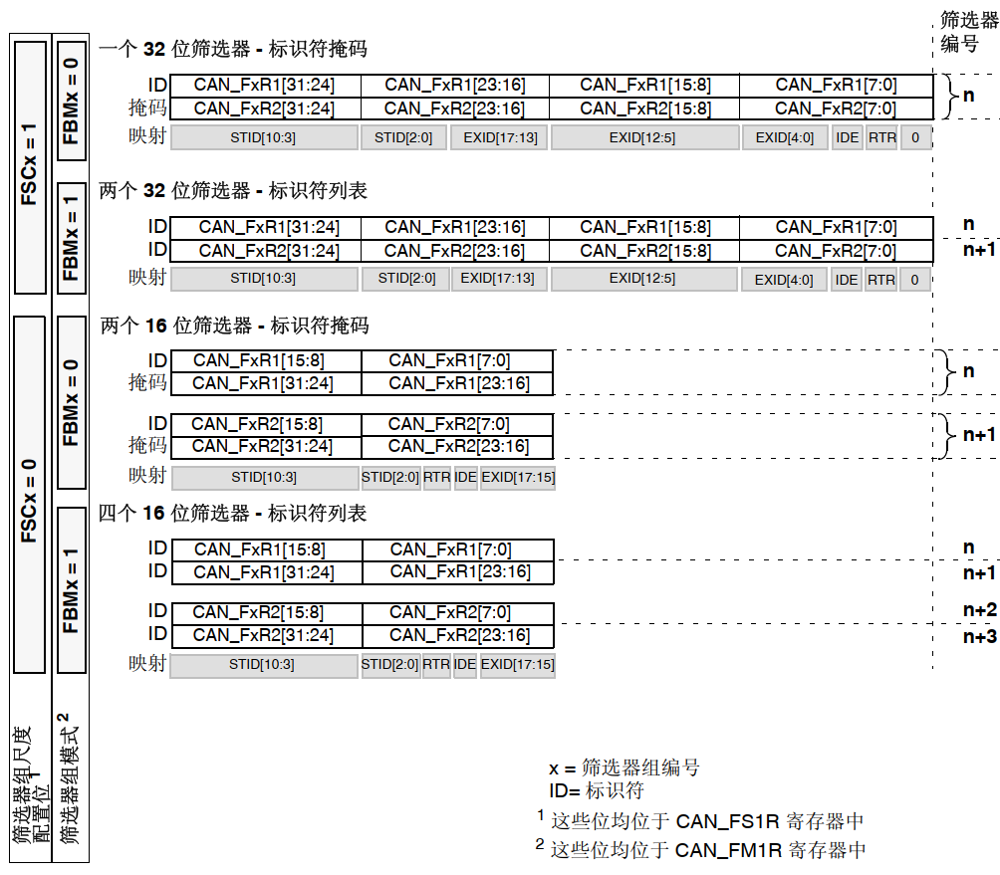

### 中断种类

在 CAN 通信过程中特定事件会触发中断，bxCAN 共有四个专用的中断向量，以下事件均会触发中断。

- 发送中断  ：发送邮箱0 ，1，2任意一个为空时。
- FIFO 0中断：队列0接收到新消息；队列满；队列上溢。
- FIFO 1中断：队列1接收到新消息；队列满；队列上溢。
- 错误和状态改变中断：发生错误状况；进入睡眠模式；唤醒状况。

## FDCAN 

本文以 STM32G4xx 系列为例介绍可变数据速率控制器区域网络（FDCAN）。

### 帧格式

FDCAN 的诞生是为了提升总线速率。相较于 bxCAN 的数据帧，FDCAN 的仲裁段保持相同的传输速率，但是通过数据段波特率可变技术将数据段的传输速率提升至 8Mbps，同时数据段最大传输字节数由8字节提升至64字节。FDCAN 兼容经典 CAN，下图是两者的区别。

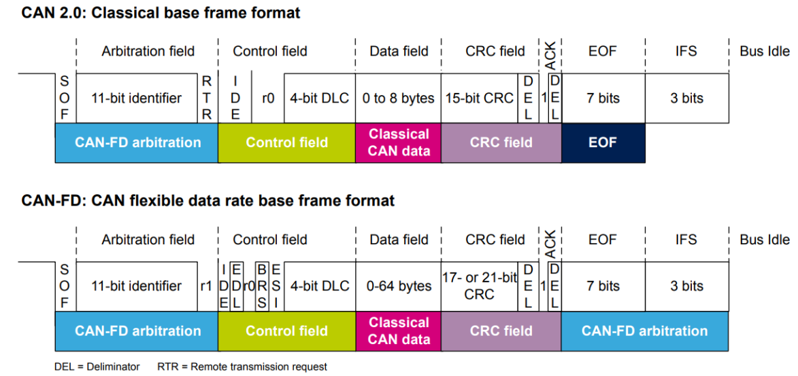

FDCAN 取消了远程帧，所以 RTR 位保留不用始终为显性。在控制段添加了三个位：

- EDL（ Extend data length）：扩展数据长度位，隐性(逻辑 1)表示 FDCAN 帧，显性(逻辑 0， R0)表示 CAN2.0 帧
- BRS（ Bit rate switching）：位速率切换，指是否切换高速率传输，如从 500K 切换到2M。
- ESI（ Error state indicator）：错误状态指示器，指示节点处于 error-active 模式还是error-passive 模式。

并且仅有16种数据长度

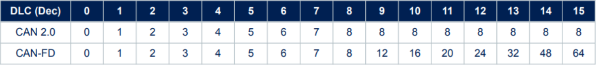

由于数据段的增长，CRC 校验段的长度也应该增加

-  有效载荷在 16 字节及以内， CRC 以 17-bit 编码。
-  有效载荷在 20 字节及以上， CRC 以 21-bit 编码。

### FDCAN 控制器结构

 STM32G4xx 系列MCU 具有3个 FDCAN ，结构如下图所示。其中TX Handler 负责将消息 RAM 中的数据发送到 CAN 内核，RX Handler 负责将 CAN 内核的数据传输到外部消息 RAM 中。  

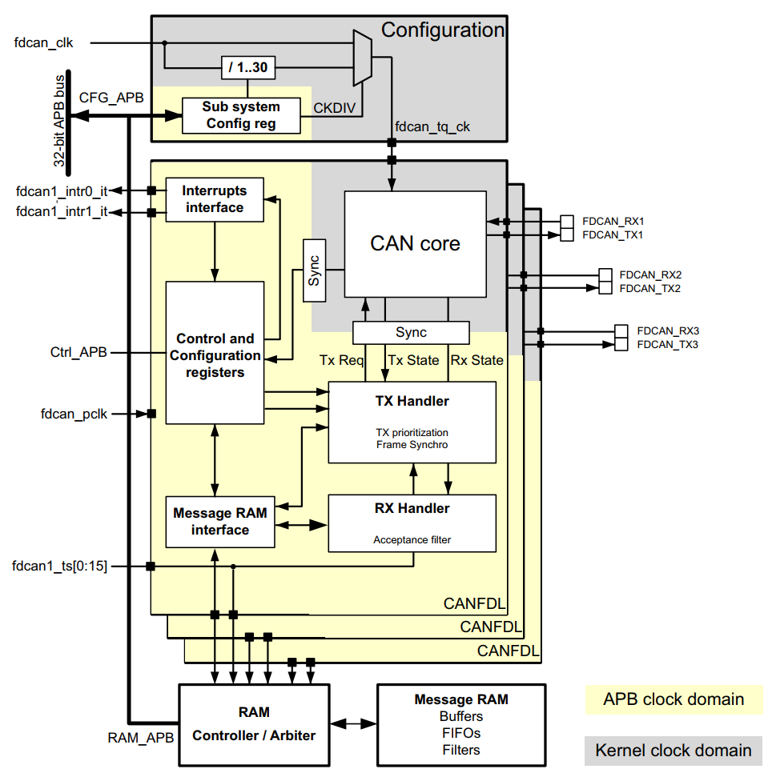

每个 FDCAN 的 Message RAM 有 848 字节用来作为表示过滤器，两个三级接收队列，一个三级发送事件队列，一个能存放三帧消息的发送缓存区。相较与经典 CAN 多了发送事件队列用来存放有关发送消息的信息（就是消息刨除数据的部分）。

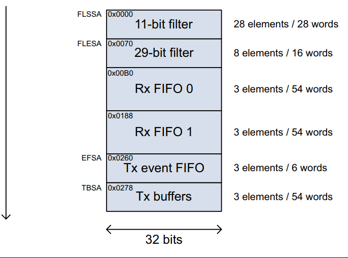

## 参考与致谢

[STM32——FDCAN&CAN](https://nomadjoeviolet.github.io/p/stm32fdcancan/)