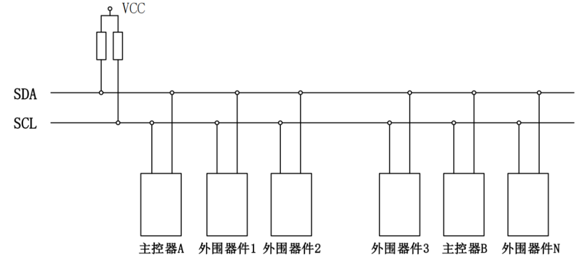
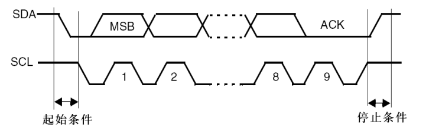
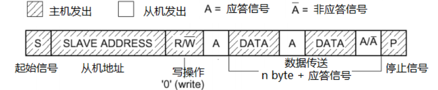
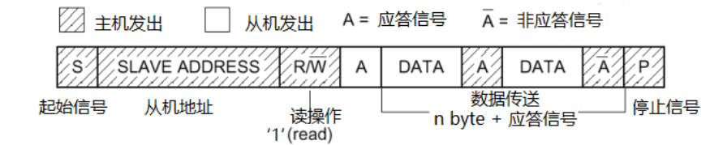
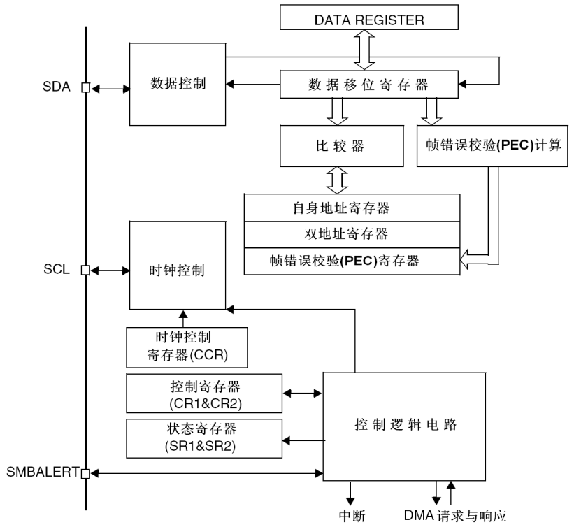
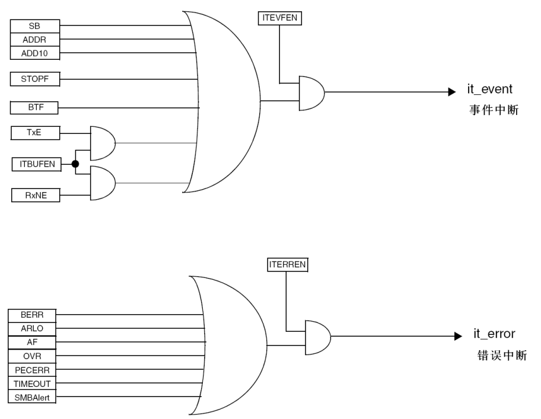

### IIC 简介

集成电路总线（Inter-Integrated Circuit，IIC也写作 I2C），由飞利浦公司开发，主打极简布线、多主多从架构，广泛应用于嵌入式系统中低速外设的近距离对接特性如下：

- 同步通信：通过 SCL 时钟线实现收发双方严格同步，无时钟偏差问题；

- 半双工传输：收发共用 SDA 数据线，同一时间仅能单向传输数据；

- 多主多从：总线支持多个主设备和从设备，通过**唯一 7 位 / 10 位设备地址**区分；

- 硬件极简：仅 2 根信号线，开漏输出设计，需外接上拉电阻（典型 4.7KΩ）；

- 速率分级：标准模式 100kbps、快速模式 400kbps，满足低速外设传输需求；

- 线与特性：SCL/SDA 总线空闲时为高电平，支持多设备挂载无冲突。



### 时序规则

IIC 无专用帧起始 / 停止位，通过总线时序信号定义通信阶段，主从设备需严格遵循：

1. **起始条件（S）**：SCL 高电平时，主机将 SDA 由高拉低，触发总线通信开始。
2. **停止条件（P）**：SCL 高电平时，主机将 SDA 由低拉高，结束通信并释放总线。
3. **数据传输**：SCL 低电平时主机通过拉高或拉低 SDA 电平来将数据发送到总线上，SCL 高电平时 SDA  电平保持稳定从机读取有效数据，每帧数据 8 位、高位先行。
4. **应答信号（ACK）**：接收方收完 8 位数据后，在第 9 个 SCL 周期主机将释放对 SDA 的控制（将会回到高电平），此时从机将获得 SDA  的控制权将其电平拉低作为 ACK，如果主机读到 SDA 上为低电平则为反馈 “接收成功”；SDA 为高则为非应答（NACK），表示传输结束 / 失败。
5. **地址寻址**：通信开始后主设备先发送 7 位 / 10 位从设备地址，紧跟 1 位**读写位**（0 = 写，1 = 读），被寻址从设备返回 ACK 后进入数据阶段。



IIC 接口可以下述4种模式中的一种运行：

- 从发送器模式
- 从接收器模式
- 主发送器模式
- 主接收器模式

IIC 接口的发送器模式向总线上传输信息，接收器模式读取总线上的信息并反馈 ACK 信号。只有主模式才能主动发起起始信号与终止信号，默认地工作于从模式。





根据上述时序规则可以通过 GPIO 模拟 IIC 时序与外设交互，通常称为 [软件 IIC](https://github.com/XJU-Hurricane-Team/STM32-Driver/tree/main/Other/iic)。


### IIC 接口结构

本文以 STM32F1 系列的为例介绍 IIC 接口，结构示意如下：




### 中断类型

IIC 中断事件如下表所示，使能 IIC 外设中断后下列事件发生时，如果对应使能位为1则会触发中断（使能位初始为0）。

| 中断事件                       | 事件标志 | 开启控制位        |
| ------------------------------ | -------- | ----------------- |
| 起始位已发送(主)               | SB       | ITEVFEN           |
| 地址已发送(主) 或 地址匹配(从) | ADDR     | ITEVFEN           |
| 10位头段已发送(主)             | ADD10    | ITEVFEN           |
| 已收到停止(从)                 | STOPF    | ITEVFEN           |
| 数据字节传输完成               | BTF      | ITEVFEN           |
| 接收缓冲区非空                 | RxNE     | ITEVFEN 和ITBUFEN |
| 发送缓冲区空                   | TxE      | ITEVFEN 和ITBUFEN |
| 总线错误                       | BERR     | ITERREN           |
| 仲裁丢失(主)                   | ARLO     | ITERREN           |
| 响应失败                       | AF       | ITERREN           |
| 过载/欠载                      | OVR      | ITERREN           |
| PEC错误                        | PECERR   | ITERREN           |
| 超时/Tlow错误                  | TIMEOUT  | ITERREN           |
| SMBus提醒                      | SMBALERT | ITERREN           |

每一个 IIC 外设有两个中断向量`I2C1_EV_IRQHandler`和`I2C1_ER_IRQHandler`他们分别对应 IIC 通信的事件中断和错误中断。



### HAL 库  API 说明

和串口一样 IIC 接收发送数据也是分为阻塞，中断，DMA三种方式。由于 IIC 通信为主从结构因此这三种方式下又分为主发送，主接收，从发送，从接收四种模式。HAL 库都分别提供了 API 函数以阻塞方式为例，HAL 提供了下面四个函数：

- `HAL_I2C_Master_Transmit()`：主机发送，主机发送起始信号与从机地址，然后向从设备发送指定长度数据。
- `HAL_I2C_Master_Receive()`：主机接收，主机发送起始信号与从机地址，然后接收从设备发送来的指定长度数据，并发送应答信号。
- `HAL_I2C_Slave_Transmit()`：从机发送，从机等待主机发送起始信号与从机地址，当地址无误后向主机发送指定长度的数据。
- `HAL_I2C_Slave_Receive()`：从机接收，从机等待主机发送起始信号与从机地址，当地址无误后接收主机发来的指定长度数据。

另外两种模式只是用中断和 DMA 的方法来取放数据以解放 CPU，也是实现这四种模式。

有些 IIC 协议外设的时序要求上述API不能满足，例如EEPROM、寄存器型传感器这类需要先发送设备地址，再写入内部地址，然后再“重复 START + 读/写数据”。对于这类外设HAL 库也提供了专门的 API 来处理，这里也仅介绍阻塞方式：

- `HAL_I2C_Mem_Write`：向总线地址为`DevAddress` 的外设的内部存储器地址`MemAddress`写入指定大小数据，同时`MemAddSize`参数用于`MemAddress`占几个字节，有两个取值`I2C_MEMADD_SIZE_8BIT`和`I2C_MEMADD_SIZE_16BIT`。
- `HAL_I2C_Mem_Read`：从总线地址为`DevAddress` 的外设的内部存储器地址`MemAddress`读取指定大小数据，同时`MemAddSize`参数用于`MemAddress`占几个字节，有两个取值`I2C_MEMADD_SIZE_8BIT`和`I2C_MEMADD_SIZE_16BIT`。

对于一些时序要求比较特别的 IIC 外设 HAL 库提供了`HAL_I2C_Master_Seqxxx()`（`_IT` / `_DMA`）函数来满足时序要求。这类函数的工作原理是在一次 IIC 通信过程中多次调用函数来"拼出"正确的时序，每次调用结尾都不发送 STOP（停止信号），并通过`XferOptions`参数来让函数知道自己属于完整通信过程中的位置，以下是该参数的取值与含义：

- `I2C_FIRST_AND_LAST_FRAME`：只有这一帧，没有顺序操作，相当于普通接口。
- `I2C_FIRST_FRAME`：顺序传输的第一帧，发送“START + 地址 + 数据”不发送 STOP。
- `I2C_FIRST_AND_NEXT_FRAME`：顺序传输的第一帧，发送“START + 地址 + 数据”不发送 STOP。与`I2C_FIRST_FRAME`区别在于还允许多次调用同一个 `_Seq_` 接口继续追加帧（仅 Master）。
- `I2C_NEXT_FRAME`：顺序传输的中间帧，先产生一个 `RESTART`，再发地址和数据不产生 STOP。
- `I2C_LAST_FRAME`：顺序传输的最后一帧 + 本帧结束时要 STOP。
- `I2C_LAST_FRAME_NO_STOP`：顺序传输的“阶段性最后一帧，但不STOP，之后要调用相反方向的 `_Seq_` 接口（仅 Master）。
- `I2C_OTHER_FRAME`：发送的每个字节都带 RESTART+地址，但不 STOP（仅 Master）。
- `I2C_OTHER_AND_LAST_FRAME`：最后一次 OTHER 帧，结束时自动生成 STOP（仅 Master）。

值得注意 IIC 通信必须事先知道要接收多少数据，从而主机才能在正确位置给出终止信号。因此对于不定长数据的接收，需要在协议层面解决，以在数据传输前知道数据的长度。


### HAL 库句柄

IIC 句柄结构体：封装 IIC 外设寄存器基地址、初始化参数、传输缓冲区、状态信息、DMA 句柄、回调函数等，是 HAL 库操作 IIC 的核心载体。

```c
typedef struct __I2C_HandleTypeDef
{
  I2C_TypeDef                 *Instance;        /*!< IIC外设寄存器基地址 */
  I2C_InitTypeDef             Init;             /*!< IIC通信参数配置结构体 */
  uint8_t                     *pTxBuffPtr;      /*!< 指向IIC发送缓冲区的指针 */
  uint16_t                    TxXferSize;       /*!< IIC发送的总数据长度 */
  __IO uint16_t               TxXferCount;      /*!< IIC发送的剩余数据计数器 */
  uint8_t                     *pRxBuffPtr;      /*!< 指向IIC接收缓冲区的指针 */
  uint16_t                    RxXferSize;       /*!< IIC接收的总数据长度 */
  __IO uint16_t               RxXferCount;      /*!< IIC接收的剩余数据计数器 */
  __IO uint32_t               State;            /*!< IIC全局工作状态（@ref HAL_I2C_StateTypeDef） */
  __IO uint32_t               ErrorCode;        /*!< IIC错误码（记录超时/应答错误等） */
  DMA_HandleTypeDef           *hdmatx;          /*!< IIC发送DMA句柄参数 */
  DMA_HandleTypeDef           *hdmarx;          /*!< IIC接收DMA句柄参数 */
  HAL_LockTypeDef             Lock;             /*!< 锁对象（多任务/中断下资源保护） */
#if (USE_HAL_I2C_REGISTER_CALLBACKS == 1)
  void (* MasterTxCpltCallback)(struct __I2C_HandleTypeDef *hi2c); /*!< 主机发送完成回调 */
  void (* MasterRxCpltCallback)(struct __I2C_HandleTypeDef *hi2c); /*!< 主机接收完成回调 */
  void (* ErrorCallback)(struct __I2C_HandleTypeDef *hi2c);        /*!< IIC错误回调 */
  void (* MspInitCallback)(struct __I2C_HandleTypeDef *hi2c);      /*!< IIC底层硬件初始化回调 */
#endif
} I2C_HandleTypeDef;
```

IIC 初始化配置结构体：用于配置 IIC 核心通信参数，主从设备参数必须完全一致，配置完成后传入`HAL_I2C_Init()`完成外设初始化。

```c
typedef struct
{
  uint32_t ClockSpeed;         /*!< IIC时钟频率（SCL），≤100kHz(标准)/≤400kHz(快速) */
  uint32_t DutyCycle;          /*!< 时钟占空比，I2C_DUTYCYCLE_2(50%)/I2C_DUTYCYCLE_16_9 */
  uint16_t OwnAddress1;        /*!< 本机地址（主设备可任意设，从设备需唯一） */
  uint32_t AddressingMode;     /*!< 寻址模式，I2C_ADDRESSINGMODE_7BIT(常用)/10BIT */
  uint32_t DualAddressMode;    /*!< 双地址模式，一般禁用（I2C_DUALADDRESS_DISABLE） */
  uint16_t OwnAddress2;        /*!< 第二个本机地址，双地址模式下使用 */
  uint32_t GeneralCallMode;    /*!< 广播模式，一般禁用（I2C_GENERALCALL_DISABLE） */
  uint32_t NoStretchMode;      /*!< 时钟拉伸，建议使能（I2C_NOSTRETCH_DISABLE） */
} I2C_InitTypeDef;
```

### 用例

#### IIC 驱动 OLED 屏

1. 0.96 寸 OLED 屏基本参数

- 驱动芯片：**SSD1306**（主流 IIC OLED 屏驱动芯片，固定 IIC 地址）；
- 分辨率：128×64（128 列，64 行）；
- 显示颜色：单色（蓝 / 白，根据屏体而定）；
- IIC 地址：**0x3C** 或 **0x3D**（主流为 0x3C，7 位地址，无需修改）；
- 供电电压：3.3V（推荐，兼容 5V）；
- 通信方式：IIC（仅 SCL/SDA 两根线，无需额外片选线）。

2. 硬件接线要求

IIC 总线为开漏输出特性，**SCL/SDA 必须外接 4.7KΩ 上拉电阻**（核心要求，无拉电阻会导致通信失败），STM32 与 OLED 接线如下（3.3V 供电）：

| STM32 引脚 | OLED 引脚 |                       备注                       |
| :--------: | :-------: | :----------------------------------------------: |
|  IIC_SCL   |    SCL    |            外接 4.7KΩ 上拉电阻到 3.3V            |
|  IIC_SDA   |    SDA    |            外接 4.7KΩ 上拉电阻到 3.3V            |
|    3.3V    |    VCC    | 屏体供电，禁止接 5V（部分屏体可兼容，建议 3.3V） |
|    GND     |    GND    |            必须共地，保证电平参考一致            |

3. 接线示例（STM32F103C8T6）

以 I2C1 为例，推荐引脚（可根据硬件修改，需对应修改代码宏定义）：

STM32 GPIOB6 → OLED SCL（上拉 4.7KΩ 到 3.3V）

STM32 GPIOB7 → OLED SDA（上拉 4.7KΩ 到 3.3V）

STM32 3.3V → OLED VCC

STM32 GND → OLED GND

#### 代码示例

以 STM32F103C8T6 的 I2C1 为例，实现**IIC 底层初始化 + SSD1306 OLED 屏驱动**，支持显示字符、数字、字符串、清屏、光标定位等基础功能，代码包含**头文件宏定义、IIC 底层实现、OLED 驱动封装、主函数测试**。

1. 头文件与宏定义（i2c_oled.h）

包含 IIC 外设、OLED 屏体、显示参数的宏定义，以及所有函数声明，统一管理配置项。

```c
#ifndef __I2C_OLED_H
#define __I2C_OLED_H

#include "stm32f1xx_hal.h"
#include <stdint.h>
#include <string.h>
#include <stdio.h>

/************************** IIC外设宏定义（可根据硬件修改） **************************/
#define I2C_UX            I2C1                    /* 选用I2C1 */
#define I2C_SCL_GPIO_PORT GPIOB                   /* SCL引脚端口 */
#define I2C_SCL_GPIO_PIN  GPIO_PIN_6              /* SCL引脚号 */
#define I2C_SDA_GPIO_PORT GPIOB                   /* SDA引脚端口 */
#define I2C_SDA_GPIO_PIN  GPIO_PIN_7              /* SDA引脚号 */

/************************** IIC时钟使能宏定义 **************************/
#define I2C_SCL_GPIO_CLK_ENABLE() __HAL_RCC_GPIOB_CLK_ENABLE()
#define I2C_SDA_GPIO_CLK_ENABLE() __HAL_RCC_GPIOB_CLK_ENABLE()
#define I2C_UX_CLK_ENABLE()       __HAL_RCC_I2C1_CLK_ENABLE()

/************************** IIC通信参数宏定义 **************************/
#define I2C_CLOCK_SPEED    400000U                /* IIC时钟频率，400KHz（快速模式） */
#define I2C_OWN_ADDRESS1   0x01U                  /* 主机本机地址（任意有效地址即可） */
#define I2C_TIMEOUT        500U                   /* IIC通信超时时间，ms */

/************************** OLED屏宏定义（SSD1306） **************************/
#define OLED_I2C_ADDR      0x3C                   /* OLED 7位IIC地址（主流0x3C，部分为0x3D） */
#define OLED_WIDTH         128                    /* OLED宽度：128列 */
#define OLED_HEIGHT        64                     /* OLED高度：64行 */
#define OLED_PAGE_NUM      8                      /* 64行分为8页，每页8行 */
#define OLED_CMD_MODE      0x00                   /* OLED写命令模式 */
#define OLED_DATA_MODE     0x40                   /* OLED写数据模式 */

/************************** 全局变量声明 **************************/
extern I2C_HandleTypeDef g_i2c1_handle;          /* IIC1句柄 */

/************************** 函数声明 **************************/
/* IIC底层函数 */
void i2c_init(void);                                                                 /* IIC外设初始化 */
uint8_t i2c_write_byte(I2C_HandleTypeDef *hi2c, uint16_t dev_addr, uint8_t reg, uint8_t data); /* IIC写1字节 */

/* OLED驱动函数 */
void oled_init(void);                                                                 /* OLED初始化 */
void oled_clear(void);                                                                 /* OLED清屏 */
void oled_refresh(void);                                                               /* OLED刷新显示 */
void oled_draw_point(uint8_t x, uint8_t y, uint8_t state);                             /* 画点：x列，y行，state=1亮/0灭 */
void oled_show_char(uint8_t x, uint8_t y, uint8_t ch, uint8_t size);                     /* 显示字符：x列，y行，字符，字号(8/16) */
void oled_show_string(uint8_t x, uint8_t y, char *str, uint8_t size);                   /* 显示字符串：x列，y行，字符串，字号 */
void oled_show_num(uint8_t x, uint8_t y, uint32_t num, uint8_t len, uint8_t size);      /* 显示数字：x列，y行，数字，位数，字号 */

#endif /* __I2C_OLED_H */
```

2. 字模文件（oled_font.h）

包含 8×8、16×16 ASCII 字符字模（取模方式：**列行式、高位先行、顺向取模**，适配 SSD1306），是 OLED 显示字符的基础，需与`i2c_oled.h`同目录。

```c
#ifndef __OLED_FONT_H
#define __OLED_FONT_H

// 8×8 ASCII字符字模（仅数字、字母、常用符号，0x20~0x7F）
extern const uint8_t oled_font8x8[96][8];
// 16×16 ASCII字符字模（仅数字、字母、常用符号，0x20~0x7F）
extern const uint8_t oled_font16x16[96][32];

#endif /* __OLED_FONT_H */
```

**字模说明**：可通过「PCtoLCD2002」取模软件生成，取模参数需严格匹配：

- 取模方式：列行式

- 字节顺序：高位先行

- 取模方向：顺向

- 字体大小：8×8/16×16

- 编码格式：ASCII


3. IIC 底层与 OLED 驱动实现（i2c_oled.c）

包含 IIC 底层硬件初始化、IIC 通用写函数、SSD1306 初始化、OLED 基础显示函数封装，基于 HAL 库阻塞式 API 开发，稳定易调试。

```c
#include "i2c_oled.h"
#include "oled_font.h"

/************************** 全局变量定义 **************************/
I2C_HandleTypeDef g_i2c1_handle;  /* IIC1句柄 */
uint8_t g_oled_buf[OLED_WIDTH * OLED_PAGE_NUM] = {0}; /* OLED显示缓冲区（128*8=1024字节） */

/************************** IIC底层硬件初始化（由HAL_I2C_Init自动调用） **************************/
void HAL_I2C_MspInit(I2C_HandleTypeDef *hi2c)
{
    GPIO_InitTypeDef gpio_init_struct = {0};
    if (hi2c->Instance == I2C_UX)
    {
        /* 1. 使能GPIO和IIC外设时钟 */
        I2C_SCL_GPIO_CLK_ENABLE();
        I2C_SDA_GPIO_CLK_ENABLE();
        I2C_UX_CLK_ENABLE();

        /* 2. 配置SCL/SDA引脚：复用开漏输出 + 上拉 + 高速（IIC标准配置） */
        gpio_init_struct.Pin = I2C_SCL_GPIO_PIN;
        gpio_init_struct.Mode = GPIO_MODE_AF_OD;        /* 复用开漏输出，保证IIC线与特性 */
        gpio_init_struct.Pull = GPIO_PULLUP;            /* 上拉电阻，总线空闲为高电平 */
        gpio_init_struct.Speed = GPIO_SPEED_FREQ_HIGH;  /* 高速模式，适配400KHz */
        HAL_GPIO_Init(I2C_SCL_GPIO_PORT, &gpio_init_struct);

        gpio_init_struct.Pin = I2C_SDA_GPIO_PIN;
        HAL_GPIO_Init(I2C_SDA_GPIO_PORT, &gpio_init_struct);
    }
}

/************************** IIC底层硬件反初始化 **************************/
void HAL_I2C_MspDeInit(I2C_HandleTypeDef *hi2c)
{
    if (hi2c->Instance == I2C_UX)
    {
        I2C_UX_CLK_ENABLE(); /* 禁用IIC外设时钟 */
        HAL_GPIO_DeInit(I2C_SCL_GPIO_PORT, I2C_SCL_GPIO_PIN); /* 释放SCL引脚 */
        HAL_GPIO_DeInit(I2C_SDA_GPIO_PORT, I2C_SDA_GPIO_PIN); /* 释放SDA引脚 */
    }
}

/************************** IIC外设初始化函数 **************************/
void i2c_init(void)
{
    /* 配置IIC初始化参数 */
    g_i2c1_handle.Instance = I2C_UX;
    g_i2c1_handle.Init.ClockSpeed = I2C_CLOCK_SPEED;
    g_i2c1_handle.Init.DutyCycle = I2C_DUTYCYCLE_2;         /* 时钟占空比50%，推荐 */
    g_i2c1_handle.Init.OwnAddress1 = I2C_OWN_ADDRESS1;
    g_i2c1_handle.Init.AddressingMode = I2C_ADDRESSINGMODE_7BIT; /* 7位寻址，常用 */
    g_i2c1_handle.Init.DualAddressMode = I2C_DUALADDRESS_DISABLE;
    g_i2c1_handle.Init.OwnAddress2 = 0x00;
    g_i2c1_handle.Init.GeneralCallMode = I2C_GENERALCALL_DISABLE;
    g_i2c1_handle.Init.NoStretchMode = I2C_NOSTRETCH_DISABLE;     /* 使能时钟拉伸 */

    /* 初始化IIC外设，失败则死循环 */
    if (HAL_I2C_Init(&g_i2c1_handle) != HAL_OK)
    {
        while(1);
    }
}

/************************** IIC写1字节数据（OLED专用，适配命令/数据写入） **************************/
uint8_t i2c_write_byte(I2C_HandleTypeDef *hi2c, uint16_t dev_addr, uint8_t reg, uint8_t data)
{
    uint8_t buf[2] = {reg, data};
    /* HAL库IIC地址为8位（7位地址+1位读写位），故7位地址左移1位 + 写位(0) */
    return HAL_I2C_Master_Transmit(hi2c, (dev_addr << 1) | 0x00, buf, 2, I2C_TIMEOUT);
}

/************************** OLED写命令/数据 **************************/
static void oled_write_cmd(uint8_t cmd)
{
    i2c_write_byte(&g_i2c1_handle, OLED_I2C_ADDR, OLED_CMD_MODE, cmd);
}
static void oled_write_data(uint8_t data)
{
    i2c_write_byte(&g_i2c1_handle, OLED_I2C_ADDR, OLED_DATA_MODE, data);
}

/************************** OLED初始化（SSD1306驱动芯片初始化序列） **************************/
void oled_init(void)
{
    HAL_Delay(100); /* 上电延时，保证屏体稳定 */

    /* SSD1306标准初始化命令序列 */
    oled_write_cmd(0xAE); /* 关闭显示 */
    oled_write_cmd(0xD5); /* 设置时钟分频因子/震荡频率 */
    oled_write_cmd(0x80); /* 分频因子=1，震荡频率默认 */
    oled_write_cmd(0xA8); /* 设置多路复用率 */
    oled_write_cmd(0x3F); /* 64行显示，复用率=63 */
    oled_write_cmd(0xD3); /* 设置显示偏移 */
    oled_write_cmd(0x00); /* 偏移0，无位移 */
    oled_write_cmd(0x40); /* 设置显示开始行 */
    oled_write_cmd(0x8D); /* 使能电荷泵 */
    oled_write_cmd(0x14); /* 开启电荷泵（必须开启，否则无显示） */
    oled_write_cmd(0x20); /* 设置内存地址模式 */
    oled_write_cmd(0x02); /* 页地址模式（常用） */
    oled_write_cmd(0xA1); /* 设置段重映射，0xA1=正常，0xA0=左右翻转 */
    oled_write_cmd(0xC8); /* 设置COM扫描方向，0xC8=正常，0xC0=上下翻转 */
    oled_write_cmd(0xDA); /* 设置COM引脚硬件配置 */
    oled_write_cmd(0x12); /* 交替COM引脚配置 */
    oled_write_cmd(0x81); /* 设置对比度 */
    oled_write_cmd(0xCF); /* 对比度值，0x00~0xFF，越大越亮 */
    oled_write_cmd(0xD9); /* 设置预充电周期 */
    oled_write_cmd(0xF1); /* 预充电周期=15DCLK+1DCLK */
    oled_write_cmd(0xDB); /* 设置VCOMH取消选择级别 */
    oled_write_cmd(0x30); /* VCOMH=0.83*VCC */
    oled_write_cmd(0xA4); /* 全局显示开启，0xA4=正常显示，0xA5=全屏亮 */
    oled_write_cmd(0xA6); /* 正常显示，0xA6=正常，0xA7=反显 */
    oled_write_cmd(0xAF); /* 开启显示 */

    oled_clear();  /* 清屏 */
    oled_refresh();/* 刷新显示 */
}

/************************** OLED清屏（清空显示缓冲区，全灭） **************************/
void oled_clear(void)
{
    memset(g_oled_buf, 0x00, sizeof(g_oled_buf)); /* 缓冲区置0，所有点灭 */
}

/************************** OLED刷新显示（将缓冲区数据写入屏体） **************************/
void oled_refresh(void)
{
    uint8_t page, col;
    for (page = 0; page < OLED_PAGE_NUM; page++)
    {
        /* 设置页地址和列地址 */
        oled_write_cmd(0xB0 + page); /* 设置页起始地址（0xB0~0xB7） */
        oled_write_cmd(0x00);        /* 设置列起始地址低4位 */
        oled_write_cmd(0x10);        /* 设置列起始地址高4位 */
        /* 写入当前页的128列数据 */
        for (col = 0; col < OLED_WIDTH; col++)
        {
            oled_write_data(g_oled_buf[page * OLED_WIDTH + col]);
        }
    }
}

/************************** OLED画点（基础函数，为字符显示提供支撑） **************************/
void oled_draw_point(uint8_t x, uint8_t y, uint8_t state)
{
    if (x >= OLED_WIDTH || y >= OLED_HEIGHT) return; /* 超出范围，直接返回 */
    uint8_t page = y / 8;    /* 计算点所在的页（每页8行） */
    uint8_t bit = y % 8;     /* 计算点在页内的位（0~7） */
    if (state)
    {
        g_oled_buf[page * OLED_WIDTH + x] |= (1 << bit); /* 置1，点亮 */
    }
    else
    {
        g_oled_buf[page * OLED_WIDTH + x] &= ~(1 << bit);/* 置0，熄灭 */
    }
}

/************************** OLED显示单个字符（8×8/16×16字号） **************************/
void oled_show_char(uint8_t x, uint8_t y, uint8_t ch, uint8_t size)
{
    if (x >= OLED_WIDTH || y >= OLED_HEIGHT || (size != 8 && size != 16)) return;
    ch -= 0x20; /* 字模从0x20（空格）开始，偏移校正 */
    uint8_t i, j;
    if (size == 8)
    {
        /* 8×8字号，1行8列 */
        for (i = 0; i < 8; i++)
        {
            uint8_t dat = oled_font8x8[ch][i];
            for (j = 0; j < 8; j++)
            {
                oled_draw_point(x + j, y + i, (dat >> j) & 0x01);
            }
        }
    }
    else
    {
        /* 16×16字号，2行16列 */
        for (i = 0; i < 16; i++)
        {
            uint8_t dat = oled_font16x16[ch][i];
            for (j = 0; j < 8; j++)
            {
                oled_draw_point(x + j, y + i, (dat >> j) & 0x01);
            }
            dat = oled_font16x16[ch][i + 16];
            for (j = 0; j < 8; j++)
            {
                oled_draw_point(x + 8 + j, y + i, (dat >> j) & 0x01);
            }
        }
    }
}

/************************** OLED显示字符串（基于字符显示封装） **************************/
void oled_show_string(uint8_t x, uint8_t y, char *str, uint8_t size)
{
    uint8_t x0 = x;
    while (*str)
    {
        if (x >= OLED_WIDTH) /* 超出列范围，换行 */
        {
            x = 0;
            y += size;
            if (y >= OLED_HEIGHT) break; /* 超出行范围，退出 */
        }
        oled_show_char(x, y, *str++, size);
        x += size; /* 字符间距=字号，可自定义调整 */
    }
}

/************************** OLED显示数字（支持无符号整数，任意位数） **************************/
void oled_show_num(uint8_t x, uint8_t y, uint32_t num, uint8_t len, uint8_t size)
{
    uint8_t i, digit;
    uint8_t buf[16] = {0};
    /* 数字转字符数组，逆序存储 */
    for (i = 0; i < len; i++)
    {
        buf[i] = num % 10 + '0';
        num /= 10;
    }
    /* 正序显示 */
    for (i = len; i > 0; i--)
    {
        oled_show_char(x + (len - i) * size, y, buf[i - 1], size);
    }
}
```

4. 主函数测试（main.c）

实现系统初始化、IIC 初始化、OLED 初始化，并测试 OLED 的**字符、字符串、数字显示**功能，包含 LED 状态指示，验证程序正常运行。

```c
#include "stm32f1xx_hal.h"
#include "i2c_oled.h"
#include "led.h"
#include <stdio.h>

/************************** printf重定向（串口调试，可选） **************************/
// 若需串口打印，需提前实现usart_init()，此处为示例
// int fputc(int ch, FILE *f)
// {
//     HAL_UART_Transmit(&g_uart1_handle, (uint8_t *)&ch, 1, 0xFFFF);
//     return ch;
// }

/************************** 主函数 **************************/
int main(void)
{
    uint32_t cnt = 0; /* 计数变量，用于测试数字显示 */

    /* 1. 系统底层初始化 */
    HAL_Init();                              /* HAL库初始化（定时器、中断等） */
    sys_stm32_clock_init(RCC_PLL_MUL9);      /* 配置系统时钟为72MHz（STM32F103标配） */
    delay_init(72);                          /* 延时函数初始化，入参为主频72MHz */
    led_init();                              /* LED初始化（状态指示，可选） */
    i2c_init();                              /* IIC1初始化（400KHz） */
    oled_init();                             /* OLED屏初始化（SSD1306） */

    /* 2. OLED显示初始化信息 */
    oled_show_string(0, 0, "STM32 IIC OLED", 16);  /* 第一行：字符串，16×16字号 */
    oled_show_string(0, 20, "128*64 SSD1306", 16); /* 第二行：字符串，16×16字号 */
    oled_show_string(0, 40, "Count: ", 16);         /* 第三行：固定字符串 */
    oled_refresh();                               /* 刷新显示到屏体 */

    /* 主循环：持续更新数字显示，LED翻转指示系统运行 */
    while (1)
    {
        oled_show_num(64, 40, cnt, 5, 16); /* 显示计数，5位数字，16×16字号 */
        oled_refresh();                    /* 刷新显示 */
        cnt++;                             /* 计数自增 */
        if (cnt > 99999) cnt = 0;          /* 溢出清零 */

        LED0_TOGGLE(); /* LED翻转（如PA8），指示系统正常运行 */
        HAL_Delay(500);/* 延时500ms，数字每秒更新2次 */
    }
}
```

关键地址处理说明

HAL 库中 IIC 的设备地址为**8 位格式**（7 位设备地址 + 1 位读写位），一般 IIC 外设地址为 7 位（如 0x3C），因此使用时需做如下转换：

**写操作**：7 位地址 << 1 + 0x00（写位为 0），例：0x3C << 1 = 0x78；

**读操作**：7 位地址 << 1 + 0x01（读位为 1），例：0x3C << 1 | 0x01 = 0x79；