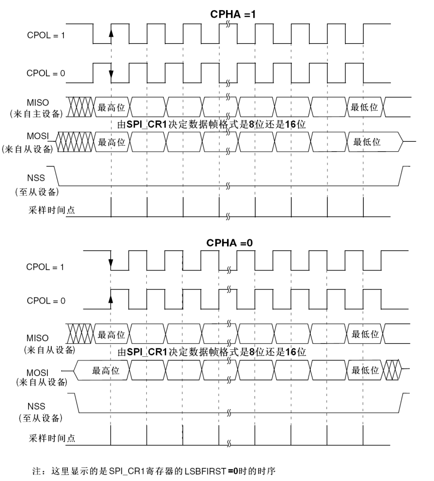
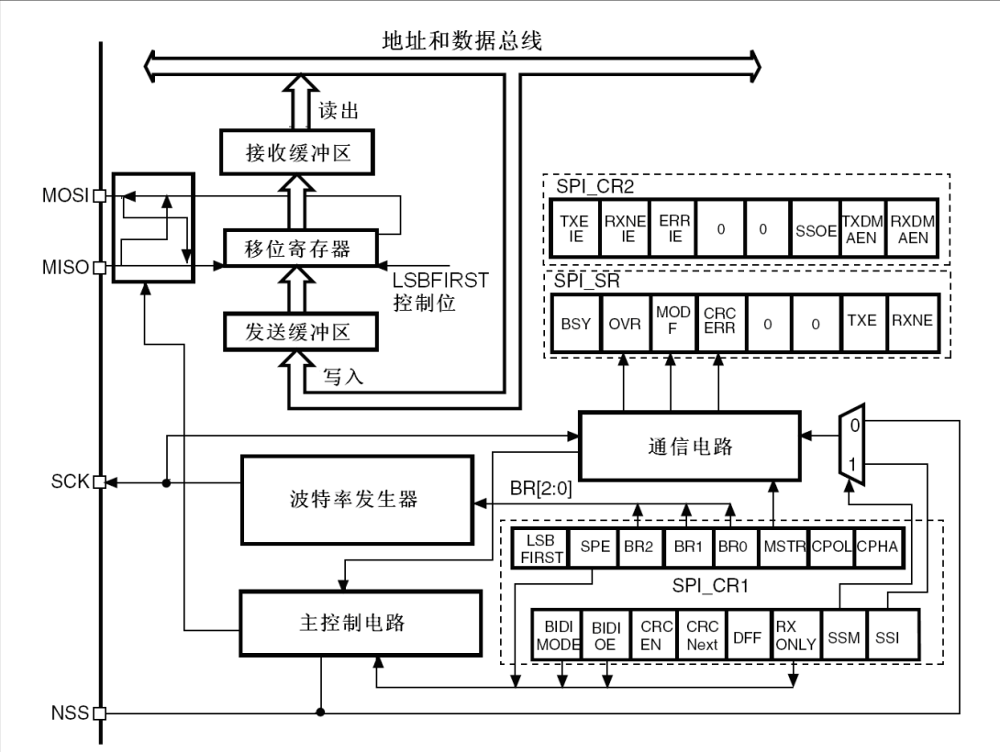
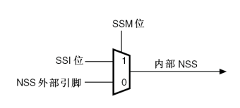

### SPI 简介

SPI（Serial Peripheral Interface，串行外设接口）是一种由摩托罗拉公司开发的同步串行通信协议，主要用于短距离、高速率的芯片间通信。SPI 采用主从（Master-Slave）架构，支持全双工通信，广泛应用于 MCU 与外设（如传感器、Flash、显示屏、ADC/DAC 等）之间的数据交互，本文以 STM32F1 系列的 SPI 接口为例介绍。SPI 总线的主要特点如下：

- **同步通信**：依赖时钟信号同步数据传输，无起始 / 停止位，传输效率高；
- **全双工**：主从设备可同时收发数据；
- **多从机支持**：通过片选（CS/SS）信号实现多个从机挂载；

- **灵活的时钟配置**：支持时钟极性（CPOL）和时钟相位（CPHA）的组合配置，适配不同外设；

- **无地址机制**：通过片选信号指定通信从机，协议简单。

SPI 总线核心引脚（4 线制，部分场景可简化为 3 线）：

| 引脚名称 |         英文全称         |                           功能描述                           |
| :------: | :----------------------: | :----------------------------------------------------------: |
|   SCK    |       Serial Clock       |             时钟信号，由主设备产生，控制通信时序             |
|   MOSI   |   Master Out Slave In    |                  主设备发送、从设备接收数据                  |
|   MISO   |   Master In Slave Out    |                  主设备接收、从设备发送数据                  |
|  CS/SS   | Chip Select/Slave Select | 片选信号，主设备拉低选中对应从机，低电平有效（每个从机都需要一根单独的片选线） |

### 时序

SPI 通信流程如下：

1. 主设备拉低目标从机的 CS 引脚，选中该从机；
2. 主设备产生 SCK 时钟信号，同步发送 / 接收数据：主设备通过 MOSI 逐位发送数据；从设备通过 MISO 逐位返回数据；
3. 通信完成后，主设备拉高 CS 引脚，释放从机。

SPI 的通信时序由 CPOL 和 CPHA 两个参数决定，共 4 种组合模式，使用时需与外设匹配：

- CPOL(时钟极性)位控制在没有数据传输时时钟的空闲状态电平 （0为低电平，1为高电平）。
- CPHA(时钟相位)位控制数据位的采样是在时钟的第几个边沿进行（0为第一个边沿，1为第二个边沿）。

| SPI 工作模式 | CPOL | CPHA | SCL 空闲状态 | 采样边沿 | 采样时刻 |
| ------------ | ---- | ---- | ------------ | -------- | -------- |
| 0            | 0    | 0    | 低电平       | 上升沿   | 奇数边沿 |
| 1            | 0    | 1    | 低电平       | 下降沿   | 偶数边沿 |
| 2            | 1    | 0    | 高电平       | 下降沿   | 奇数边沿 |
| 3            | 1    | 1    | 高电平       | 上升沿   | 偶数边沿 |

{.img-scale-75}

### SPI 接口结构

工作时位移寄存器中的数据按位移出，通过MOSI引脚发送给从机，与此同时从机发来的数据通过 MISO 引脚按位从另一侧移入位移寄存器。当发送给从机的一帧数据从位移寄存器中完全移出后，位移寄存器中刚好接收完成一帧从机发来的数据。此时硬件将这样接收到的数据写入接收缓存区，同时将要发送的下一帧数据从发送缓存区写入位移寄存器。

根据 SPI_CR1 寄存器中的 LSBFIRST 位，输出数据位时可以MSB在先也可以LSB在先。根据 SPI_CR1 寄存器的DFF位，每个数据帧可以是8位或是16位。

NSS是从设备选择引脚，有两种工作模式：

- 软件NSS模式：SSI 为1时引脚处于软件 NSS 模式，此时内部 NSS 连接在SSI位上，SSI 为1时 SPI 工作在主机模式，SSI 为0时 SPI 工作在从机模式，同时 NSS 引脚的 IO 可以剩下来另作他用。
- 硬件NSS模式：SSI 为0时引脚处于硬件 NSS 模式，此时内部 NSS 连接在外部 NSS 引脚上。如果 SPI 外设被设置为从机模式，那么如果检测到外部 NSS 引脚被拉低则知道自己被选中，如果 SPI 外设被设置为主机模式，并且开启了 NSS 输出功能（SSOE=1），那么这个引脚会自动输出低电平，用来控制其他从机。

### 中断种类

| 中断事件           | 事件标志 | 使能控制位 |
| ------------------ | -------- | ---------- |
| 发送缓冲器空标志   | TXE      | TXEIE      |
| 接收缓冲器非空标志 | RXNE     | RXNEIE     |
| 主模式失效事件     | MODF     | ERRIE      |
| 溢出错误           | OVR      | ERRIE      |
| CRC错误标志        | CRCERR   | ERRIE      |

### HAL 库 API 解析

SPI 的发送与接收也是分为阻塞，中断与 DMA 三种方式，与串口不同的是每种方式多了`HAL_SPI_TransmitReceive_xxx()`的方式用于同时进行数据的接收与发送。

SPI 协议中从机只会在时钟边沿采样，时钟信号由主机发出，从机只是被动跟随，信号有多快，信号之间的间隔从机并不关心。在传输过程中如果 HAL 库函数发送完成节数据后没有把CS引脚拉高，这时传输并不算结束但是时钟线上也没有时钟信号，从机会一直等待下一个时钟信号到来再对数据线进行采样，或者是 CS 被拉高通信终止。

### 注意事项

1. **时钟速率匹配**：主设备 SCK 速率需低于外设支持的最大速率（通常外设手册会标注）；
2. **CPOL/CPHA 配置**：必须与外设的 SPI 时序要求一致，否则数据读写错误；
3. **CS 信号控制**：每次通信前拉低 CS，结束后拉高；多从机场景需确保同一时刻仅一个从机的 CS 被拉低；
4. **数据位宽**：根据外设要求配置 8 位 / 16 位数据宽度；
5. **总线冲突**：SPI 无总线仲裁机制，多主设备场景需额外设计冲突避免逻辑；
6. **硬件兼容性**：部分外设仅支持半双工，需配置 `SPI_DIRECTION_1LINE` 模式；
7. **注意大小端**：SPI_CR1寄存器中的LSBFIRST位定义的”MSB在前”还是”LSB在前” 。