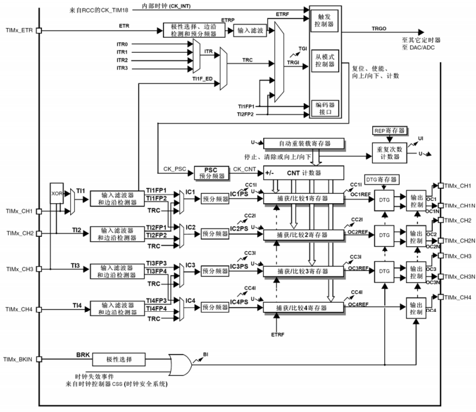
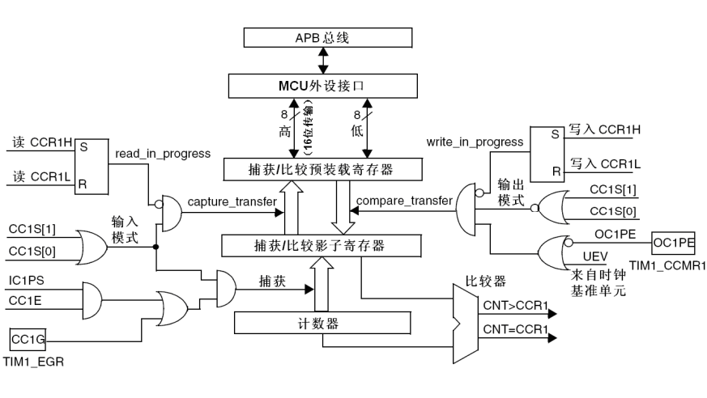
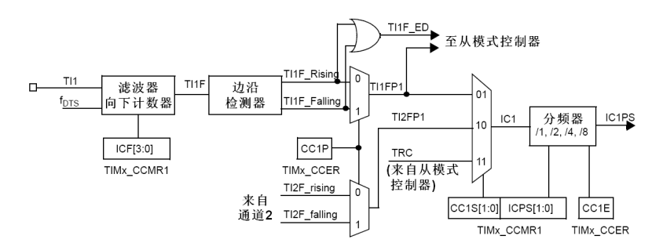
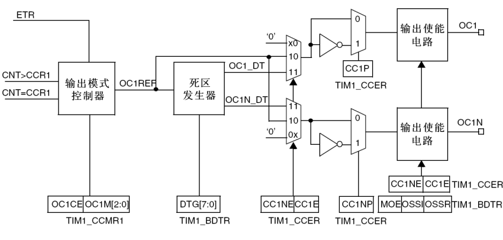
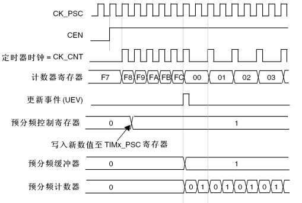
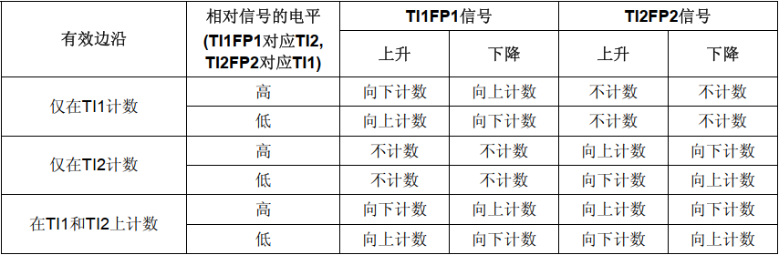

### TIM简介

本文以 STM32F1 系列单片机为例介绍定时器模块。STM32F1 系列单片机的定时器模块被分为以下三类：

| 定时器类型 | 定时器                 | 计数器位数 | 计数模式                | 捕获/比较通道 | 互 补输出 | 应用场景                            |
| ---------- | ---------------------- | ---------- | ----------------------- | ------------- | --------- | ----------------------------------- |
| 基本定时器 | TIM6，TIM7             | 16         | 递增                    | 0             | 无        | 基础定时                            |
| 通用定时器 | TIM2，TIM3，TIM4，TIM5 | 16         | 递 增 、 递减、中央对齐 | 4             | 无        | 测量信号脉宽、产生PWM、定时计数等。 |
| 高级定时器 | TIM1，TIM8             | 16         | 递 增 、 递减、中央对齐 | 4             | 有        | 电机控制、数字电源变换等。          |

### TIM结构

 STM32F1 系列单片机高级定时器结构如下，大体上分为时钟信号输入部分、时基单元、输入捕获和输出比较部分：

名词解释：

- TRGI：Trigger Input（触发输入）
- TI1FP：Timer Input 1Filtered Polarity（仅上升或下降沿计数）
- TI1F_ED：Timer Input 1Filtered Edge Detection（边沿检测，两个边缘均计数）
- IC：Input Capture（输入捕获）
- OC：Output Compare（输出比较）

#### 时基单元

时钟源有以下选择：

- 内部时钟(CK_INT)：APB 总线时钟经过定时器内部倍频/分频后的时钟。
- 外部时钟模式1：用通道（TI1 和 TI2）引脚上信号的边沿做时钟，计数外部脉冲。
- 外部时钟模式2：使用专用的 ETR 引脚作为定时器时钟。
- 内部触发输入(ITRx)：每根线连接某个定时器的 TRGO，使用一个定时器作为另一个定时器的预分频器。

时基单元通过对时钟信号进行计数来实现计时，包含以下部分：

- 计数器寄存器(TIMx_CNT)：存放计数值。
- 预分频器寄存器 (TIMx_PSC)：设置对时钟源进行的几分频。
- 自动装载寄存器 (TIMx_ARR)：向上计数时计数到ARR的大小后归零。
- 重复次数寄存器 (TIMx_RCR)：用于设置溢出几次才会发生更新事件。

#### 输入捕获/输出比较

TI1-TI4 这四个通道用于实现定时器的输入捕获/输出比较功能。

- 输入捕获：通过分别记录 TI 通道上输入信号上升沿与下降沿来临时 CNT 值从而测量输入信号持续的时间。
- 输出比较：通过对比 CNT 值与捕获/比较寄存器的值来决定输出信号的电平。

下图是捕获/比较的主电路，当发生`capture_transfer`和`compare_transfer`时预装载寄存器与影子寄存器会发生数据更新（传递方向由箭头所示），发生条件是相连接的与门输出为真。在输入捕获模式下，当满足输入捕获的条件时会将计数器中的值自动锁入影子寄存器，未使用预装载寄存器（OCxPE=’0’）软件写入 CCRx 就更新，OCxPE=’1’ CCRX的影子寄存器只能在发生下一次更新事件时被更新；而输出比较模式下，比较器会一直比较计数器与影子寄存器的值满足条件后就会输出信号到输出模式控制器。

输入捕获通道（通道1）如下图所示，外部信号从 TI1 输入经过滤波器输入到边沿检测器中，输出信号的上边沿和下边沿，再经过选择器从 TI1 和 TI2 的上升沿和下降沿信号中选择一个作为 IC1 信号，最后通过分频器得到输入捕获信号。

输出比较通道（通道1至3）如下图所示，捕获/比较的主电路中比较器输出的信号会输入到输出模式控制器当中，进而输出OC1REF（输出比较参考信号）。OC1REF信号可以选择直接作为输出信号或者进入死区发生器，最终通道会输出OC1和OC1N（N = Negative），这个两个信号作为互补输出通常设置为相反极性，用以驱动半桥/全桥电路。驱动半桥/全桥时由于MOS管关闭需要时间，上管刚关、下管就立刻开有可能上下管同时导通导致烧管，因此需要死区发生器在两个信号间插入死区时间保证上下管不会同时打开。

#### 更新事件

更新事件（UEV）发生时，定时器中**带有缓冲/影子**的寄存器的值会真正更新生效（例如：预装载寄存器的值会在更新事件发生时写入自动装载影子寄存器，从而真正更新重装载值），同时会将更新中断标志位置位（UIF）并产生更新中断/更新DMA请求。以下两种情况会发生更新事件：

- 硬件自动产生：每次计数器溢出时会产生更新事件。如果使用了重复计数器功能，在计数次数达到设置的重复计数次数时，产生更新事件。
- 软件手动产生：在 TIMx_EGR 寄存器中置UG位也可以产生一个更新事件。

下图是更新事件发生时，预分频器的缓冲区被置入预装载寄存器的值的时序图：

### 主要模式

PWM 输入模式：使用两路通道测量PWM信号的周期和占空比，一路通道用上升沿捕获+复位计数得周期，另一路用下降沿捕获得高电平宽度，两次捕获共享同一个计数器。

PWM输出模式：相较于一般 OC 只在比较点执行动作，PWM模式由TIMx_ARR寄存器确定频率、由TIMx_CCRx寄存器确定占空比，在 CNT < ARR 时通道输出一种电平，在 CNT > ARR 时输出另一种电平从而产生 PWM，还有中心对称模式用于输出每个周期波形都中心对称的 PWM。

- PWM模式1－ 在向上计数时，一旦TIMx_CNT<TIMx_CCR1时通道1为有效电平，否则为无效电平；在向下计数时，一旦TIMx_CNT>TIMx_CCR1时通道1为无效电平(OC1REF=0)，否则为有效电平(OC1REF=1)。
- PWM模式2－ 在向上计数时，一旦TIMx_CNT<TIMx_CCR1时通道1为无效电平，否则为有效电平；在向下计数时，一旦TIMx_CNT>TIMx_CCR1时通道1为有效电平，否则为无效电平

编码器接口模式：两个输入TI1和TI2被用来作为增量编码器的接口。

强置输出模式：定时器正常运行，通道输出有效电平或无效电平由软件设定。

单脉冲输出模式：定时器只运行一个周期，输出单个脉冲就停止。