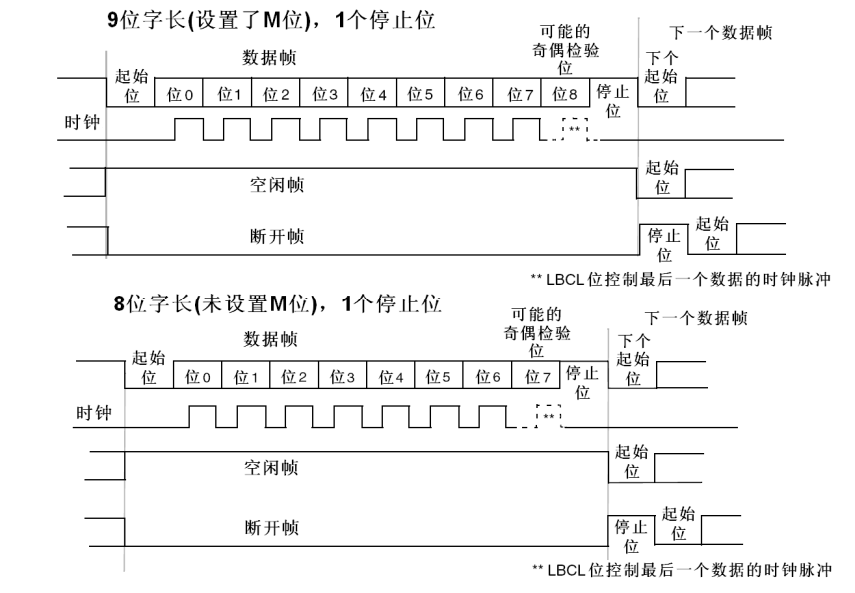
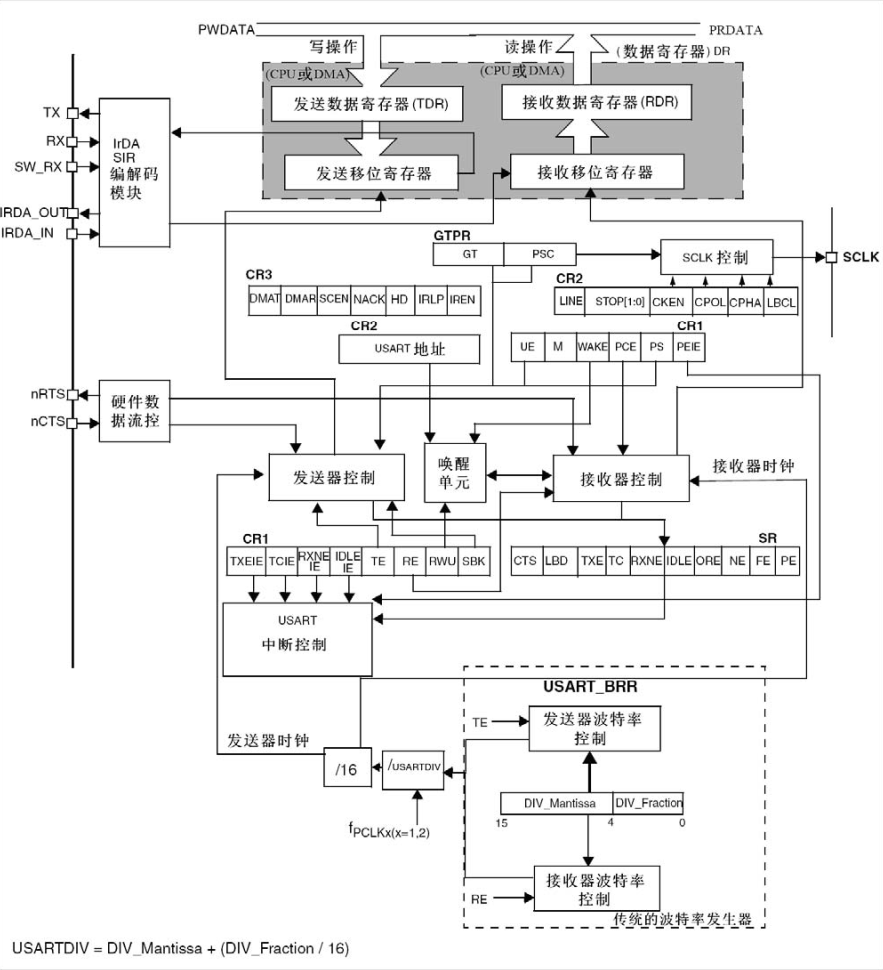

### USART简介

本文以 STM32F1 系列为例介绍通用同步异步收发器(USART)  。该外设用于实现串口通信，分为以下两种类型：

- **UART（通用异步收发传输器）**：仅支持异步通信，无需时钟同步，依靠波特率、数据位、停止位、校验位等参数保证通信同步。
- **USART（通用同步异步收发传输器）**：兼容 UART 所有功能，额外支持同步通信（需 SCLK 时钟线），两者除了同步功能外没有区别，下文以 USART 为例介绍。

USART 支持多种工作模式：

- 全双工的，异步/同步串行通信 。
- IRDA红外数据组织) SIR 编码器解码器。
- 智能卡模拟功能。
- LIN(局部互连网)  。

对于全双工，异步串行通信，USART只需保证通信双方帧格式相同，波特率一致，即可通过三根线完成通信：

- TX：发送数据输出，接对方 RX 引脚。不发送数据时，TX引脚处于高电平。  
- RX：接收数据串行输入，接对方 TX 引脚。通过过采样恢复数据。  
- GND：通信双方GND相连，保证通信双方共地排除干扰。


### 帧格式

在空闲状态下总线维持高电平（逻辑1），有三种帧格式：

- 数据帧：起始位为持续一位时长的低电平，停止位为持续一位时长的高电平，中间是八位数据位（九位模式多一位奇偶校验位）。
- 空闲帧：连续一帧数据均为高电平（包括起始位与终止位）则为空闲帧，收到空闲帧会触发空闲事件，将空闲标志位置位。
- 断开帧：连续一帧数据均为低电平（包括起始位与终止位）则为断开帧，硬件会将帧错误标志位置位。



### USART结构

发送数据时仅需将数据写入 TDR 寄存器，硬件自动将 TDR 寄存器内容放入发送位移寄存器中然后按位发送出去。当接收位移寄存器接收到一帧数据后硬件会自动写入 RDR 寄存器，只需将 RDR 寄存器中的数据读出即可。

- CK：发送器时钟输出。此引脚输出用于同步传输的时钟， (在Start位和Stop位上没有时钟脉冲，软件可选地，可以在最后一个数据位送出一个时钟脉冲)。。
- IrDA_RDI: IrDA模式下的数据输入。
- IrDA_TDO: IrDA模式下的数据输出。
- nCTS: 清除发送，若是高电平，在当前数据传输结束时阻断下一次的数据发送，用于硬件流控。
- nRTS: 发送请求，若是低电平，表明USART准备好接收数据，用于硬件流控。



### 中断类型

USART 中断事件如下表所示，以 USART1 为例，启用其中断后下列事件发生时，如果对应使能位为1则会触发中断（使能位初始为0），使 CPU 跳转到`USART1_IRQHandler` 执行中断服务函数。

| 中断事件                                 | 事件标志                                   | 使能位 |
| ---------------------------------------- | ------------------------------------------ | ------ |
| 发送数据寄存器空                         | TXE （对USART_DR的写操作，硬件将该位清零） | TXEIE  |
| CTS标志                                  | CTS                                        | CTSIE  |
| 发送完成                                 | TC                                         | TCIE   |
| 接收数据就绪可读                         | TXNE                                       | TXNEIE |
| 检测到数据溢出                           | ORE                                        | TXNEIE |
| 检测到空闲线路                           | IDLE                                       | IDLEIE |
| 奇偶检验错                               | PE                                         | PEIE   |
| 断开标志                                 | LBD                                        | LBDIE  |
| 噪声标志，多缓冲通信中的溢出错误和帧错误 | NE或ORT或FE                                | EIE    |


### 收发方式

HAL 库为串口通信提供了三种接收发送方式，下面以发送情况为例介绍：

- 阻塞式收发：每当 TDR 寄存器为空时，CPU 就将要发送的数据写入 TDR 寄存器。当 TDR 寄存器非空时（USART 正在发送当前数据），CPU 一直阻塞式等待，直到 USART 将所有数据发送完毕才会执行后续程序。
- 中断式收发：每当 TDR 寄存器为空时触发 TXE 中断，此时在`HAL_UART_IRQHandler`中会调用私有函数`UART_Transmit_IT`使 CPU 将要发送的数据写入 TDR 寄存器。当 TDR 寄存器非空时，CPU 可以去执行其他内容而不必一直阻塞。如果重写了`HAL_UART_TxHalfCpltCallback`和`HAL_UART_TxCpltCallback`，`HAL_UART_IRQHandler`就会在数据发送一半和完成时调它们。
- DMA 式收发：每当 TDR 寄存器为空时 USART 会向 DMA 发送请求(TXEIE=0，DMAT=1，不会触发 TDR 寄存器为空中断)，使 DMA 将要发送的数据从内存搬入 TDR 寄存器，这就完全解放了 CPU 可以去执行其它内容。同时将 UART 私有函数`UART_DMATransmitCplt`注册为 DMA 的传输完成回调函数，在 DMA 传输完成之后使能 TC 事件。

接收也是这三种模式与发送相近不再展开，但是原本的接收函数直到接收到指定数量的数据后或者等待超时后才会停止，为了解决接收数据长度预先不确定的问题，HAL 库提供了三个函数，这三个函数除了上述两个停止条件外，接收到空闲帧（意味着发送停止）也停止：

- `HAL_UARTEx_ReceiveToIdle`：发生空闲事件时会跳出接收等待停止阻塞，通过`RxLen`参数返回接收到的数据长度。
- `HAL_UARTEx_ReceiveToIdle_IT`：发生空闲事件时会启用 IDLE 中断，`HAL_UART_IRQHandler`会调用`HAL_UARTEx_RxEventCallback`将接收到的数据长度返回给用户。
- `HAL_UARTEx_ReceiveToIdle_DMA`：发生空闲事件时会启用 IDLE 中断，`HAL_UART_IRQHandler`会关闭 DMA 同样调用`HAL_UARTEx_RxEventCallback`将接收到的数据长度返回给用户。


### HAL 库句柄

UART 句柄结构体：该结构体是 HAL 库操作 UART 的核心，包含外设基地址、配置参数、缓冲区、状态信息、回调函数等。

```c
typedef struct __UART_HandleTypeDef
{
  USART_TypeDef                 *Instance;        /*!< UART寄存器基地址        */
  UART_InitTypeDef              Init;             /*!< UART通信参数配置结构体  */
  uint8_t                       *pTxBuffPtr;      /*!< 指向UART发送传输缓冲区的指针 */
  uint16_t                      TxXferSize;       /*!< UART发送传输的总数据长度    */
  __IO uint16_t                 TxXferCount;      /*!< UART发送传输的剩余数据计数器 */
  uint8_t                       *pRxBuffPtr;      /*!< 指向UART接收传输缓冲区的指针 */
  uint16_t                      RxXferSize;       /*!< UART接收传输的总数据长度    */
  __IO uint16_t                 RxXferCount;      /*!< UART接收传输的剩余数据计数器 */
  DMA_HandleTypeDef             *hdmatx;          /*!< UART发送DMA句柄参数        */
  DMA_HandleTypeDef             *hdmarx;          /*!< UART接收DMA句柄参数        */
  HAL_LockTypeDef               Lock;             /*!< 锁对象（用于多任务/中断下的资源保护） */
  __IO HAL_UART_StateTypeDef    gState;           /*!< UART全局状态信息 */
  __IO HAL_UART_StateTypeDef    RxState;          /*!< UART接收操作状态信息 */
  __IO uint32_t                 ErrorCode;        /*!< UART错误码 */
#if (USE_HAL_UART_REGISTER_CALLBACKS == 1)
  void (* TxHalfCpltCallback)(struct __UART_HandleTypeDef *huart);        /*!< 发送完成一半回调 */
  void (* TxCpltCallback)(struct __UART_HandleTypeDef *huart);            /*!< 发送完成回调 */
  void (* RxHalfCpltCallback)(struct __UART_HandleTypeDef *huart);        /*!< 接收完成一半回调 */
  void (* RxCpltCallback)(struct __UART_HandleTypeDef *huart);            /*!< 接收完成回调 */
  void (* ErrorCallback)(struct __UART_HandleTypeDef *huart);             /*!< 错误回调 */
  // 其他回调函数省略
#endif
} UART_HandleTypeDef;
```

UART 初始化结构体：用于配置 UART 核心通信参数。

```c
typedef struct
{
  uint32_t BaudRate;                  /*!< 波特率 */
  uint32_t WordLength;                /*!< 字长（UART_WORDLENGTH_8B/9B） */
  uint32_t StopBits;                  /*!< 停止位（UART_STOPBITS_1/1_5/2） */
  uint32_t Parity;                    /*!< 校验位（UART_PARITY_NONE/ODD/EVEN） */
  uint32_t Mode;                      /*!< 模式（UART_MODE_TX/RX/TX_RX） */
  uint32_t HwFlowCtl;                 /*!< 硬件流控（UART_HWCONTROL_NONE/RTS/CTS/RTS_CTS） */
  uint32_t OverSampling;              /*!< 过采样（UART_OVERSAMPLING_16/8，仅部分芯片支持8倍） */
} UART_InitTypeDef;
```

