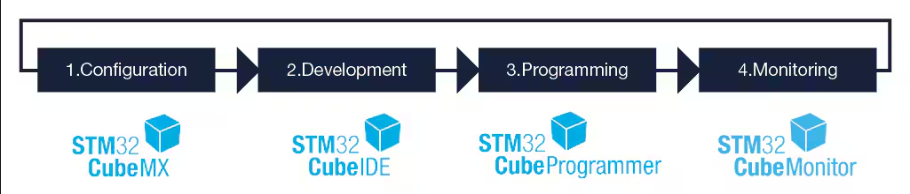
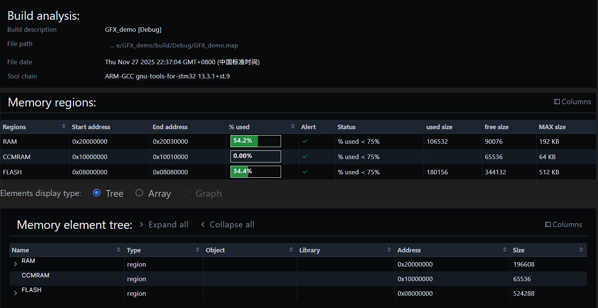
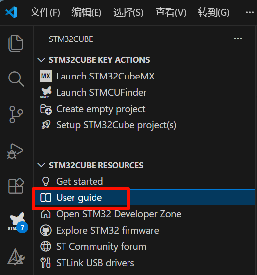

## Keil MDK

Keil MDK（[下载地址](https://www.keil.com/download/product/)）是 arm 公司一款经典且强大的嵌入式 IDE，它支持包括STM32在内的大多数 Cortex-M 系列微控制器的开发，集成了强大的编译器（5.36版本之后不提供AC5编译器），调试器与包管理工具，能够一站式完成代码的编写，编译，与调试。缺点是仅支持 Windows 平台，且界面复古，代码提示落后。详细操作见[用户指南](https://developer.arm.com/documentation/101407/0540)。

{.img-scale-50}

## EIDE

 [Embedded IDE](https://em-ide.com/zh-cn/docs/intro/)是一个 VScode 插件，能够用于STM32，8051等单片机开发。具有现代的 UI 与智能的代码提示，支持跨平台，一键导入Keil项目，支持多种开发工具等优点。但插件本身并不集成编译器，需要自行下载配置工具链，针对 STM32 的调试基于[Cortex-Debug](https://github.com/Marus/cortex-debug)。

## STM32Cube

STM32Cube 是 ST 公司为 STM32 打造的软件生态，用以给 ST 的 MCU 和 MPU 提供完整[软件解决方案](https://www.st.com/content/st_com/en/stm32-mcu-developer-zone/software-development-tools.html)。

-  [**ST MCU Finder**](https://www.st.com/en/development-tools/st-mcu-finder-pc.html)**：**STM32和STM8产品线的选型工具。
-  [**STM32CubeMX**](https://www.st.com/en/development-tools/stm32cubemx.html)**：**图形化配置工具。
-  [**STM32CubeIDE**](https://www.st.com/en/development-tools/stm32cubeide.html)**：**ST家的集成开发工具IDE。
- [**STM32CubeProgrammer**](https://www.st.com/en/development-tools/stm32cubeprog.html)**：** 支持图形化和命令行的烧录工具。
- [**STM32CubeMonitor**](https://www.st.com/en/development-tools/stm32cubemonitor.html)**：** 监测工具套装。

### STM32CubeMX

STM32CubeMX（[下载地址](https://www.st.com/stm32cubemx) ）是一种图形工具，能给通过图形化的方式配置生成初始化C代码，能够集成FreeRTOS，TouchGFX等中间件。6.10版本之前需要提前安装[Java运行库](https://www.java.com/zh_CN/download/windows-64bit.jsp) ，之后的版本内置了一个 JRE 无需额外安装。

- Help 选项卡下的 Help 选项是对用版本CubeMX使用说明。
- Help 选项卡下的 Embedded S0ftwa re Packages Manager 可用于下载固件库与各类第三方库。
- Help 选项卡下的 Connection & Updates 用于设置固件下载路径，固件更新检查设置，和代理设置。

### STM32Cube for VS Code

STM32Cube for VS Code 是一个 VS Code 插件。具有以下特点：

- 使用开源工具链。
- 具有智能代码导航、代码补全、AI辅助。
- 基于 CMake 和 Ninja 的构建系统。
- 支持 ST-LINK 和 JLink 调试器。
- 与 STM32Cube 中其他软件高度适配程度。
- 具有图形化的 .map 文件分析工具。

缺点是软件仍在开发阶段并不成熟。详细操作见用户指南：

{.img-scale-50}

[STM32CubeIDE for VS Code配置](https://shequ.stmicroelectronics.cn/thread-868922-1-1.html)
