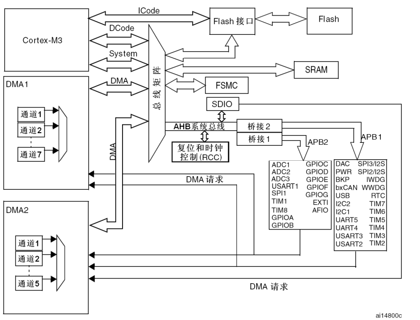
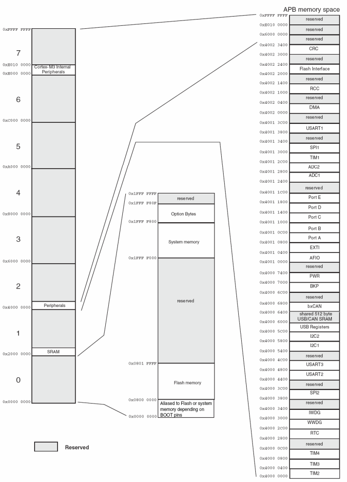
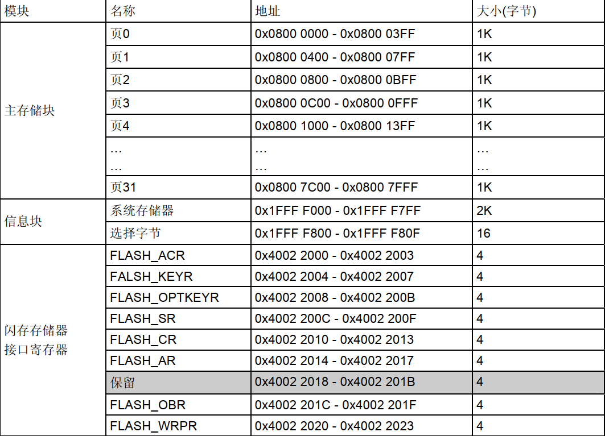
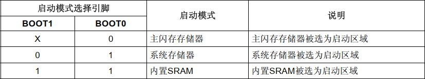
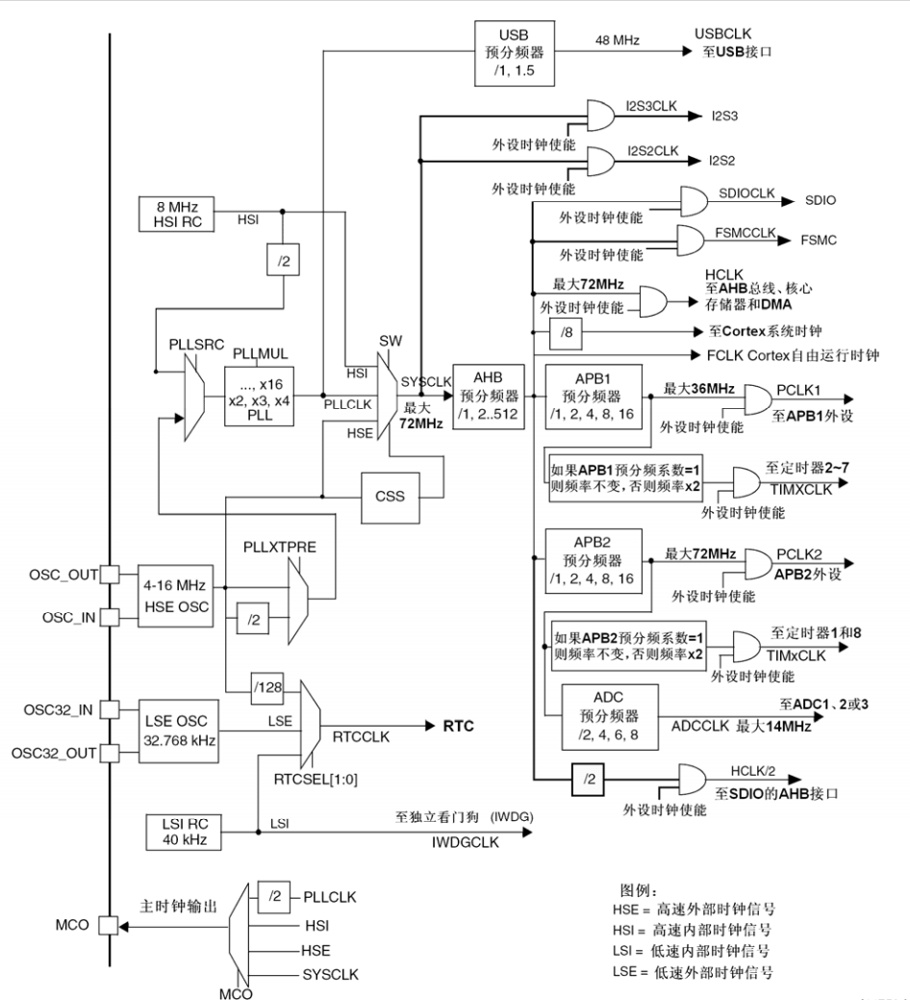
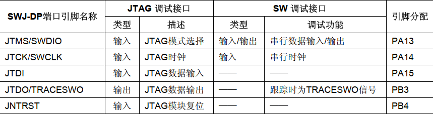
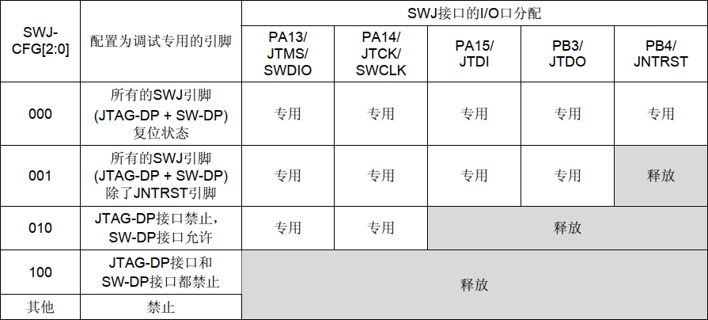

本文以 STM32F10xx 系列为例介绍STM32单片机的系统架构。

### 系统构架  

STM32F10xx 系列MCU的系统架构如下图所示：



主要组成部分有：

- 内核：STM32F10xx 系列使用32位精简指令集的Cortex-M3内核，相当于计算机的CPU，执行指令并进行数据运算。
- DMA：负责通过总线矩阵进行数据搬运，减轻内核负担。
- ICode总线：与闪存指令接口相连接，用于指令预取。  
- DCode总线：与总线矩阵相连接，用于常量加载（从 FLASH 读取），SRAM的读写和调试访问。  
- 系统总线：与总线矩阵相连接，用于访问外设，系统控制和中断向量表的读取。
- 总线矩阵：总线矩阵协调内核系统总线和DMA主控总线之间的访问仲裁，仲裁利用轮换算法。
- AHB/APB总线桥：所有外设挂载在两条高级外设总线（APB）上，由这条总线控制并提供时钟信号，其中APB1操作速度限于36MHz， APB2操作速度限于72MHz。这两根总线通过AHB总线连接在总线矩阵上。

### 存储器映像

STM32 单片机的逻辑寻址空间是2的32次幂也就是`4GB`，这`4GB`空间部分被分配给了 ram，flash 和外设寄存器，还有绝大部分保留未用。对于STM32F10xx 系列地址映射如下图所示：



#### SRAM

SRAM的起始地址是`0x2000 0000`，对于 STM32F10xxx 系列该地址之后64K字节都是静态SRAM。可以以字节、半字(16位)或全字(32位)访问 ，可用作C语言的堆栈空间。    

#### 位段

存储器映像包括两个位段区。

```c
// 区域1：SRAM位段区
#define SRAM_BB_REGION_BASE    0x20000000  // SRAM起始地址
#define SRAM_BB_REGION_END     0x200FFFFF  // 前1MB SRAM，实际只有64KB内存

// 区域2：外设位段区  
#define PERIPH_BB_REGION_BASE  0x40000000  // 外设起始地址
#define PERIPH_BB_REGION_END   0x400FFFFF  // 前1MB外设
```

别名区中的每个字（32bit）映射到位段存储器区的一个位，在别名区写入一个字具有对位段区的目标位执行读-改-写操作的相同效果。别名区中的每个字通过下面公式映射到位带区的相应位： 

`bit_word_addr = bit_band_base + (byte_offset× 32) + (bit_number× 4)`

- bit_word_addr是别名存储器区中字的地址，它映射到某个目标位。
- bit_band_base是别名区的起始地址。
- byte_offset是包含目标位的字节在位段里的序号。
- bit_number是目标位所在位置(0-31)。

在STM32F10xxx里，外设寄存器和SRAM都被映射到一个位段区里。

```c
/* 计算公式：别名地址 = 0x22000000 + (字节偏移×32) + (位号×4) */

// 别名区1：SRAM位段别名区
#define SRAM_BB_ALIAS_BASE     0x22000000  // SRAM别名区起始

// 别名区2：外设位段别名区
#define PERIPH_BB_ALIAS_BASE   0x42000000  // 外设别名区起始
```

STM32单片机最小内存访问单元为32位，因此通过别名区改写位段区中的位保证了操作的原子性，不会被中断打断。同时别名区的地址为逻辑地址并不对应实际存储空间，因此也没有造成存储空间的浪费。

```assembly
#传统方法需要3步（非原子性）：
LDR R0, [R1]     ; 1. 读取整个字
ORR R0, R0, #0x20; 2. 修改特定位
STR R0, [R1]     ; 3. 写回整个字
#如果在第1步和第3步之间发生中断，可能数据不一致

#位段方法只需要1步（原子性）：
LDR R0, =0x42210194  ; 加载位段别名地址
MOV R1, #1
STR R1, [R0]         ; 单指令完成位设置
#这条STR指令执行时不会被中断打断
```

#### Flash

Flash 模块一般由主存储模块、信息块、存储器接口寄存器三部分组成。

- 主存储块的起始地址为`0x08000000`，不同型号大小不同用于存放中断向量，烧录的代码等。
- 信息块包含系统存储器和选项字节两部分。系统存储器存放了Bootloader代码与设备ID，Bootloader 用于通过USART/USB/SPI/I2C下载程序，系统引导选择，系统保护功能。而选项字节通常包含读保护、写保护 、看门狗配置、复位配置。
- 接口寄存器用于控制和配置Flash操作。



#### 启动配置

在系统复位后，SYSCLK的第4个上升沿， BOOT引脚的值将被锁存。用户可以通过设置BOOT1和BOOT0引脚的状态，来选择在复位后的启动模式。CPU 从地址`0x0000 0000`获取堆栈顶的地址，并从`0x0000 0004`地址开始执行代码，不同的启动模式下将不同地址的位置映射到`0x0000 0000`地址。



### 时钟

#### RCC

RCC（Reset and Clock Control）是时钟和复位控制模块。它负责管理系统时钟的生成和分配，以及控制外设的复位和时钟开启/关闭，通过RCC配置，开发者可以优化STM32的性能和功耗，确保系统在不同工作条件下稳定运行。

RCC的主要功能包括：

- 时钟源选择：RCC可以选择不同的时钟源，比如内部振荡器、外部晶振等。

- 时钟配置：可以配置主时钟、外设时钟等，以满足不同外设的工作频率需求。
- 复位控制：RCC可以对各个外设进行复位，确保在系统初始化时外设处于已知状态。
- 时钟使能/禁用：动态地开启或关闭外设的时钟，以节省功耗。

#### 时钟源

有四个时钟源：

- HSE：外部高速时钟，一般为外部晶体/陶瓷谐振器或者用户外部时钟提供。
- LSE：外部低俗时钟，32.768kHz低速外部晶体提供，经过`2^15`分频为1HZ。
- HSI：内部高速时钟，由内部8MHz的RC振荡器产生。
- LSI：内部低俗时钟，时钟频率大约40kHz并不精准。

HSE，HSI 和经过锁相环倍频的两者通常用作驱动系统时钟。例如F1系列就可以使用 HSE 通过锁相环倍频得到72MHZ（8MHZ*9）的系统时钟。LSE，LSI可用于驱动独立看门狗和通过程序选择驱动RTC（Real-Time Clock）。当不被使用时，任一个时钟源都可被独立地启动或关闭，由此优化系统功耗。

  

- SYSCLK：内核时钟，由时钟源倍频得到。
- HCLK：AHB总线时钟，由SYSCLK分频得到。
- PCLK1/2：APB1/2时钟，由HCLK分频得到。
- Systisk：系统节拍定时器，一般为 HCLK/8。
- 定时器时钟：如果相应的APB预分频系数是1，定时器的时钟频率与所在APB总线频率一致。否则，定时器的时钟频率被设为与其相连的APB总线频率的2倍。

### 调试支持

STM32 支持两种调试接口 SWD，JTAG。两种调试接口复用为SWJ调试端口(serial wire and JTAG)，该端口可在两种调试接口之间转换。STM32F10xxx的5个普通I/O口可用作SWJ-DP接口引脚。  



可通过配置寄存器来释放一些引脚为普通 IO。


