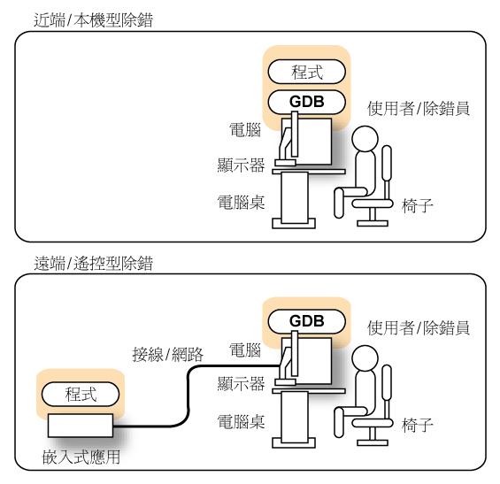
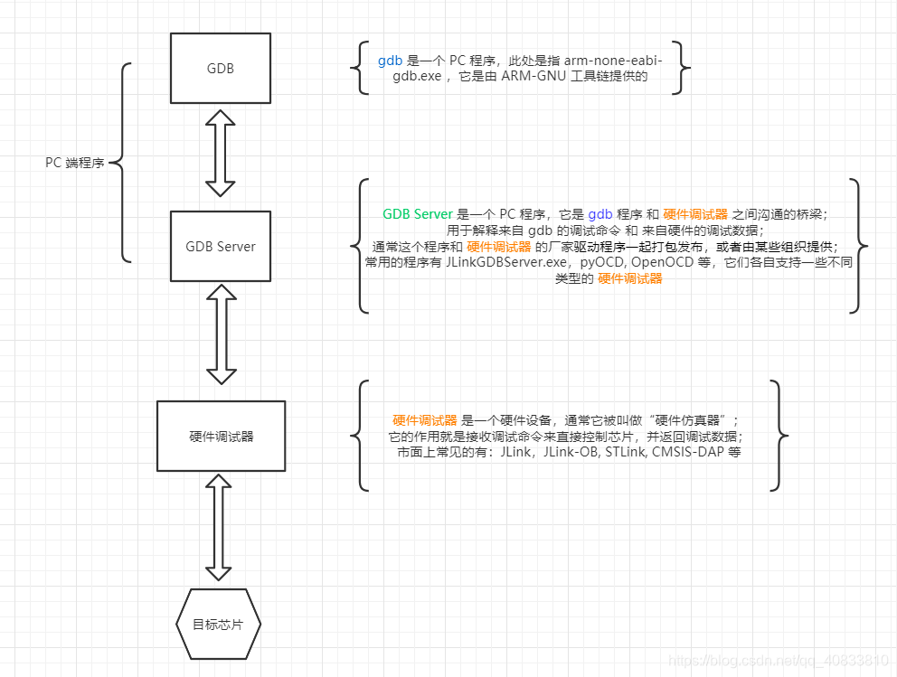
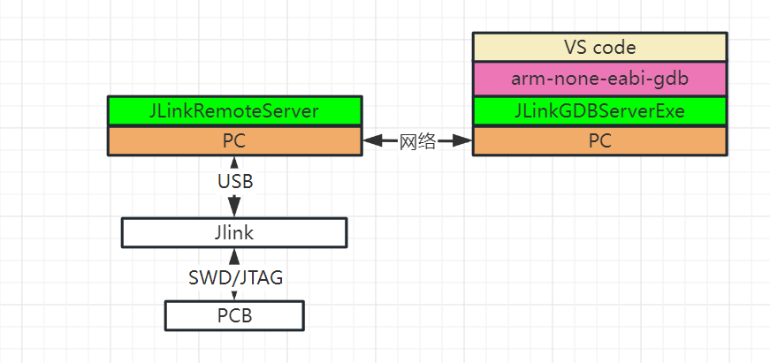
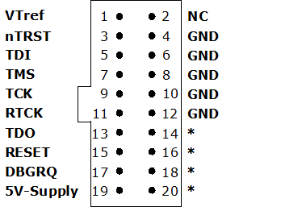
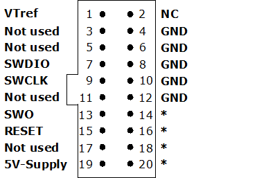
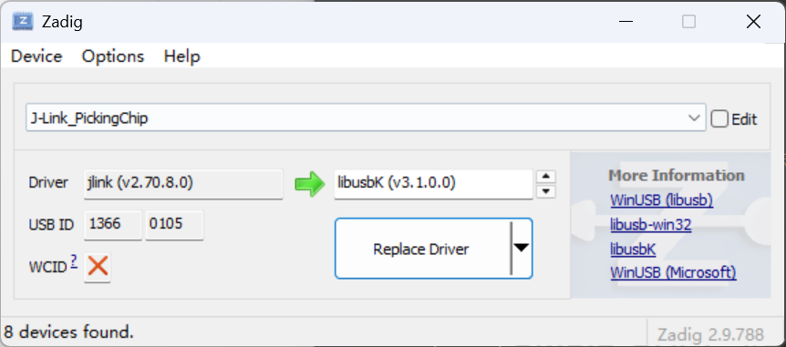
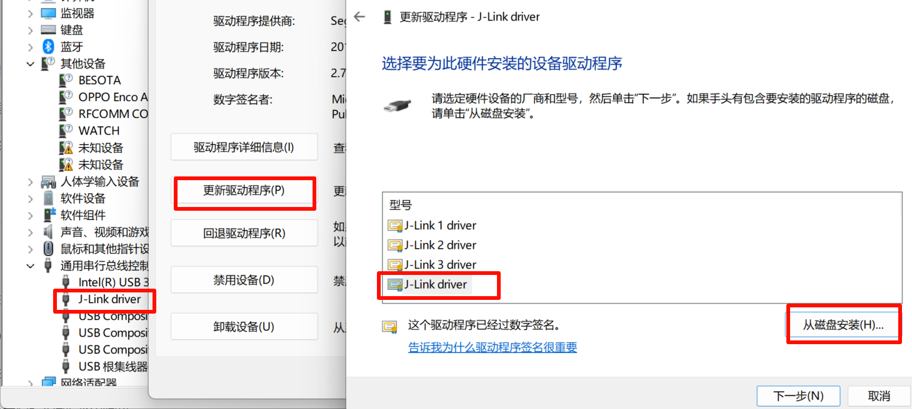

## GDB


> GDB 的吉祥物，一条 “射水鱼”。擅长射出水柱击落岸边植物上的昆虫（Bug）。

### What's GDB?

[GNU symbolic debugger](https://sourceware.org/gdb/current/onlinedocs/gdb.html/)，一个符号式命令行调试器。所谓“符号式" (symbolic) ，意思是在执行程序时，可以使用在源代码中对变量和函数定义的名称，引用这些变量和函数。为了显示和翻译这些名称，调试器需要程序中变量类型和函数类型的相关信息，以及可执行文件中哪条命令对应到源文件中哪行代码的信息。这类信息以符号表（ symbol table ）的形式出现，当使用`- g` 选项进行编译和链接时，将生成符号表，符号表被包含在可执行文件中：

```bash
$ gcc -g gdb—example. c	#在由多个源文件组成的大型程序中，必须在编译每个模块时都使用`-g` 选项。
```

 

### [GDB工作原理](https://www.cnblogs.com/sewain/articles/14131927.html)

GDB有两种工作模式，本地调试和远程调试。如下图所示，本地调试的目标程序与GBD运行在同一设备上，远程调试中两者运行在不同的设备上通过网络或者线路进行连接从而调试。



本地调试分为直接调试和附加调试两种，直接调试先启动 GDB 进程再将目标程序作为GDB进程的子进程启动，从头开始调试目标程序。而附加调试则将 GDB 进程绑定到正在运行的目标程序上，可以调试正在运行的程序。

### GDB ?启动 ！

在 shell 命令提示符中输人 gdb 命令就可以启动 GDB 。 GDB 支持许多命令行选项与参数：

```bash
$gdb [options] [executable_file [core_file | process_id]] 
```

参数解析：

1. **[options]** :可选的操作选项，常用的如下

   - -verslon 、-v:

     GDB 在控制台上输出它的版本和版权信息，然后退出，不会启动任何调试过程。

   - --quiet 、-silent:

     GDB 启动一个交互式的调试过程，不显示版本和版权信息。

   - --help 、 -h:

     GDB 显示它的命令行语法，它简要地描述所有的选项，然后退出，不会启动任何调试过程。

   - -args:

     使用 --args 选项，启动一个调试会话，将命令行参数传人到被 GDB 加载用来的调试程序中。

     在下例中， myprog 是被调试程序：

     ```bash
     $ gdb --args myprog -d "$HOME" #这里的 -d和“$HOME”都是myprog的参数
     ```

     一 args 选项后面必须紧接着被调试程序。该命令由被调试程序名称以及它的参数组成，参数的次序与不采用 GDB 调试而是正常执行该程序时的次序一样。 --args 必须是 GDB最后出现的选项。

   - -symbols filename 、 -S filename:

     如果调试符号表没有被包含在可执行文件中，可以使用-symbols 选项加载一个单独的符号表文件。 GDB 会从指定的文件中读取符号表信息。

   - -exec fllename 、 -e fllename:

     指定要被调试的可执行文件。

   - -se fllename:

     所指定的文件是希望使用 GDB 测试的可执行文件，并包括了符号表。这个选项通常不是必须的，如果 GDB 命令行包含了一个文件名，并且该文件名并非任何选项的参数，那么 GDB 会将首个出现的文件名视为-se 选项的参数。

   - -tty device 、 -t device:

     调试器使用 device 作为被调试程序的标准输人和输出流。在下面的示例中，程序myprog 的标准 I / O 流会输出到终端/ dev/tty5。

     ```bash
     $ gdb myprog -t /dev/tty5
     ```

2. **[executable_file]**: 要调试的可执行文件的路径。这个文件通常是你编译的程序。

3. **[core_file]**: （可选）核心转储文件，包含程序崩溃时的内存状态，通常用于分析程序错误。

   调试核心文件（core file）是指在程序异常崩溃时生成的文件，包含了程序在崩溃时的内存状态和其他重要信息。通过分析这个文件，可以用来定位和修复潜在的问题。

4. **[process_id]**: （可选）正在运行的进程的 ID，可以用于附加调试已在运行中的程序。

下面的命令将直接启动调试器，不显示启动信息：

```bash
$ gdb -silent #该命令没有指定要调试的文件，可使用file命令指定可执行文件
```

### GDB的常用命令

- l : list 列出程序源码，一般展示十行，将要执行的那一行在中间。显示指定文件的指定行`list fllename:line number`。

- b : break 加上行号，在该行下断点。也可以打条件断点`break [position] if expression`。

- d :delete 不带参数会删除所有的断点，带上断点的编号只会删除指定的断点。

- i：info breakpoints 显示所有断点。

- r : run 运行到断点，嵌入式远程调试中使用 continue 。

- n : next 单步调试，执行一整行代码。

- s : step 如果这一条程序包含函数，则会运行进去，在函数内的第一条语句中断程序执行。

- p : print 加上变量名，会显示出变量的值（GDB 的 print 命令输出具有 $number=value的格式）

## 嵌入式调试

### 调试原理

嵌入式调试就属于远程调试，目标程序运行的在嵌入式设备上而调试程序运行在 PC 上。而嵌入式调试又分为两种情况，通常情况下嵌入式设备通过调试器与 PC 物理连接， PC 上运行的 GDB Server 作为 GDB 与调试器的桥梁，同时与调试器和 GDB 交互，将调试器反馈的数据上报给 GDB ，将 GDB 的调试指令发送给调试器，进而调试嵌入式设备上的目标程序。



而在另一种情况下，运行调试程序的 PC 并不直接与嵌入式设备物理连接，而是通过网络与直接连接调试器的 PC 交互。以使用 J-Link 为例这一交互是通过本地 PC 运行 J-LinkGDBServer 程序（充当GDBServer的角色）和远程 PC 运行 J-LinkRemoteServer 程序实现的。不过在GDB看来上述两种调试情况并没有区别，因为它仅与 GDBServer 交互。



### 调试接口

JTAG 和 SWD 两者均为下载调试的协议，具有配套的硬件接口。

JTAG（Joint Test Action Group）最初设计用于验证设计和PCB制造后的质量，随着时间推移不断发展和扩展，成为定义CPU调试接口的标准。有4/5引脚TCK、TMS、 TDI、 TDO、 TRST（可选）。

| 引脚接口 |     类型     |                           功能说明                           |
| :------: | :----------: | :----------------------------------------------------------: |
|   TCK    |     输入     |           测试时钟输入（TCK）为测试逻辑提供时钟。            |
|   TDI    |     输入     |  串行测试指令和数据在测试数据输入（TDI）时被测试逻辑接收。   |
|   TMS    |     输入     | 测试模式选择（TMS）接收到的信号由TAP控制器解码以控制测试作。 |
|   TDO    |     输出     |   测试数据输出（TDO）是测试指令和测试逻辑数据的串行输出。    |
|  nTRST   | 输入（可选） | 可选的测试复位（nTRST）输入可实现TAP控制器的异步初始化。**** |




SWD（Serial Wire Debug）是 ARM Debug Access Port（DAP） 架构的一部分。有三个引脚，SWDCLK、SWDIO、SWO（有的没有）。

| 引脚名 |                           功能说明                           |
| ------ | :----------------------------------------------------------: |
| SWDIO  |                      串行数据线（双向）                      |
| SWCLK  |                    串行时钟（调试器驱动）                    |
| SWO    | 串行线输出，允许CPU输出自定义数据，通常在支持 JTAG 和 SWD 的设备上，与 TDO 引脚共享。 |



## J-Link

J-Link 是 segger 公司推出的嵌入式调试器，支持大多数 arm cortex 系列芯片的调试，配套的软件组件功能十分全面。

### J-Link Commander

[J-Link Commander ](https://kb.segger.com/J-Link_Commander)是J-Link 的命令行工具，它能够进行简单的调试，如停止、步进、走、读寄存器等，可以验证目标连接、擦除芯片、调整J-Link设置。

### J-LinkGDBServer

[J-Link GDB Server ](https://kb.segger.com/J-Link_GDB_Server) 是 GDB 的远程服务器，使 GDB 能够通过 J-Link 连接并与目标设备通信。 J-LinkGDBServer 与 GDB 通过 TCP/IP 连接通信，使用标准的 GDB 远程协议。通过 J-LinkGDBServer，可以在目标设备的 ROM 和 Flash 中调试，具有无限断点功能，同时还支持一些 GDB 未直接实现的功能，但可通过 monitor 命令访问，这些命令可直接通过 GDB 发送。

```powershell
#可以运行 gdb 连接 J-LinkGDBServer 进行调试
target remote :2331
file D:\\Workspace\\R2_demo\\build\\Debug\\R2_demo.elf
list
step
break main
continue
monitor reset
```

### J-Flash

[J-Flash](https://kb.segger.com/UM08003_JFlash) 是一款独立的闪存编程软件，能够通过 J-Link 高速读写芯片的 Flash。

### J-LinkRemoteServer

[J-LinkRemoteServer](https://www.segger.com/products/debug-probes/j-link/tools/j-link-remote-server/) 用于网络调试。

## OpenOCD

### 简介

OpenOCD（Open On-Chip Debugger）开源片上调试器，起到上述嵌入式调试中 GDBServer 的作用。针对 J-Link 硬件有 J-LinkGDBServer 作为桥梁与 GDB 交互，而OpenOCD并不针对特定的硬件调试器，它能作为许多调试器的 GDBServer ，如Stlink、Dap、J-Link等。一般使用开源工具链进行开发时选用 OpenOCD 进行调试。

### 如何使用

启动 OpenOCD 时执行下面命令，其中`openocd.cfg`为配置文件，用于提供 OpenOCD 连接的调试器信息，告诉 OpenOCD 如何工作。

```bash
openocd -f openocd.cfg
```

`openocd.cfg`需要根据使用的硬件调试器手动编写，其中`stm32f4x.cfg`提供了目标芯片的信息， OpenOCD 支持的芯片的配置文件均在`\share\openocd\scripts\target`路径下。

```tcl
# 选择调试适配器（根据你的硬件修改）
# ST-Link
adapter driver stlink
transport select hla_swd

# J-Link
# adapter driver jlink
# transport select swd

# CMSIS-DAP
# adapter driver cmsis-dap
# transport select swd

# 设置目标芯片，其中stm32f4x.cfg为目标设备描述文件。
source [find target/stm32f4x.cfg]

# 可选：设置时钟速度
adapter speed 1000
```


使用 OpenOCD 连接 J-Link 需要使用[Zadig](https://zadig.akeo.ie/)更换 J-Link 的Windows驱动为 libusbk 。



注意更改完驱动之后Jlink的软件组件将无法使用，用的时候需要再把驱动改回去。



改为通用驱动之后设备管理器中显示可能就不是 J-Link，需要多插拔几次确定哪个是 J-Link，然后选择在磁盘上查找驱动手动更新驱动，官方驱动在 J-Link 软件套件安装的路径下`\JLink_V880\USBDriver\x64`。


对于我们熟知的 Keil MDK ，它使用一套由ARM自己定义的、专有的、不公开的调试协议和架构，它内部并不基于标准的GDB，而是通过调用厂商提供的DLL驱动来直接控制调试器。

## 参考与致谢

[GDB使用教程](https://wokron.github.io/posts/gdb-tutorial/)

[JTAG和SWD的简单了解](https://www.cnblogs.com/xiaochengxin/p/19007898)

[OpenOCD笔记](https://www.cnblogs.com/wanower/articles/17653065.html)

[Open OCD 与 J-Link 识别](https://zhuanlan.zhihu.com/p/668020706)
