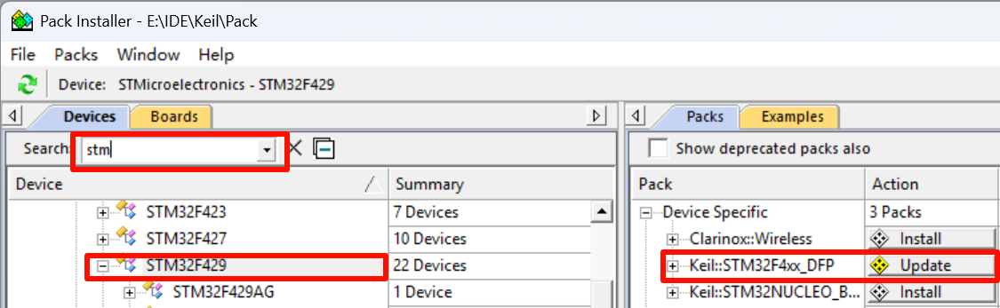
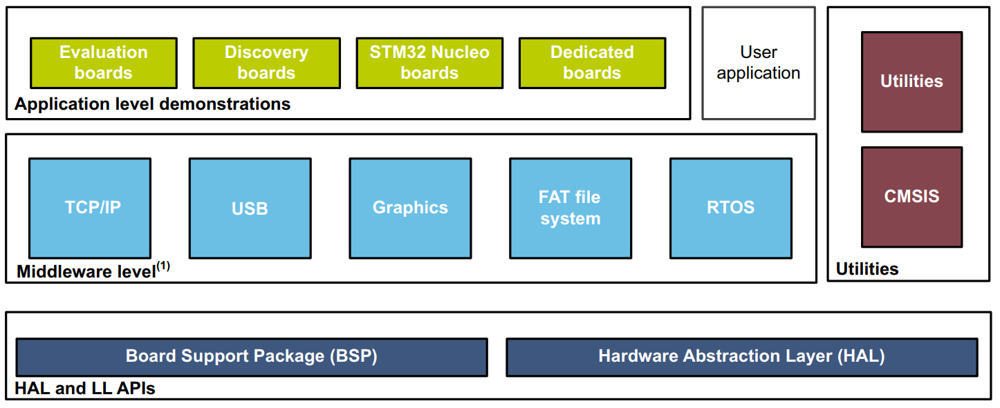
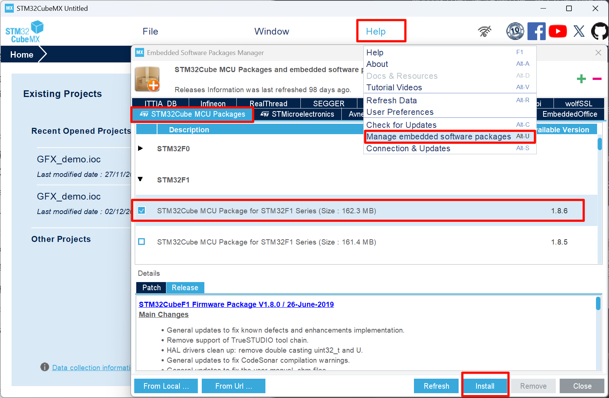
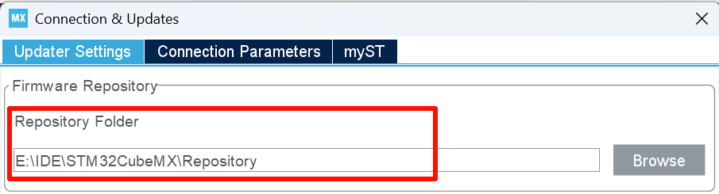
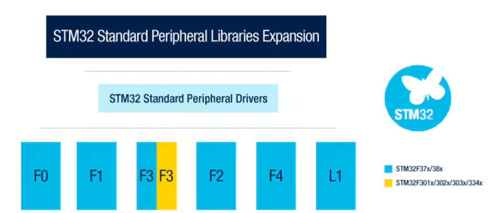
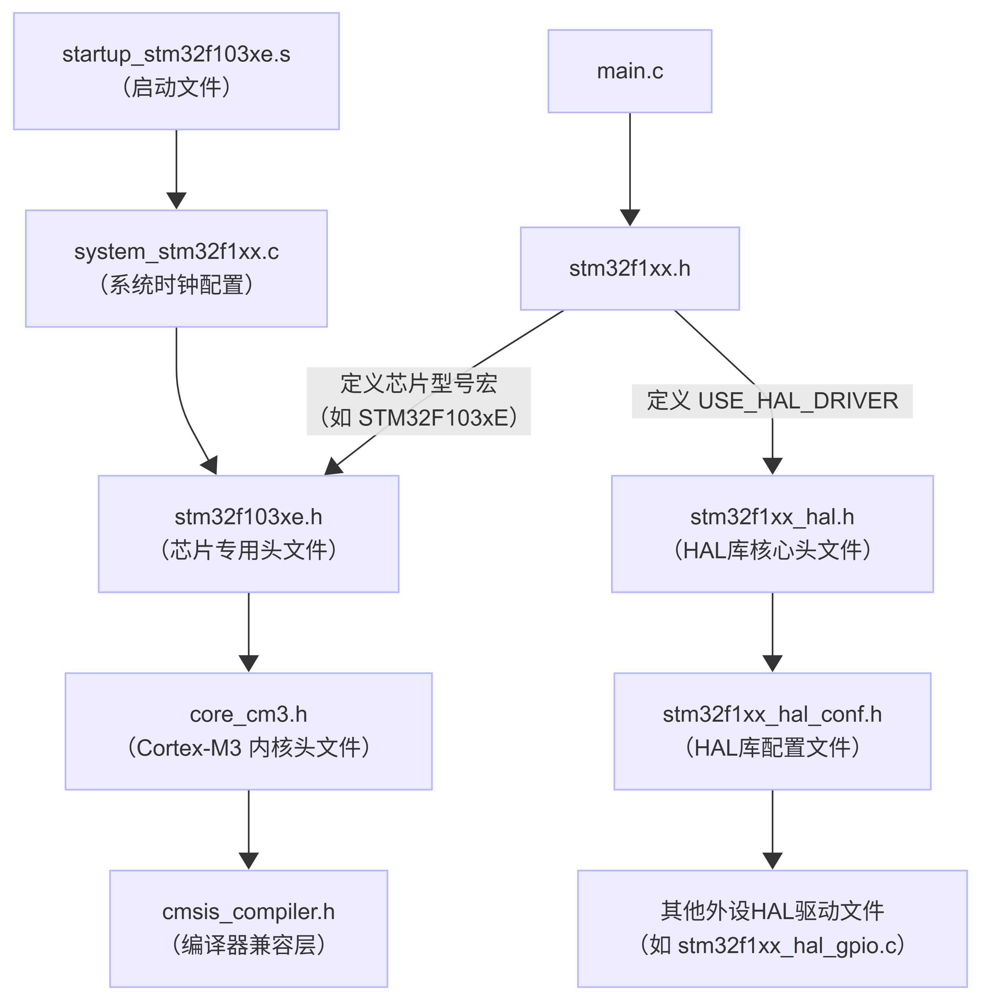

### 设备家族包

设备家族包（Device Family Pack），用于让 IDE 识别并支持对应系列的芯片，Keil 构建 STM32 项目时需要导入对应芯片的设备家族包。

以 STM32F4 系列为例，截至目前其最新版本 DFP 为`Keil.STM32F4xx_DFP.3.1.1.pack`，其本质上是一个压缩包。里面包含了针对 STM32F4 系列芯片进行开发所需的各种核心文件：

- .pdsc 文件：一个 XML 格式的文件，但它有特定的扩展名是包描述文件，用于描述 DFP 的版本信息，文件结构，支持的芯片信息。
- .svd 文件：System View Description (SVD) 是 XML 格式的系统视图描述文件，它包含了该芯片的所有外设、寄存器结构、地址映射以及详细的特性描述，用于在调试时告诉 IDE 外设寄存器信息。
- .FLM 文件：烧录算法文件，是二进制文件，在烧录时用于初始化 Flash 控制器将用户程序写入 Flash。
- .dbgconf 文件：调试配置文件，用于在调试时配置 MCU 的内部调试模块，可通过Keil 中的图像化界面更改配置。

DFP 在版本 3.0.0（发布于2024年10月11日）进行了精简：

- 删除了芯片参考手册。
- 删除了板级外设驱动和示例。
- 删除了HAL库 和 LL库驱动文件，较早版本的为标准库。
- 删除了使用于编译器的启动文件以及 CMSIS-Driver 相关文件。

删除的大部分内容被移交到了 STM32CubeMX 固件包当中。

DFP 可通过 Keil 内部的 Pack Install 安装或更新，也可[在线下载](https://www.keil.arm.com/devices/)离线安装包。

### 固件包

固件包（Firmware Package）用于配合 STM32CubeMX 生成工程模板。

上图中是固件包的主要组成部分：

- HAL 库（LL）驱动程序和一些评估板所需的 BSP 驱动。
- CMSIS 组件相关的文件，包含启动文件，DSP库等。
- 中间层组件，包含有关RTOS，USB，UI等库。
- 官方评估开发板示例工程。

固件包可通过 STM32CubeMX 获取：

安装后的固件包在如下路径可找到。

### 外设驱动程序

STM32 单片机根据使用的外设驱动程序种类不同，通常有 HAL 库（LL库），标准库，寄存器三种开发方式。

- HAL 库又称为硬件抽象层（ Hardware Abstraction Layer），HAL 库将对 MCU 外设的操作封装成统一接口的函数，代码的可移植性好，但是由于层层封装导致性能开销较大，且开发者容易不熟悉硬件底层。
-  LL 库（Lower Layer）与 HAL 库捆绑发行，通过宏和内联函数的方式操作寄存器效率高，用于对性能要求极端的场景以解决 HAL库的弊端。
- 标准库的可移植性较差，意法半导体公司不再提供对标准库的支持，老项目常见使用。而寄存器的开发方式效率最高，但较为繁琐。

在老版本的 DFP 中有标准库文件，也可在[官网获取](https://www.st.com.cn/zh/embedded-software/stm32-standard-peripheral-libraries.save-bookmark.html)。支持以下系列芯片。

HAL 库和LL 库可在固件包中获取，通常使用 STM32CubeMX 来完成外设初始化。

### 文件说明

以 STM32F103RCT6 的HAL库工程为例介绍以下文件的作用。

#### startup_stm32f103xe.s

汇编文件，用于单片机启动时 C语言运行环境的搭建，详见 Stm32 启动过程。

#### system_stm32f1xx.c/.h

这个文件用于配置系统时钟，其中编写了一个全局变量和两个函数：

- `SystemCoreClock`： 存储当前系统内核时钟（HCLK）的频率值（单位为 Hz），用来设置 SysTick 计时器，作为系统时钟频率的唯一参考。
- `SystemInit()`：系统每次复位时默认使用 HSI 作为时钟源。这个函数在`startup_stm32f1xx_xx`中被调用，负责在主函数调用前来初始化系统的时钟（系统时钟源，PLL乘法器，AHB/APBx预分频器和Flash设置）。
- `SystemCoreClockUpdate()`：更新变量SystemCoreClock，必须在程序执行期间更改核心时钟时调用。

头文件中包含了函数声明，在`stm32f103xe.h`文件中被引用。

#### stm32f1xx_hal.c/h

- .c 文件中包含了HAL库一些公共函数的定义，这些函数实现了HAL库初始化（配置中断优先级分组；HAL库时钟初始化，1ms为时基），延时函数（依托 Systick 中断实现），获取设备ID，启动调试模块等功能。
- .h 文件引用了`stm32fxxx_hal_conf.h`文件，包含了所有的HAL库函数的声明（大部分都在`stm32fxxx_hal_conf.h`引用的各个头文件中），定义了一些调试用的宏。

#### stm32f1xx_hal_conf.h

这个文件用于裁剪配置HAL库。在 HAL库源码头文件目录下有一个配置文件的模板 `stm32f1xx_hal_conf_template.h` 。需要将这个文件拷贝更改为 `stm32f1xx_hal_conf.h `。在这个文件当中你可以通过修改宏定义来选择哪些外设的HAL库驱动头文件被包含在项目中，从而实现对HAL库的裁剪。

#### stm32f103xe.h

不同型号的芯片使用的该文件不同，这个文件主要包含以下内容：

-  所有外设的数据结构和地址映射。
-  外设的寄存器声明和位定义。
-  访问外设寄存器硬件的宏。

#### stm32f1xx.h

这个文件中包含了一些对寄存器位操作的宏定义（实现寄存器的原子化访问）并且引用了`stm32f1xx_hal.h`和`stm32f103xe.h`两个头文件。`main.c`中只需要引用这个头文件即可调用 HAL 库中的函数操作外设，也可直接操作寄存器。

- 通过预处理器是否定义`USE_HAL_DRIVER`这个宏来决定是否引用`stm32f1xx_hal.h`，
- 通过定义芯片型号对应的宏来确定引用的对应的寄存器描述头文件，对于STM32F103RCT6 这个型号这里定义`STM32F103xE`这个宏引用`stm32f103xe.h`这个文件。

#### stm32f1xx_it.c

这个文件中包含了一些异常处理中断服务函数，当运行发成异常时就会触发这些中断进而执行对应的中断服务函数，可以自行更改这些函数。同时用户编写的中断服务函数也可放在这里。

- NMI（非屏蔽中断）：通过 `NMI_Handler` 函数处理。
- 硬故障：当发生硬故障时，`HardFault_Handler` 会进入无限循环，通常用于调试。
- 内存管理异常：`MemManage_Handler` 也会进入无限循环。
- 总线故障：`BusFault_Handler` 处理总线故障并进入无限循环。
- 使用故障：`UsageFault_Handler` 处理使用故障并进入无限循环。
- SVCall（Supervisor Call）、调试监视器和PendSV异常等。

#### core_cm3.h

 这个文件在`stm32f103xe.h`文件中被引用，是 Cortex-M3 内核的头文件，作用如下：

1. 定义内核寄存器：

   - `NVIC_Type`：嵌套向量中断控制器 (Nested Vectored Interrupt Controller)。
   - `SysTick_Type`：系统滴答定时器 (System Tick Timer)。
   - `SCB_Type`：系统控制块 (System Control Block)。
   - `MPU_Type`：存储器保护单元 (Memory Protection Unit)。

2. 提供内核访问函数：
   
   - 执行复位 (`NVIC_SystemReset`)。
   - 设置中断优先级 (`NVIC_SetPriority`)。
   - ITM 发送字符（`ITM_SendChar`）。
   
3. 标准化类型定义：定义了一些宏定义于规范寄存器访问。

   - `__I` (volatile const/只读)。
   - `__O` (volatile/只写)。
   - `__IO` (volatile/读写) 等宏。

#### cmsis_compiler.h

这个文件在`core_cm3.h`中被引用，用于对不同编译器作兼容。`cmsis_compiler.h`文件会根据编译时产生的宏来判断编译器的种类，从而引用对应编译器头的适配文件。

- `cmsis_armcc.h`：AC5编译器。
- `cmsis_armclang.h`：AC6编译器。
- `cmsis_gcc.h`：GUN GCC 编译器。
- `cmsis_irrarm.h`：IAR EWARM编译器。

这些头文件通过宏定义的形式将 CMSIS 标准宏翻译成它们所适配编译器能看懂的语法。同时实现了Cortex-M 内核的一些特殊汇编指令。

这些文件的引用关系如下图所示：

{.img-scale-75}

### 工程模板

工程模板可以参考使用：

1. [Hurricane-STM32-Template](https://github.com/XJU-Hurricane-Team/STM32-Template)
2. [Deadline039的工程模板](https://github.com/Deadline039/STM32-Template)。
3. STM32CubeMX 生成的工程。
4. 正点原子的工程。

