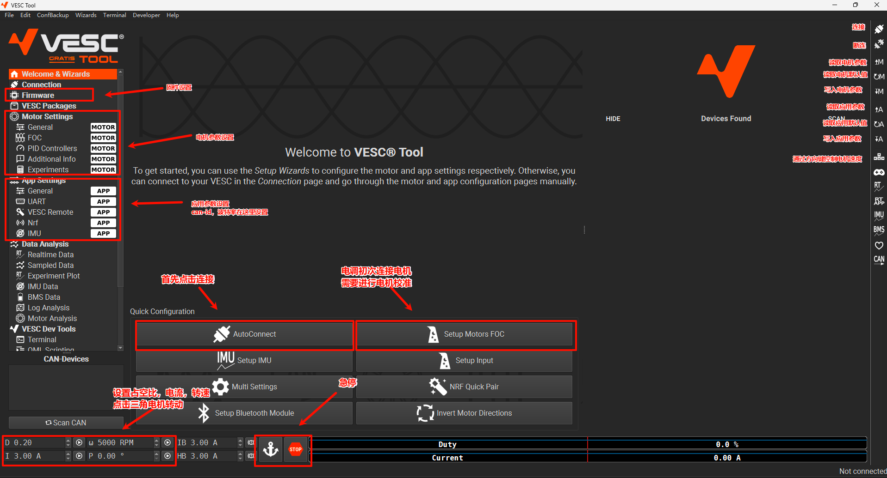

## VESC上位机使用

上位机需要和VESC固件相对应，建议是最新的固件搭配最新的上位机，截至目前（25/9/21）最新的上位机版本是6.06已在实验室仓库同步。 

[校准参考](https://zhuanlan.zhihu.com/p/1910085988224574682)

## VESC项目源码

前言：VESC固件源码建议在Linux环境下进行编译（在Windows环境中编译makefile有各种各样的语法问题），也可以在[在线编译]([免环境搭建！everbamboo VESC电调固件在线编译指南 - 嘉立创EDA开源硬件平台](https://oshwhub.com/article/environment-free-build-up-everbamboovesc-edc-firmware-online-compilation-guide))不用搭建环境。

目录详细分析：[VESC代码分析](https://xtzhyhydwl.github.io/2025/05/14/VESC代码分析1：固件文件总览/)

代码分析视频： [b站代码分析](https://www.bilibili.com/video/BV1DZ42127Yk/?spm_id_from=333.1387.upload.video_card.click)

项目地址：[bldc]([vedderb/bldc：VESC 电机控制固件](https://github.com/vedderb/bldc/?tab=readme-ov-file))

项目目录：

- **applications/**：上层“应用”任务（PPM/ADC 油门、UART/CAN 控制、自定义 APP）。想加自己的业务逻辑，就在这写。
- **blackmagic/**：用 Black Magic Probe 调试/下载相关脚本与规则。
- **build/**：编译生成的文件都在这里。
- **ChibiOS_3.0.5/**：RTOS 与 HAL（STM32 外设驱动、线程调度等）的完整源码。
- **comm/**：通讯协议与打包层（USB/串口/CAN、VESC 协议、指令解析）。
- **documentation/**：文档与示例。
- **downloads/**：第三方依赖的下载缓存（一般是`gcc-arm-none-eabi-7-2018-q2-update-win32`编译器，Windows环境下载巨慢,实验室仓库已存）。
- **driver/**：底层驱动抽象（ADC/SPI/I2C/TIM/PWM、Flash、DRV83xx/栅极驱动、放大器、保护等）。
- **encoder/**：霍尔、ABI/AS504x/MT6816 等编码器支持。
- **hwconf/**：**板级硬件配置核心**：GPIO/ADC 索引、分压比、NTC 参数、DRV830x 引脚与寄存器、PWM 定时器通道映射等。给新板适配基本都在这改。
- **imu/**：IMU 传感器（MPU/ICM 等）与姿态算法。
- **libcanard/**：UAVCAN 轻量协议栈（需要 CAN 上做 UAVCAN 时用）。
- **lispBM/**：内嵌 Lisp 虚拟机（在 VESC 上跑脚本）。
- **make/**：构建规则、链接脚本、MCU/晶振等编译选项。
- **motor/**：电机控制算法（FOC、观测器、SVPWM、速度/位置环、限流/限压）。
- **Project/**：IDE 工程/示例（例如 Eclipse 工程）。
- **qmlui/**：QML 小界面/示例 UI（部分板/屏幕用）。
- **tests/**：单元/回归测试与仿真桩。
- **tools/**：打包、烧录、生成版本号等脚本。
- **util/**：通用工具（滤波、数学库、PID、CRC、NTC 计算等）。
- 根目录的 **bms.c / bms.h**：与电池管理相关的模块入口（某些板会用）。
- **.gdbinit / .gitignore / .travis.yml**：调试、忽略与 CI 配置。

