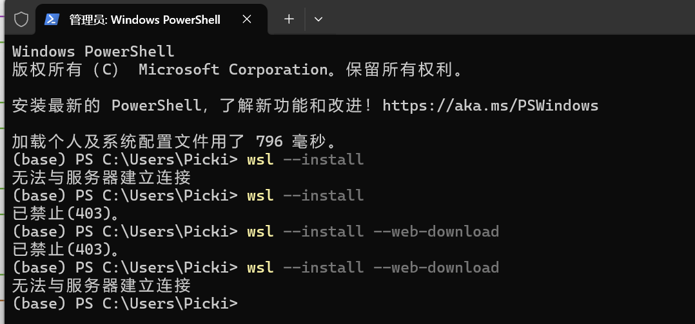

Windows专业版才支持Hyper-V服务，请确保系统是专业版。

打开以下服务：

- Hyper-V
- Virtual Machine Platform
- Windows虚拟机监控程序平台
- 适用于Linux的Windows子系统

### wsl下载网络问题



如图不开代理无法与服务器建立连接，开了代理出现已禁止（403）

解决方案确保Windows相应服务被正常开启（家庭版的系统使用KMS升级为专业版），然后到Github上手动下载WSL的[release]([Releases · microsoft/WSL](https://github.com/microsoft/WSL/releases))运行安装之后，在终端运行`wsl --install`默认下载`Ubuntu`。

### wsl移盘

-  导出它的备份（比如命名为 Ubuntu.tar）。在 CMD 命令行下输入“wsl --export Ubuntu- 24.04 E:\Ubuntu\Ubuntu_24_WSL\Ubuntu.tar”。
- 确定在 E:\Ubuntu\Ubuntu_24_WSL 下是否可看见备份 Ubuntu.tar 文件， 之后注销原有的 WSL。
  在 CMD 命令行输入`wsl --unregister Ubuntu-24.04`注销原本的 WSL。
- 将备份文件恢复到 E:\Ubuntu\Ubuntu_24_WSL 中去。在 CMD 命令行下输入“wsl -- import Ubuntu-24.04 E:\Ubuntu\Ubuntu_24_WSL E:\Ubuntu\Ubuntu_24_WSL\Ubuntu.tar”恢复备份文件。

### 修改WSL默认启动挂载文件夹位置

.bashrc 文件是 Bash 的配置文件之一，每次启动 Bash 时都会自动加载其中的配置。通过修改 .bashrc 文件，我们可以更加灵活地自定义 WSL 的启动行为，包括设置默认启动目录。

1. **启动 WSL。**

2. **输入以下命令打开 .bashrc 文件：**

   ```
   nano ~/.bashrc
   ```

   如果你更习惯使用 vi 或 vim 编辑器，也可以使用相应的命令打开 .bashrc 文件。

3. **将以下代码添加到 .bashrc 文件的末尾：**

   ```
   if [ -d "/mnt/d/your/desired/path" ]; then
       cd /mnt/d/your/desired/path
   fi
   ```

   请将 `/mnt/d/your/desired/path` 替换为你想要设置为默认启动目录的 Windows 文件夹路径。

   **需要注意的是：**

   - WSL 使用 `/mnt` 目录来挂载 Windows 磁盘分区，因此你需要根据实际情况修改路径。例如，若目标文件夹位于 D 盘，则路径应以 `/mnt/d` 开头。
   - 代码中的 `if` 语句用于判断目标文件夹是否存在，以避免因路径错误导致启动失败。

   通过将这段代码添加到 .bashrc 文件中，就可以实现在每次启动 WSL 时，自动检查并进入指定的 Windows 文件夹。
   
   
   
   此时启动ubuntu默认用户是root，修改为之前设定的用户
   
   ```shell
   ubuntu2004 config --default-user 刚刚建立的用户名 
   ```

### 解决`wsl: 检测到 localhost 代理配置，但未镜像到 WSL。NAT 模式下的 WSL 不支持 localhost 代理。`问题

在Windows的用户文件夹下创建`.wslconfig`文件写入以下内容

```bash
[wsl2]
autoMemoryReclaim=gradual
networkingMode=mirrored
dnsTunneling=true
firewall=true
autoProxy=true
```

执行`wsl --shutdown`之后再启动`wsl`

### wsl打开子系统显示无图标

`%USERPROFILE%\AppData\Local\Packages\Microsoft.WindowsTerminal_8wekyb3d8bbwe\LocalState\settings.json` 找到子系统设置那几行，我的是Ubuntu，添加icon配置

```json
"icon": "图标的路径，注意使用双斜杠",
```

### 安装其它发行版	

```powershell
wsl --list --online #显示所有支持的发行版
```

官方支持的发行版

| 发行版名称       | 安装方式                       | 备注                        |
| ---------------- | ------------------------------ | --------------------------- |
| Ubuntu（各版本） | wsl --install -d <版本名称>    | 包括 20.04、22.04、23.10 等 |
| Debian           | wsl --install -d Debian        | 稳定版                      |
| Kali Linux       | wsl --install -d Kali-linux    | 渗透测试专用                |
| Fedora Remix     | wsl --install -d Fedora        | 社区维护版                  |
| OpenSUSE Leap    | wsl --install -d openSUSE-Leap | SUSE 分支                   |
| AlmaLinux        | wsl --install -d AlmaLinux     | RHEL/CentOS 替代            |
| Rocky Linux      | wsl --install -d RockyLinux    | RHEL/CentOS 替代            |

设置wsl默认启动选项

```bash
wslconfig /setdefault 选项名
```
