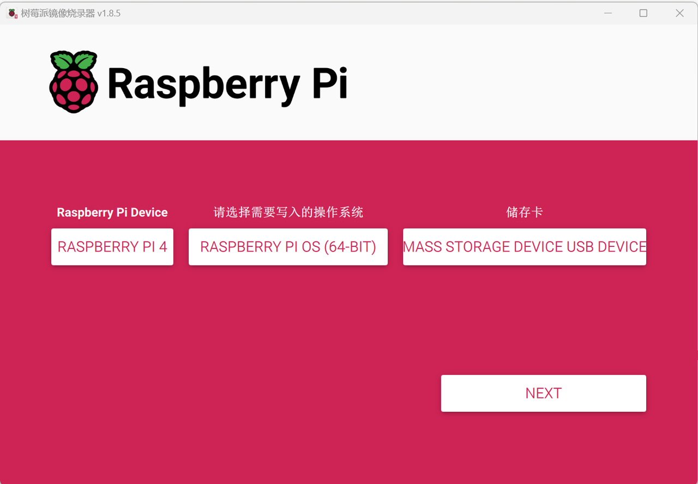
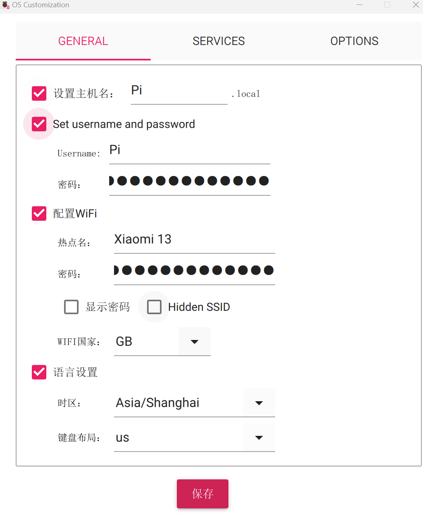
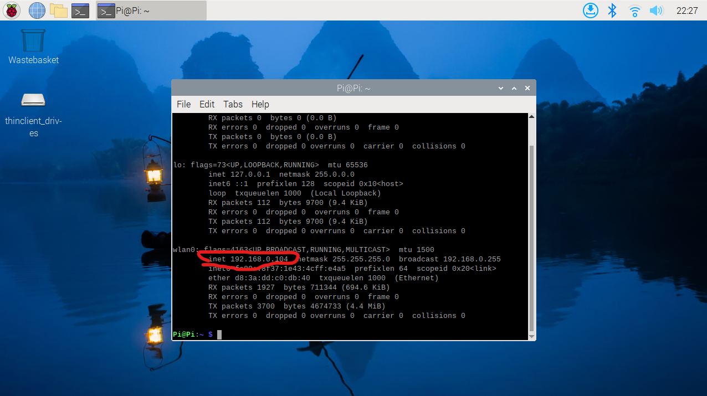
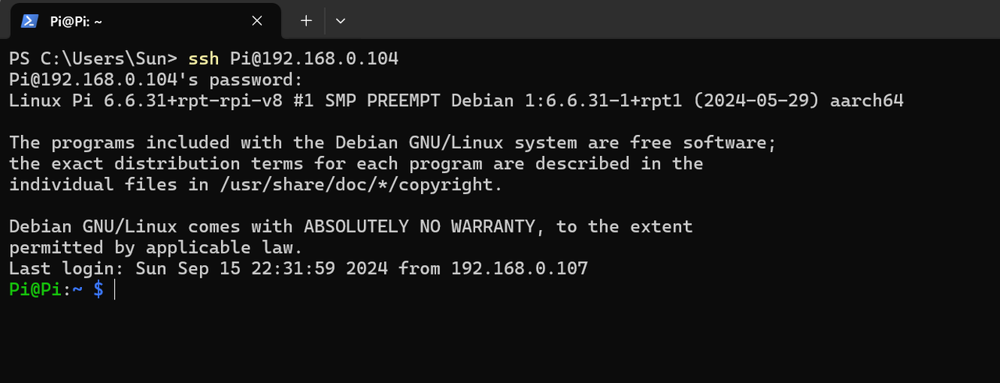
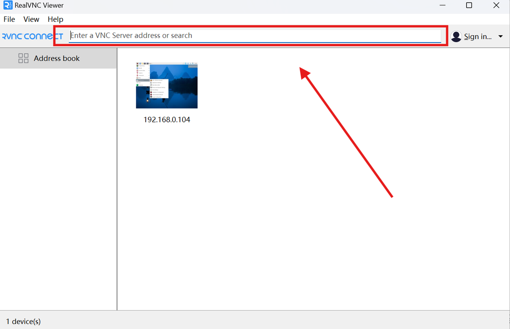
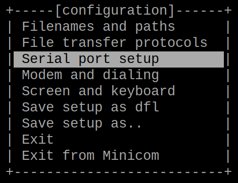
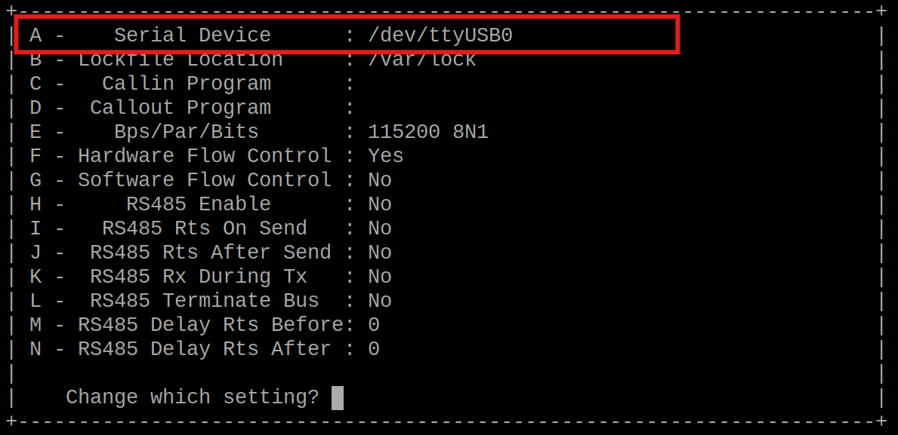
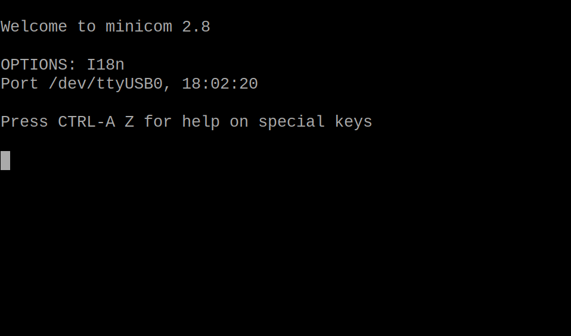

> ## 一口一个树莓派

### What's Raspberry Pi?


树莓派是微型计算机，别看它只有一张信用卡大小，实际上它除了性能低其它和电脑没什么区别，能够轻松运行Linux炒作系统。同时它拥有着很强的拓展性，方便去手动探索了解计算机。树莓派是一个大的家族，下面有着许多系列和型号的版本，这里我仅介绍树莓派4B版本。(因为我只有这个😭)


### 开机必备：

- 树莓派开发板，最好要有散热不然会降频影响性能
- typeC供电线（要求5v/3A，所以直接接电脑上是不行的，测试后发现手机充电器/充电宝可以完美平替电源）
- 显示屏，HDMI线（最好要有屏幕不然会很麻烦，虽然没屏幕也能解决）
- TF卡16GB以上，和读卡器（用来烧录系统和做flash用）

### 烧录程序：

树莓派可以选用的系统有很多，基本上都是基于Linux的（有一说一树莓派拿来练习Linux真的很不错），这里我选用的是树莓派官方的系统：Raspberry Pi 操作系统（下面是官网链接选择适合自己型号的就行）

树莓派系统下载：[官方地址](https://www.raspberrypi.com/software/operating-systems/#raspberry-pi-os-64-bit)

下载好镜像后将其缓存在我们磁盘中任意位置都行，接着我们需要借助镜像烧录工具将系统文件烧录到TF卡之中，我们使用官方的镜像烧录工具：Raspberry Pi Imager（下面是官方下载地址）

树莓派镜像烧录器：[官方地址](https://www.raspberrypi.com/software/)



按NEXT之后，点击编辑设置，设置主机名，密码，和WIFI（不要用校园网，可以连热点或者实验室的路由器）



点击第二个菜单栏SERVICES把ssh服务打开然后开始烧录，这个过程可能会要10分钟左右的时间烧录完成后即可把TF卡插入树莓派，然后就可以上电启动了。

### 远程连接：

有屏幕的话，正常连接HDMI数据线接通电源树莓派就可以正常开机了（没屏幕的话插电也能开机但是你只能看见两个闪烁的LED灯）。

开机后会自动连接到之前烧录时设置的网络上，如果像进行远程连接还需要知道树莓派的ip地址，在树莓派上连接键盘Ctrl+Alt+T打开终端输入ifconfig找到IP地址，记下来。



然后可以选择以下方法连接：

#### PuTTY连接：

PuTTY软件进行ssh连接但是仅有终端，自行在官网下载，下载后在如下界面输入树莓派ip即可连接


然后accept它的警告后依次输入主机名（烧录时期的名字）和密码即可。

#### Power shell连接:

打开power shell输入：

```powershell
ssh 用户名@ip
```

接着输入密码即可，如下图即可在powershell中使用树莓派终端



#### Vnc远程桌面连接：

下载地址：https://www.realvnc.com/en/connect/download/vnc/

下载后在下图位置输入ip地址，然后在后面的对话框中依次输入主机名和密码即可



有点卡不是很推荐

#### Windows自带的mstsc连接

在树莓派上下载远程端

```shell
sudo apt-get install xrdp
```

开始菜单搜索mstsc，在程序中输入树莓派信息即可连接，推荐使用，清晰流畅（甚至可以调分辨率）还能访问计算机本地磁盘（虽然会比较慢）


如果远程连接失败请检查树莓派与主机是否连接同一WiFi，如果成功连接但是显示黑屏，可能是本地登录和远程登陆冲突（有一个显示另一个就不显示）可采用以下方法解决：

```shell
sudo vim vim /etc/xrdp/startwm.sh

#在文件中做以下更改
unset DBUS_SESSION_BUS_ADDRESS
unset XDG_RUNTIME_DIR
#重启xrdp服务
sudo systemctl restart xrdp.service
```


### 其它操作：

#### apt换源：

Linux系统的下载工具`apt`默认的下载地址是国外的服务器这会导致下载速度非常慢，因此需要更换国内的镜像源。

在`/etc/apt/`目录下打开source.list文件添加需要的镜像网站。·

armch64架构设备更换清华源请在上述文件添加以下内容：

```shell
# 默认注释了源码镜像以提高 apt update 速度，如有需要可自行取消注释
deb https://mirrors.tuna.tsinghua.edu.cn/debian/ bookworm main contrib non-free non-free-firmware
# deb-src https://mirrors.tuna.tsinghua.edu.cn/debian/ bookworm main contrib non-free non-free-firmware

deb https://mirrors.tuna.tsinghua.edu.cn/debian/ bookworm-updates main contrib non-free non-free-firmware
# deb-src https://mirrors.tuna.tsinghua.edu.cn/debian/ bookworm-updates main contrib non-free non-free-firmware

deb https://mirrors.tuna.tsinghua.edu.cn/debian/ bookworm-backports main contrib non-free non-free-firmware
# deb-src https://mirrors.tuna.tsinghua.edu.cn/debian/ bookworm-backports main contrib non-free non-free-firmware

# 以下安全更新软件源包含了官方源与镜像站配置，如有需要可自行修改注释切换
deb https://security.debian.org/debian-security bookworm-security main contrib non-free non-free-firmware
# deb-src https://security.debian.org/debian-security bookworm-security main contrib non-free non-free-firmware
```

参考网站：[raspbian | 镜像站使用帮助 | 清华大学开源软件镜像站 | Tsinghua Open Source Mirror](https://mirrors.tuna.tsinghua.edu.cn/help/raspbian/)

#### CSI摄像头和USB摄像头：

**CSI摄像头：**

CSI（Camera Serial Interface）摄像头，就是排线连接的摄像头。

在树莓派老版本的系统中可以通过`raspi-config`命令在`interface options`选项中打开`camera`选项来打开摄像头，使用`raspistill`命令来使用摄像头。

在23年以后的系统中这一选项被移除，需要通过安装libcamera库来调用摄像头。

libcamera能够支持的相机：***OV5647 ，IMX219 ，IMX477 ，IMX708 ，IMX290, IMX327, OV9281, IMX378***

安装`libcamera`：

```shell
sudo apt install libcamera-apps
sudo apt install libcamera-tools
```

调用下面的命令来进行测试

```shell
libcamera-hello	#从相机获取预览图象
libcamera-still #视频捕获
libcamera-jpeg -o test.jpg # 获取一张全分辨率的JPG图片
```

libcamera详细使用方法：[基于Raspberry 的 libcamera 使用 - 小淼博客 - 博客园](https://www.cnblogs.com/uestc-mm/p/17442508.html)

**USB摄像头**：

检查摄像头是否连接：

```shell
ls -la /dev/vid*
```

需要安装相关控制库:

fswebcam是一个调用usb摄像头的控制库

```shell
sudo apt install fswebam	
```

一般用法：

```shell
fswebcam -d 摄像头 -s延迟几秒拍摄 -r 分辨率 -q 文件路径
```

但是实测下来拍摄得到的照片很暗，可以调用配置文件来设置拍摄

```shell
fswebcam -c <配置文件路径>
```

需要自己编写配置文件

```shell
#配置文件fswebcam.conf
device /dev/video0            # 摄像头设备
resolution 1280x720           # 分辨率

# 输出路径
save /path/to/your/output.jpg # 将照片保存到指定路径

--no-banner					  #照片不显示标记
delay 2 					  #延时两秒
skip 5						  #跳过开始的5帧防止摄像头不稳定
frame 3						  #连续拍摄3帧选取质量最好的一帧
# 调整亮度
set brightness=80             # 亮度调节（数值在 0-100 之间，根据设备支持情况可能不同）

```

详细可以参阅：[树莓派上用 fswebcam + USB 摄像头拍摄 | 树莓派实验室](https://shumeipai.nxez.com/2020/08/23/raspberry-pi-fswebcam.html)

guvcview是一个摄像头调试工具

```shell
sudo apt install guvcview
```

设备插上摄像头之后执行下面命令就会运行程序的GUI调试界面

```
guvcview &
```


#### minicom:

这是一个Linux环境下的串口工具。

```shell
sudo apt install minicom
```

安装完成后执行下面命令打开选项栏进行基础配置

```shell
minicom -s
```



选择第三个选项接口配置，然后按A添加要交流的串口挂载的路径（下图所示位置）



然后enter, ESC返回上一界面接着选择`Save setup as dfl`选项来保存配置

（如果保存失败，使用sudo来执行`minicom -s`）、

如果配置成功就会进入如下界面



常见操作：

- crtl+A->x	退出minicom
- crtl+A->z     打开选项栏
- crtl+A->e     打开回显
- crtl+A->o     打开配置页面


可以使用如下指令快速打开串口：

```shell
minicom -D /dev/ttyUSB0
```


#### SIM7600X 4G模块配置：

第一步，将一张SIM卡插入模块背部的卡槽然后插入树莓派

第二步，确定挂载的位置

```shell
ls /dev/ttyUSB*
```

第三步，通过minicom发送指令初始化模块

```shell
sudo minicom -D /dev/ttyUSB0	#填自己设备挂载的位置，一般为ttyUSB0
#使用minicom发送下面指令。
AT+CUSBPIDSWITCH=9011,1,1
```

第四步，查询网卡,看所给信息中有没有usb0的网卡如果有表明激活成功。

```shell
ifconnfig -a
```

第五步，获取ip并将上网方式切换为无线网卡上网（插入网卡时如果已经联网那么不执行该命令树莓派不会使用网卡上网）

```shell
sudo dhclient -v usb0
```

第六步，设置开机自动连接网卡。

```shell
sudo vim /etc/rc.local #打开开机配置脚本在倒数第二行添加下面内容

sleep 18s && sudo dhsclient -v usb0#开机会自动显示网卡ip
```


#### conda环境配置:

树莓派4B处理器架构为aarch64架构，能够使用aarch64版本的miniconda，但是**4B不兼容miniconda3 4.10以上的版本**。请先使用`uname -a`命令查看本机处理器架构。

1.下载安装脚本：

```shell
wget https://repo.anaconda.com/miniconda/Miniconda3-py37_4.9.2-Linux-aarch64.sh	#会将安装脚本下载在当前终端所在位置
```

ps.这个版本适合*python3.7*，架构*aarch64* 的树莓派，可以在这个网站寻找想要的版本[Index of /](https://repo.anaconda.com/miniconda/)

2.执行安装脚本

```shell
bash Miniconda3-py37_4.9.2-Linux-aarch64.sh
```

这条命令前加sudo会安装给root用户，如果不执行sudo则安装给当前用户，建议不用sudo

3.根据提示安装完成后，添加conda的执行路径

```shell
vim ~/.bashrc	#打开这个文件在最后一行添加下面内容

export PATH="/home/‘用户名’/miniconda3/bin:$PATH"
```

如果不能正常使用可能未初始化：

```shell
conda init bash	#初始化 Conda 环境
```


**conda使用方法：**

```shell
conda create -n 虚拟环境名称 python=版本号	#创建虚拟环境
conda activate 虚拟环境名称	#进入虚拟环境
conda deactivate 退出当前虚拟环境	#推出虚拟环境
conda remove -n 虚拟环境名称 --all	#删除虚拟环境
conda info --env	#查看本地有哪些虚拟环境
conda config --show channels	#conda显示源
conda config --remove channels 源的网址 #conda删除源
conda list #输出conda已经安装的包
```

#### pip使用方法：

```shell
pip config set global.index-url https://pypi.tuna.tsinghua.edu.cn/simple
#pip更换清华源
pip config list		#pip显示所有源
pip config unset global.indexl-url	#pip删除源	
```

创建python虚拟环境

```shell
python -m venv venvdemo
```

#### 文件系统：

FAT32文件系统的U盘无法拷贝4GB以上的文件解决方法：

将通过CMD终端执行下面命令将文件系统改为ntfs格式

```cmd
convert F: /fs:ntfs	
```

### 引脚拓展：

树莓派4B上有40个IO引脚：


[树莓派的GPIO编程 - Vamei - 博客园](https://www.cnblogs.com/vamei/p/6751992.html)
