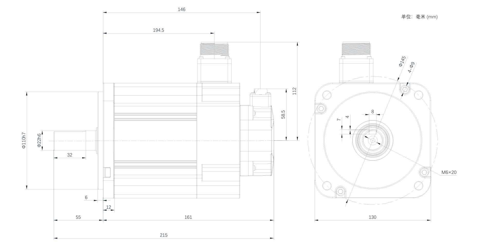
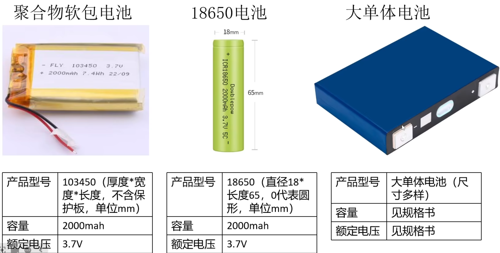
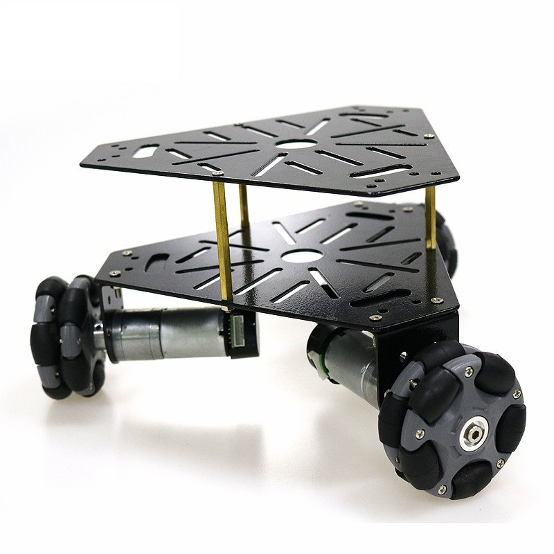
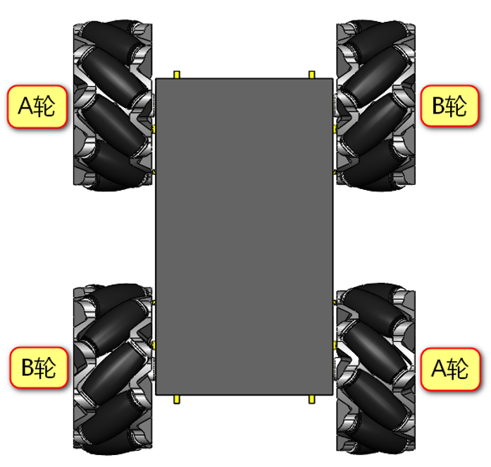
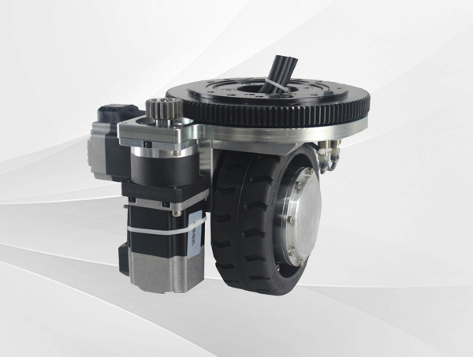

### 电机选型

#### 伺服电机

组成部分：1.电机 2.驱动器 3.编码器

优缺点：

1. 精度高，伺服电机可以通过编码器来时实现速度环和位置环的闭环控制。
2. 动力强劲，能够承受短时间的过载，获取两到三倍的力矩，能够做到高转速和高力矩。
3. 贵。

功率计算公式：
$$
功率=转矩*转速/9550
$$
公式推导：[伺服的电机转矩、功率、转速、电压、电流换算公式_伺服电机功率转矩-CSDN博客](https://blog.csdn.net/jk_101/article/details/126651363)

PS.一般用电机前法兰的宽度来表示电机的大小。

#### 步进电机

组成部分：1.驱动器 2.电机

概述：线圈中电流方向切换一次就前进一个角度（步进角） ，速度（大概在1000rpm）和精度都不如伺服电机，但是便宜。步进电机没有编码器，通过步进角来测算位置（一般有两相1.8°，三相1.2°，五相0.72°）会有低频振动（在100rpm左右时），所以一般的应用区间就是在300到600转左右。步进电机转速越快由于楞次定律电流会下降，所以功率不稳定所以选型上不标注功率，只标注静态力矩（随速度增大而减小），想要知道对应转速的力矩可以通过查看产品数据手册矩频特性曲线得知。同等体积下步进电机的静态力矩大一些，但是转速上来之后就不好说了。

优缺点：

1. 精度较差
2. 转速较低
3. 便宜

#### 航模电机

概述：常见的航模电机上面都标有主要参数，例如"2212"电机 ，即线圈（定子）直径为22mm，高度为12mm。线圈越宽力矩越大，越窄越高越灵敏。

KV值：是指电压每升高1V电机增加的转速。空心杯电机，电机转速非常快可以达到万转，但是力矩较小。

优缺点：

1. 转速很快
2. 扭矩小

### 锂电池

讲解视频：[锂电池基础知识](https://www.bilibili.com/video/BV1FqpqeXETj/?spm_id_from=333.1387.favlist.content.click&vd_source=6bb92a819dfdcd7bd3bc4e88195b918d)

#### 相关常识

1. 工作电压：有负载时正负极之间的电压，放电速率越高，工作电压越低。

2. 截止电压：规定的最低充电电压和放电电压。

3. 标称电压：锂电池电压会随着电池电量的降低而降低，电压与电量并非一次函数的关系。因此标称电压为电池在冲满状态下，从开始放电到放电截至时的平均输出电压，常见的为3.7V，
4. 电池放电倍率：即C值，1C表示一小时充满电池理论容量的电流密度，C数越大表示电池的充放电能力越强 
5. 电池串并联：电池上标注`2s3p`或者`6s4p`表示电池电芯的串并联方式，`2S3P`中S表示串联，P表示并联，2表示两个电芯串联，3表示并联三排，总共就是6个电芯通过串联和并联组成的电池。电池串联时内阻大的电池更容易过放，电池老化后内阻会增大，放电深度越大内阻也会增大，因此电池串联时最好选择同一批次的电阻。 

放电倍率（C值）：

$$
放电倍率=充放电流/额定容量
$$
锂电池常见种类：

 

### 底盘选轮

#### 全向轮

讲解博客：[机器人常见底盘运动学分析 ](https://xxty847.github.io/2020/02/02/原理篇：机器人常见底盘运动学分析/)

优缺点：

1. 便宜，灵活
2. 底盘灵敏度较低，会打滑
3. 适合三角底盘，空间利用率高

示意图：

#### 麦轮

讲解视频：[麦克纳姆轮工作原理](https://www.bilibili.com/video/BV1sp421R7zZ/?spm_id_from=333.337.search-card.all.click&vd_source=6bb92a819dfdcd7bd3bc4e88195b918d)

优缺点：

1. 解算简单，适合方形底盘
2. 能量利用效率低下
3. 不耐磨，对场地平整度要求高
4. 不能承受较大负载

示意图：

#### 舵轮

概述：一个舵轮需要两个电机驱动，一个为转向电机控制驱动轮的方向，另一个为驱动电机为驱动轮提供动力 。

优缺点：

1. 具有更好的灵敏度和承重能力。
2. 成本高，需要两个电机。
3. 运动解算复杂。

解析博客：[舵轮运动学分析 ](https://www.zxytql.top/Algorithm/Steering_Wheel)

