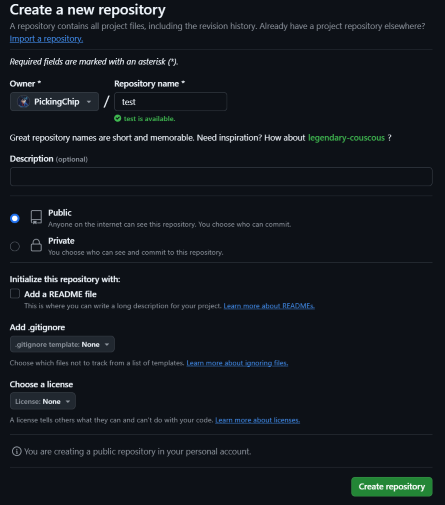
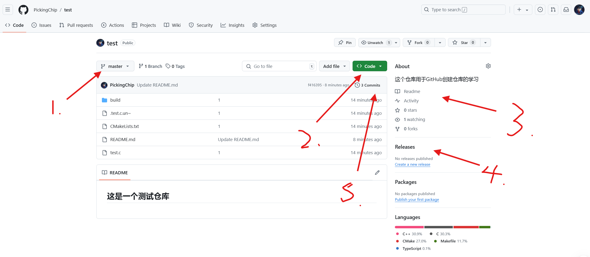
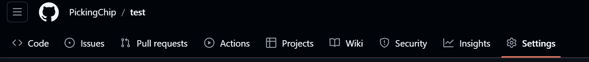
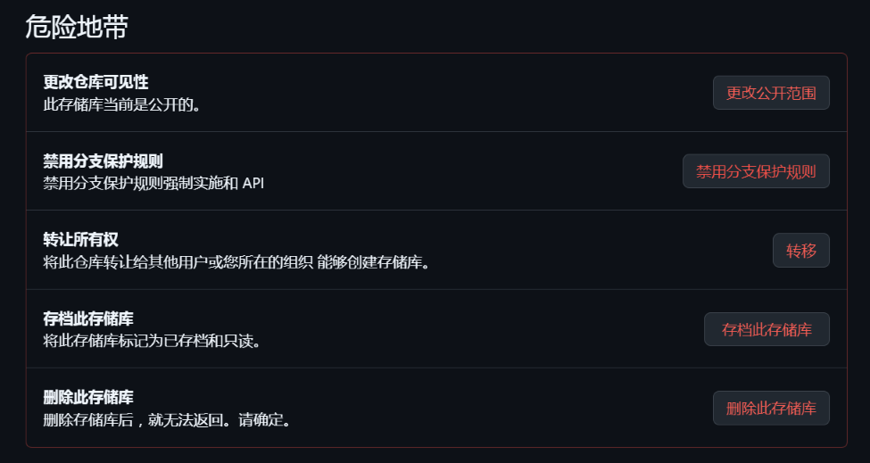

### What's  GitHub?


我们知道Git作为版本控制程序能够创建本地仓库并连接远程仓库，本地仓库在我们的个人电脑上，而远程仓库就托管在GitHub上。GitHub是全球最大的开源代码托管平台，在平台上创建开源仓库完全免费，上面有着来自全球优秀程序员的开源项目，是互联网精神的具象化的产物。作为全球最大的程序员社交平台，它于2018年被微软收购，如果硬要说缺点的话那就是全英文对英语不好的同学不太友好，同时国内需要科学上网才能稳定访问。

题外话：是GitHub不是GayHub！😤


### 关于仓库

Github上的代码是以仓库的形式托管的，当你需要托管一个项目的代码时就可以为这个项目创建一个仓库，并将项目的所有代码存放在仓库当中，这个仓库可以是私人的（尽自己组织可见），也可以是公开的，

#### 创建仓库：

在GitHub上即使你是游客的身份访问也能无障碍的下载或是拉取开源项目，但是如果你想要创建自己的远程仓库就需要注册一个GitHub账号，这里就不再讲述如何注册，直奔如何创建仓库。

在`Home`页面下，点击右上方的`+`可以选者创建新仓库或者导入本地仓库


点击创建新仓库就会来到下面的页面，在这个页面里你可以选择创建的仓库的名称，是否公开和是否在初始化时添加`README`文件



这里主要解释以下最后两个选项

**Add `.gitignore`**

`.gitignore`文件用于指定在Git版本控制中应该被忽略的文件和目录。这些通常是一些不需要被跟踪的文件，例如：

- **编译产生的文件**：如中间文件、二进制文件。
- **操作系统特有的文件**：如Thumbs.db（Windows）或.DS_Store（macOS）。
- **环境配置文件**：如包含敏感信息的配置文件，通常希望保留在本地而不推送到远程。

通过添加`.gitignore`，可以保持代码库的整洁，提高代码管理的效率。

**Choose a License**

选择许可证是指你决定如何允许他人使用、复制、修改和分发你的代码。不同的许可证提供不同的权利和限制，常见的许可证包括：

- **MIT许可证**：非常宽松，允许任何人使用、复制、修改，只需保留原许可证说明。
- **Apache 2.0许可证**：提供专利权利，适合需要保护专利的项目。
- **GPL许可证（通用公共许可证）**：要求任何修改和再发布的代码也必须采用相同许可证，适合倡导开源的软件。

点击`Creat reposity`即可创建自己的远程仓库，然后复制远程仓库的地址


在本地仓库中打开`git`执行下面命令：

```shell
git remote add origin <website> #这里<website>填你远程仓库的地址
```

这样你的远程仓库就创建完毕了 

#### 仓库操作：

当你的仓库创建成功之后，点击仓库你会看到如下界面：



我将主要介绍图中箭头所指位置的常用功能：

1. 在1所指位置可以查看当前仓库所在分支，点击可以切换到其他分支
2. 在2所指位置可以复制当前仓库的网址，或者下载当前仓库内容的压缩包
3. 在3所指位置是对当前仓库的情况的概述
4. 在4所指位置是当前仓库发行的程序和包
5. 在5所指位置可以查看历史提交记录

PS.

- release 通常是一个整体的版本发布，包含的更改和更新详细，你需要下载开源程序往往就在这里。
- Package 则是单个代码或组件的版本，可以被其他项目直接引用或使用。

#### 仓库删除：



在仓库页面中选择`Setting`，然后拉到最下方红色框住的部分就是删除仓库的部分



如果你要删除仓库平台会让你再三确认，因为这是一件十分危险的事情，如果不这样做可能一不注意很多人的心血就付之东流了。
