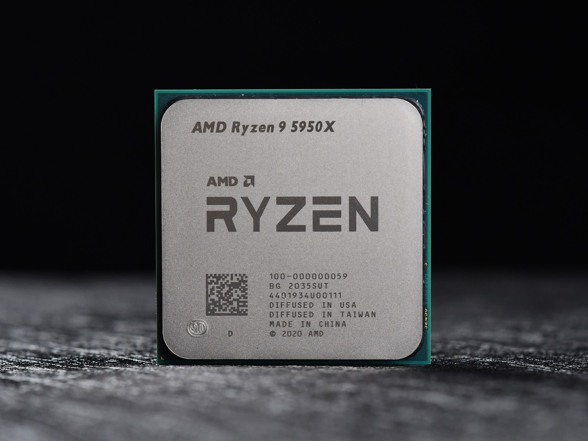

前言：

我在上大学之后才真正意义上接触电脑，因此有许多基础性的概念我并不清楚，这使得对计算机或者程序的进一步学习十分困难，因此我在大一的时候写下了基础知识部分，算才有了对计算机的初步认知，希望也能帮助其他对计算机不那么熟悉的同学。

[计算机硬件基础_哔哩哔哩_bilibili](https://www.bilibili.com/video/BV1TL4y1N7ZM/?spm_id_from=333.999.0.0&vd_source=6bb92a819dfdcd7bd3bc4e88195b918d)

### 1.CPU

计算机进行数据运算的核心，主频越高运算越快，主流的PC芯片由英特尔和超威两家公司提供。

Intel（英特尔）:
	目前个人计算机主要使用酷睿（core）系列之前还有奔腾和赛扬（已淘汰）


每一代CPU分为四个等级：

-  i3只适合轻度办公

-  i5有一点性能可以玩小型游戏
-  i7性能比较卓越可以游戏或者设计
-  i9最顶

后面的数字前两位一般代表代号（近几年就是13，14），然后三位是SKU值，数越大性能越好，最后就是后缀。

- Y表示续航款性能比较拉跨
- U表示有点续航，可以用来办公
- G表示核显比较强的
- H表示焊接上去不可拆卸载
- K有超频表示可以放个大招提升性能
- F没有核显，一般自己配电脑有独显可以考虑这种有性价比
- E表示嵌入式cpu

AMD（超威）
一般就是锐龙系列（还有其他一堆龙不过都和英特尔的奔腾一样不太行了），和英特尔类似第一个数字代表的含义与i3,i5一样数字越大越好，后面的7000/5000的数字表示第几代。



后缀：

- U：低电压，性能弱些但功耗低，通常出现在轻薄本中，举例型号：R7-5700U；
- H：标压，性能强，通常出现在游戏本中，举例型号：R5-5600H；
- HX：一般使用在AMD高端发烧级CPU上，至尊版，举例型号：R9-5980HX；
- HS：相当于H功耗略低，通常出现在轻薄全能本，性能较强，举例型号：R7 5800HS、R5 5600HS

ps.amd在7000系列开始使用zen4架构，这是AMD崛起的开端。

我们常常听说CPU是多少核多少线程的？为什么要这样描述CPU呢？其实线程表示CPU能够同时并行处理的任务数，内核就相当于人脑的脑仁，一个CPU内核包括了执行基本运算和逻辑操作所需的硬件组件，一般一个内核对应一个线程，但是现在也有一核多线程的技术，使逻辑内核比物理内核数翻倍，处理多任务能力提升。这样你就知道核心越多的CPU能够同时处理的任务数量就越多，因而性能就越强。

### 2.内存

RAM：

可以称为运行内存，用于存放正在运行应用的数据 ，数据断电丢失，通俗来讲内存越大可以同时打开的进程越多，如果内存满了就打不开新的任务了，一般有笔记本有8G,16G,32G。

DDR:

DDR的全称为Double Data Rate SDRAM（双倍速率的SDRAM），就是我们平时说的内存颗粒，也就是内存芯片。（买内存条时商家所说的DDR3，DDR4就是不同代的DDR，自然的代数越高性能越强，买的时候还要看看主板支不支持相应代数的DDR。）


单通道&双通道

- 单通道：只能进行单向传输数据，要么就输出，要么输入。
- 双通道：可以同时输出和输入，带宽增加一倍，提升临时数据的传输速度、对吃内存的程序提升显著，两只手打拳肯定快。
- 四通道：双通道的双倍快乐下再翻倍

理论上通道数越多，提升越大，计算公式如下：

```
内存速度（带宽）=内存等效频率*内存位宽/8
```

以DDR4-2400举个例子:

- 单通道速度=2400*64/8=19200MB/s=19.2GB/s
- 双通道=19.2*2=38.4GB/s
- 四通道=19.2*4=76.8GB/s

### 3.硬盘

计算机的数据存储器，用于永久存储大量数据，掉电不丢失。一般分为机械硬盘和固态硬盘。

- 机械硬盘仅有的优点就是便宜，数据安全性高。
- 固态硬盘除了贵点没啥缺点。

固态是由存储颗粒组成的，一般有以下两种颗粒：

- TLC : 每个存储单元可以存储3位数据。TLC固态硬盘在速度和耐用性方面表现不错，而且成本适中，使其成为用户的理想选择。
- QLC : 每个存储单元可以存储4位数据。这种技术可以提供更高的存储密度，意味着更低的成本和更大的存储容量。然而，这也导致写入速度较慢和寿命较短。

相较之下相同存储空间下QLC便宜，TLC性能好。


接口：

- SATA接口，用来接机械硬盘的接口
- PCI-E接口，扩展性极强，可以插显卡的PCI-E X16的那个物理接口，或	者插网卡，声卡的那个PCI-E X1那个物理接口，都是属于一类的物理接口，这类接口只跑PCI-E通道。
- M.2接口，主流用于接入SSD的物理接口的名称，M.2物理接口上，可以	跑PCI-E或者SATA通道，具体区别于主板或硬盘支持情况。

通道：

- PCI-E通道：速率丰富，适合各种不同速率要求的硬件，上至显卡，下至声卡。
- SATA通道：以前用于接硬盘，光驱。
- SAS通道：企业级别硬盘用的通道。
- FC通道：光纤通道。

协议：

- IDE协议：机械硬盘时代，用于数据操作，传输的协议
- AHCI协议：仍然是机械硬盘时代的主流数据传输协议，例如使用SATA通道。优化后的效率相比IDE提升10-30%。
- NVMe协议: 由于机械硬盘和固态硬盘的工作模式发生巨大变化，需要一种全新的针对固态的传输层协议，NVMe因运而生，设计是跑在PCI-E通道上的。

### 4.电源

笔记本都有自己的电源适配器，台式机根据自己的cpu和显卡的配置在网上查找推荐瓦数。通俗来说，电源就像一个马车夫瓦数越高拉的货越多。（如果要是自己组装电脑功耗还是要考虑的，你也不想在宿舍电脑一开机就跳闸吧🤭）

### 5.显卡

大多都是英伟达的大体有三个系列：

- GeForce主要应用于游戏娱乐领域
- Quadro主要用于专业可视化设计和创作，
- Tesla更偏重于深度学习、人工智能和高性能计算

GeForce系列主要有GTX（最高端）和GT（次高端）类型，在20系列时英伟达推出了RTX，具有实时光线追踪功能。

拿常见的`3050ti`，`4060`显卡举例：

30 40 是代号后面的50 60是一代中的不同型号，数越大性能越强，后缀还有ti,super表示加强版。


### 6.主板

主板主要就是根据前面硬件的配置选择具有合适接口，根据说明选择合适的主板。

### 7.机箱

看个人喜好吧，注重散热就行。

belike：


