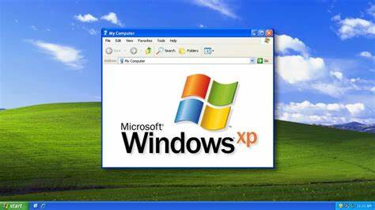
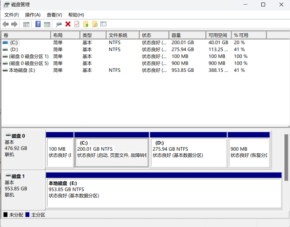

计算机的正常运作除了依托于硬件更离不开操作系统的调度，我们的个人计算机大多都使用Windows操作系统，它就像一扇让大家窥探计算机的窗户，让我们指挥计算机。这部分内容我们就来了解一下Windows。

[Windows11教学：计算机基础实战_哔哩哔哩_bilibili](https://www.bilibili.com/video/BV1vR4y1Q7iF/?spm_id_from=333.999.0.0)

### **历史常识**

现在使用的Windows系统是以图形用户界面为基础研发的操作系统，而图形用户界面（GUI）最早由施乐（一家研发打印机的公司提出），后来被apple拿去优化做出了当时很惊艳的图形界面，再后来微软也根据这个做出了Windows系统。

比较经典的windows系统：

- Windows XP 	2001
- Windows 7   	2009
- Windows 10 	2015
- Windows 11	2021

XP系统经典的蓝天白云绿草地😌

### **环境变量**

从名字来看这玩意就是个变量，用于存放文件地址。每一个文件都有一个绝对路径，但是每台电脑的特定程序绝对路径可能都不一样，操作系统调用程序的时候就很麻烦。所以给一个“变量”去“赋值”，让这个变量去代表这个程序的绝对路径，这样一来就方便程序通过环境变量调用文件。这也就是为什么有的时候移动了程序的位置后程序就无法运行了，这就是因为程序的绝对路径已经发生改变，但是“变量”的值还没变所以程序在使用“变量”调用程序时就会找不到文件的位置，进而使程序无法正常运行。

在Windows系统中，有两种环境变量：**用户变量**和**系统变量**。(环境变量没有区分大小写，例如path跟PATH是一样的。)

两者的区别：

- 系统变量对所有用户有效，用户变量只对当前用户有效。
- 用户环境变量存储用户特定的配置信息，系统环境变量存储全局配置信息。
- 用户环境变量只对当前用户有效，需要重新登录才能生效；系统环境变量对所有用户有效，修改会立即生效。
- 用户变量的优先级比系统变量高，也就是说如果用户变量和系统变量同名时，用户变量会覆盖上系统变量。
- 系统变量和用户变量都有path变量，但是它的值是用户变量中的值与系统变量中的值的叠加。 

eg. %TEMP%这个环境变量表示的就是电脑存放临时文件的绝对路径，不管你的临时文件是存放在C盘还是D盘只要在文件资源管理器路径栏里输入%TEMP%，它就会跳转到你存放临时文件的位置。

据对路径和相对路径：

​	绝对路径：从根目录为起点到某一个目录的路径。

​	相对路径：一个目录为起点到另外一个的目录的路径。

例如：
             ┍ A文件夹

​          C -|

​             ┕ B文件夹

绝对路径： C:\A文件夹

相对路径（如果你在A文件夹时）： ..\B文件夹  （‘..\’向上一级意思）

### **注册表**

在说注册表之前先来讲一讲什么是INI文件

INI文件是`Initialization file`的缩写，即为初始化文件，是Windows系统配置文件所采用的存储格式，统管Windows的各项配置。就是说你一个程序的需要的一些初始化参数都存放在这个文件里，程序在运行时会自动调用文件里的参数来完成初始化。

为什么要用INI文件？如果我们的程序没有任何配置文件时，这样的程序对外是全封闭的，一旦程序需要修改一些参数必须要修改程序代码本身并重新编译，这样很不好，所以要用INI文件，让程序出厂后还能根据需要进行必要的配置。

但是这样的话每一个程序都会有一个对应的INI文件，程序一多就不方便管理，所以注册表就应运而生，用于存放各个程序的初始化参数。

**因此注册表就是一个层次化的数据库，用于存储系统和应用程序的设置信息。**

注册表的结构

注册表中，所有的数据都是通过一种树状结构以键和子键的方式组织起来的。每个键包含一组特定的信息，每个键的键名都是和它所包含的信息相关联的。

键值由三部分组成： 名称、类型、数据。

键值类型由常用的6种组成：

- 字符串值（REG_SZ）

- 二进制值（REG_BINARY）
- 32位值（4个字节）（REG_DWORD）
- 64位值（5个字节）（REG_QWORD）
- 多字符串值（REG_MULTI_SZ）
- 可扩充字符串值（REG_EXPAND_SZ）

注册表的根键共有5个，且全为大写。
1.HKEY_CLASSES_ROOT：

​	包含当前登录用户的配置信息。用户的文件夹、屏幕颜色和“控制面板”设置都存储在这里。

2.HKEY_USERS：

​	包含计算机上的所有以活动方式加载的用户配置文件。

3.HKEY_LOCAL_MACHINE：

​	包含特定于计算机的配置信息（用于任何用户）。此项有时缩写“HKLM”。

4.HKEY_CLASSES_ROOT：

​	HKEY_CLASSES_ROOT预定义项包含了启动应用程序所需的全部信息。

5.HKEY_CURRENT_CONFIG

​	包含有关本地计算机在系统启动时使用的硬件配置文件的信息。

打开注册表的方法：win+R 输入regedi。

还可以通过注册表实现程序开机自启动程序，感兴趣可自行查询配置方法。

### **运行库**

运行库就是程序在运行时所需要的库函数，可以理解为程序运行的工具，基本上所有程序运行都需要用到是由所有程序共用的，因此程序可以删除但是运行库不可以（你删了其它程序用个寂寞）。缺少了运行库有些程序就会打不开，所以需要到网上下载完善语和运行库。

常见运行库：

- Visual Basic Virtual Machine (5.1)
- Visual Basic Virtual Machine (6.0)

- Microsoft C Runtime Library 2002

- Microsoft C Runtime Library 2003

- Microsoft Visual C++2005 SP1

- Microsoft Visual C++2008 SP1

- Microsoft Visual C++2010 SP1

- Microsoft Visual C++2012 UP4

- Microsoft Visual C++2013

- Microsoft Visual C++2019

- Mcr0 soft Visual C+2015-2022

- Microsoft Universal C Runtime

- Microsoft Visual Studio 2010 Tools For Office Runtime

如果打开程序时提醒你“缺少xxx.dll文件”就是缺少对应的运行库上网自行下载即可。

运行库一般是DLL文件，  **DLL(Dynamic Link Library)文件为动态链接库文件，又称“应用程序拓展”，是软件文件类型。**

在Windows中，许多应用程序并不是一个完整的可执行文件，它们被分割成一些相对独立的动态链接库，即DLL文件，放置于系统中。当我们执行某一个程序时，相应的DLL文件就会被调用。一个应用程序可使用多个DLL文件，一个DLL文件也可能被不同的应用程序使用，这样的DLL文件被称为共享DLL文件。

运行库就是程序在运行时才会被动态加载的dll文件，而且不同程序可能会加载相同的dll文件，这样就使得文件更小。相对应的还有静态版（LIB）运行库，但是静态版必须在编译的时候需要把C和C++运行库复制到目标程序中（.exe），所以产生的可执行文件会比较大。

### **Windows服务**

`Microsoft Windows `服务（即以前的 NT 服务）就是一种可以在你的电脑上长时间运行的程序，和普通的应用程序不同的地方它像是一种系统的“基础服务”一样，可以在计算机启动时自动启动，可以暂停和重新启动而且不显示任何用户界面。同时它可以供同一台计算机上的不同用户使用。

首先Windows服务和普通应用一样是是一个应用程序，一个后台进程。但它又十分特殊，特殊在以下几点：  

　　1.它通常在系统启动时用户登录Windows之前由NET kernel中的SCM（Service Control manager）加载，并一般在系统启动时自动开启的。  

　　2.Windows服务独立于特定用户之上，也就是说它可以被一台计算机上任何用户所共用。   

如果一个应用需要长时间的后台运行，并且独立于某个特定用户控制台，我们可以考虑把它写成Windows服务。它通常没有界面（没有硬性限制，可以编写有界面的Windows服务），通常随机启动，随机关闭而关闭，但也可以随用户需要手动启动。

服务列表打开方法：win+R 输入services.msc

### **磁盘分区**

右键win图标打开“磁盘管理”右键磁盘可以点击压缩卷进行压缩，如果磁盘有空闲空间可以进行新建卷和扩展卷（扩展卷时空闲空间必须和目标扩展盘相邻）。
一般C盘是系统盘，需要预留足够的空间，否则可能会造成计算机卡顿，如果需要进行c盘扩容可以使用傲梅分区助手。

### **装系统**

可以从微软官方网站获取windows系统的下载文件，不过需要密钥激活，安装时可以先跳过。
也可以从下面这个网站上获取你需要的操作系统：https://msdn.itellyou.cn/			

准备一个8G左右的空U盘（装系统时会格式化硬盘）然后把官网的下载文件下载进去，在电脑启动时根据不同的主板在开机时按不同的按键，选择用U盘启动，然后上网上找教程。。。。。。我也没装过系统等以后实践过后再看看有没有什么补充的吧。

### **系统盘清理**

首先系统盘最好是留足够的空间，毕竟要是不够用了去扩容还要费不少事，其次软件能装在其他盘就尽量放在其他盘，实在不行再放在系统盘。

**1.c盘关闭睡眠**
这个功能对Windows系统比较鸡肋，即使休眠还是会有电量损耗，所以建议关闭
具体操作：
右键开始菜单；选择终端管理员；输入 powercfg -h off 回车即可关闭。
如果想要打开同一样的操作输入 powercfg -h on即可。 

**2.删除Windows.old文件夹**
Windows.old文件夹是Windows中保存上一个Windows安装的所有文件的临时文件夹。它是在重装系统或升级系统时，为了保留旧系统的文件而自动创建的。它的作用是方便用户退回旧系统或恢复旧系统的文件。
一般来说只有升级过系统才有，而且这个文件在系统盘内是隐藏文件，Windows也会在系统升级一个月后把它删除掉，Windows.old文件夹可以手动删除，也可以使用磁盘清理工具进行清除。

搜索disk打开磁盘清理即可清理。

**3.关闭备份**

解释一下什么是系统还原点，这个东西就像一个时光机，如果你在未来遭遇不测就可以回到当初你设置的时间点从新来过，它是通过在指定的时间收集当前重要的系统文件（像驱动程序，注册表，系统文件，已安装程序等）保存下来，如果系统文件损坏，就可以将计算机恢复到还原备份的结点。当然这么做会占用c盘内存，如果c盘空间不足可以删除系统还原点。

设置里搜索系统保护->创建还原点->配置里删除还原点，也可以创建还原点。

**4.关闭bit-locker**
据说这玩意没什么用。

**5.软件的调整和配置**

steam默认下载路径；

adobe暂存盘更改；

微信,QQ聊天记录更改；

**6.c盘分析工具**
  SpaceSniffer

### **重置系统和重做系统**

**（1）重置系统：**
		    电脑文件太乱了，你想恢复出厂设置就可以重置系统，前提是你的电脑还可以正常开机。
在设置系统恢复里设置，重置系统时只会对系统盘重置，可以选择保留个人文件（就是用户文件夹里的东西），还可以选在云下载（从官网上下载最新的系统）或者本地下载（还是下载当前版本），后面的设置如果选择删除所有驱动器那么你的电脑就会被彻底净化（所有盘都被清空）。

**（2）重做系统：**
			电脑蓝屏了，开不了机。
			这就是用U盘重装系统，参考重装系统的做法就行了，开机时进入BIOS（BIOS 是计算机启动时加载的第一个软件，BIOS 的设置直接关系到电脑是否可以正常启动，并影响到之后的使用效率。Windows 操作系统，也是在 BIOS 的引导下进行工作的。） 切换U盘启动。

