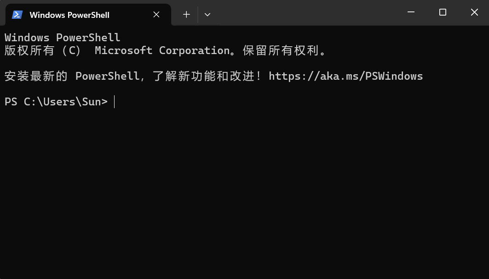
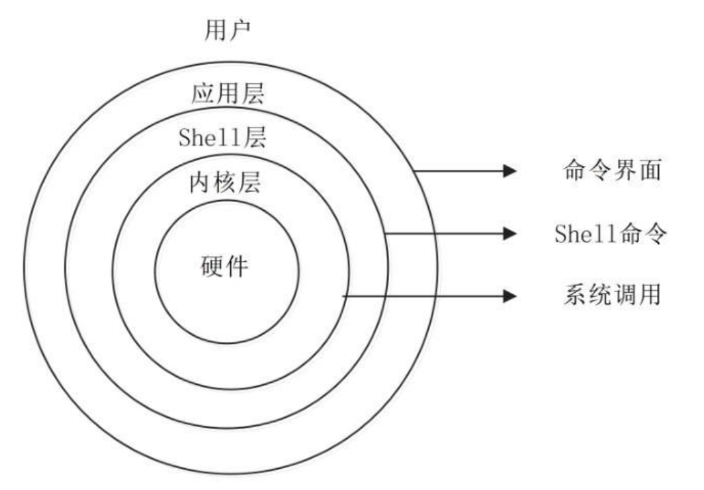

### **终端**

人们所能看到，接触到的都是计算机最外围设计好与人做交互的部分，这一部分都被称为终端（你要是硬要把电脑拆开看看它的心当我没说），因此计算机与用户交互的部分就是终端。

	计算机 = 主机 + 终端
	
	终端 = 输入终端 + 输出终端

向主机输入数据的设备就是输入终端（键盘，鼠标），接收主机数据的就是输出终端（显示器）
用物理方式和主机相连的称为物理终端，没有用物理方式相连就是虚拟终端。

我们就是通过一个个终端与计算机交互的。

ps.一台主机可以有很多终端，权限最高的终端就是控制台（只有一个）

### Shell（壳）

终端和主机虽然连接起来了，但是我们想一想为什么仅仅通过鼠标点击图形，轻轻敲击键盘就能让计算机明白我们想干嘛，执行我们想进行的操作？
其实这个时候就需要有一个程序把我们的在终端上的操作翻译成计算机能听得懂得指令，而这个程序就是 Shell。

Shell俗称壳（用来区别于核 kernel），分为图形界面shell（GUI，就是之前提到过的用户图形界面，windows系统中见到的桌面即explorer.exe（资源管理器））和命令行shell（CLI，例如早期的MS-DOS操作系统和现在的cmd等）两大类。

命令行终端belike:

Shell管理你与操作系统之间的交互：等待你输入，向操作系统解释你的输入，并且处理各种各样的操作系统的输出结果。不同系统有不同的shell，如bash、C shell、windows power shell 等等；在linux系统中，通常是bash( Bourne Again shell )。

事实上，Shell不只是一种解释器（在用户和系统间起着桥梁的作用），还是一种称为脚本语言的编程工具。它与编译型语言（比如C/C++/JAVA等）有些不同，在下一篇文章中会介绍这两种语言的区别。

总而言之shell就是将我们在终端上的操作翻译给操作系统内部听的（它本身也是操作系统的一部分），它有GUI和CLI两种形式，但是这个shell作为交互程序一端连接的是终端（也就是我们用户）那另一端连接的是什么呢？或者说这个"壳"包裹的到底是什么呢？这就是计算机的核心部分。

### Kernel(核)

#### 1.what's the Kernel?

kernel和shell一样是操作系统的一部分，是真正与硬件交互的那部分软件，与硬件交互包括读写硬盘、读写网盘、读写内存以及任何连接到系统中的硬件。除了与硬件交互外，内核还负责分配资源，分配什么资源呢？所谓资源就是硬件，比如CPU时间、内存、IO等等，这些都是资源。

内核通过虚拟的方法让每一个进程以为自己在独占CPU，这通过CPU时间片来实现，内核让CPU在各个进程之间快速切换，这样程序员写好程序员后直接运行即可，即使在单核系统中运行成百上千个进程都没有问题。

**总而言之内核就是控制硬件运作的那部分软件，是连接硬件和软件的纽带。**在Windows系统里内核为Windows net，而在以Linux为内核的系统（如CentOS、Ubuntu、RedHat、Android）里内核为Linux。

那么kernel和我们的shell 又有什么联系呢？这问题的解释需要我们先了解一下操作系统的结构。

#### 2.系统结构

操作系统从上到下的结构如下：

--->APP（应用层，正常的软件程序都属于这一层）

--->Windows API/C标准库（这一层是一大堆库函数供给应用层使用）

--->Kernel(这就是我们的内核负责调控硬件)

--->Hardware(硬件层，就是我们电脑的主体部分)

看到这里你对系统的结构应该就有了一个简单的认知，而我们之前所说的shell就属于应用层，它在上层包裹着我们的kernel，两者的关系就像是一个“壳”包裹着一个“核”一样，它们名字其实是很形象的。

壳与核是这种包裹的关系，壳负责面向终端（也就是用户）核负责面向硬件，那么他们两者之间是怎么交流的呢？这个时候我们的Windows API/C标准库就赶到了战场。当我们的程序（也就是应用层）想要使用内核的服务时就要进行系统调用（system call）Windows API/C标准库。

下面看一下Windows API的解释：

Windows API又叫做 API 函数， 是 Windows 的核心，从技术上讲，我们技术人员在 Windows 操作系统里做技术开发，Windows 对我们技术人员来说，里面有大量的 API 函数。
API 叫做 “应用程序编程接口”（Application Programming Interface） ，在使用各种各样的编程语言在 Windows 平台上开发时，都可以使用 API函数。做程序设计、软件开发，肯定要调用或者说是使用  Windows 里已经做好的那些 API 函数。

微软在做 Windows 时，数千名工程师在十几年的时间里编写出了大量API函数， Windows 自身在用这些函数，而程序员也可以调用这些函数。

再看一下C 标准库的解释：

C标准库（C Standard Library / ISO C Library），是用于诸如输入/输出处理，字符串处理，内存管理，数学计算和许多其他操作系统服务之类任务的宏，类型和函数的集合。它是在C标准中（例如C11标准）中被指定的。它的内容分布在不同的头文件中，例如math.h。

应用层的程序就是靠调用这些已经封装好的函数来实现“壳”与“核”的互动的。

至此所有部分就被串起来形成了一个由内核到外部层层相套的结构——操作系统，如果再加上终端和硬件层部分那么一台完整的计算机就算是初具雏形了！

