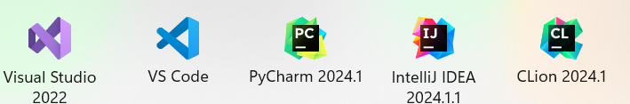

#### 引言

上一篇咱们整明白了操作系统的大体框架，现在有了这个框架我们要考虑一下如何在这个框架下进行我们想要的创作——编程。但想要编写程序我们需要有趁手的武器，这篇文章用来介绍我们需要使用什么样的武器编写我们想要得到的程序的。

一般情况下我们写代码都是在专门的软件上编写的，比如学校机房上的Dev-c++，或者Visual studio，亦或者pycharm等等等等，这些软件都是用来写代码的，它们其实有一个统一的名字——集成开发环境（IDE）。

#### 基础概念

集成开发环境一般包括代码编辑器、编译器、调试器和图形用户界面工具。集成了代码编写功能、分析功能、编译功能、调试功能等一体化的开发软件服务套。所有具备这一特性的软件或者软件套(组)都可以叫集成开发环境。就比如大家都会用到的MDK Keil，它也属于用于ARM软件开发的集成开发环境。

个人理解就是将代码从高级语言或者汇编语言变成能够被机器识别的二进制文件一整套的工具集合。

不知道你们有没有过这样一个疑惑，Visual studio code 和 Visual studio有什么区别？这两个玩意都是微软的产品，都是用来写代码的，甚至连图标都有几分神似，难到微软会闲到没事做两个一样功能的东西出来？

肯定不是这样的啊，其实 Visual studio是属于上面所讲的IDE，它能完成设计、编码、调试、测试、部署到维护的所有工作，有“宇宙最强IDE“之称，而VScode则属于专门用来写代码的文本编辑器，也就是说它自身并没有编译，调试等功能，需要去下载相应的插件和配置相关环境。

那么一个真正的IDE需要具有哪些部分呢？

#### 组成部分

**1.编辑器**

文本编辑器（文字编辑器）是用作编写普通文字的应用软件，它与文档编辑器（文字处理器）不同之处在于它并非用作桌面排版（例如文档格式处理），它常用来编写程序的源代码。

**2.编译器（编译型语言）**

把源代码转换成（翻译）低级语言的程序，一个现代编译器（比如gcc）的主要工作流程：

源代码 (source code) → 预处理器 (preprocessor) → 编译器 (compiler) → 目标代码 (object code) → 链接器 (Linker) → 可执行程序 (executables)。

编译器的任务就是把我们的源文件通过预处理，编译，汇编，链接四个步骤编译成可执行文件。编译器编译完，高级语言变为汇编语言，.h文件和.c文件变为.a文件，即汇编文件。汇编器汇编完，生成.o文件，通过链接器用链接库做链接，最终变成a.out文件（Linux中）和a.exe文件（Windows中）。即变成电脑能够识别的二进制文件。

**3.解释器（解释型语言）**

直接把高级编程语言一行一行转译运行，重点是不会一次把整个程序转译出来，因此运行速度比较缓慢，它每转译一行程序就立刻运行，然后再转译下一行，再运行，如此不停地进行下去。
使用解释器的语言一般有很好的跨平台性，如python，Java等脚本语言 ，但是一段程序在每一次执行时都需要进行编译所以效率低。

**4.调试器**

DeBugger（调试器）是自从计算机诞生伊始就始终伴随着程序员的一个挚友，起初的调试器都是基于硬件直接实现的。这个很好理解，就是控制软件运行、查看软件运行中信息、修改软件执行流程等作用，通俗的讲调试器是用来在程序运行以后，根据运行状况来检查错误，Keil5上的DeBug功能就是靠他进行的。

#### 常见的IDE

 **（1）Visual Studio Code**

​	概述: Visual Studio Code（简称VS Code）是由Microsoft开发的一个轻量级但功能强大的源代码编辑器，支持Windows、Linux和macOS。它提供了丰富的开发功能，包括语法高亮、智能代	码补全、代码重构、内置Git等。
​	适用场景: Web开发、Node.js、Python等几乎所有主流编程语言。

 **（2）IntelliJ IDEA**

​	概述：是 Java 语言的集成开发环境，IDEA 在业界被公认为是最好的 java 开发工具之一，尤其在 	智能代码助手、代码自动提示、重构、javaEE支持、Ant、JUnit、CVS 整合、代码审查、创新的 	GUI 设计等方面的功能可以说是超常的。
​	适用场景：

 **（3）PyCharm**

​	概述: PyCharm也是JetBrains出品，是一款专门为Python开发设计的IDE。它提供了代码分析、图	形化的调试器、一个集成的测试运行器、Git集成等功能。
​	适用场景: Python开发，包括Web开发、数据科学和机器学习。

 **（4）Eclipse**

​	概述: Eclipse是一个开源的、多语言的集成开发环境，由Eclipse基金会支持。它以Java开发为	主，但通过安装插件也可以支持C/C++、PHP、JavaScript等多种编程语言。
​	适用场景: Java开发、C/C++开发、Web开发等。

 **（5）Clion**

​	概述：Clion是一款专门开发C以及C++所设计的跨平台的IDE。它是以IntelliJ为基础设计的，包含	了许多智能功能来提高开发人员的生产力。这种强大的IDE帮助开发人员在Linux、OS X和	Windows上来开发C/C++,同时它还能使用智能编辑器来提高代码质量、自动代码重构并且深度整	合Cmake编译系统，从而提高开发人员的工作效率。
​	
   **(6)Visual Studio**

​	概述：Visual Studio（简称 VS）是一款闭源的、平台限定的、重量级的集成开发环境，它主要在 Windows 和 macOS 上运行，提供了一整套的开发工具和组件，包括代码编	辑器、编译器、调试器、测试工具、数据库工具、图形设计器、UML 工具、代码分析工具、代码	重构工具、代码管理工具、云服务工具等，以及针对不同开发目标的工作负载和模板，如： .NET、C++、Python、Java、Web、移动、桌面、游戏、机器学习、数据科学等。

#### 语言类型

我们知道任何代码最终都要被“翻译”成二进制的形式（机器码）才能在计算机中执行。但是他们翻译成为机器码的方式依旧有所不同。

##### 编译型语言：

如 C/C++、Pascal、Go语言、汇编等，必须在程序运行之前将所有代码都翻译成二进制形式（执行：预处理（Preprocessing）、编译（Compilation）、汇编（Assembly）、链接（Linking）这四个步骤），也就是生成可执行文件，用户拿到的是最终生成的可执行文件，看不到源码。这个过程叫做编译（Compile），这样的编程语言叫做编译型语言，完成编译过程的软件叫做编译器（Compiler）。

##### 解释型语言：

如 Shell、JavaScript、Python、PHP等，需要一边执行一边翻译，不会生成任何可执行文件，用户必须拿到源码才能运行程序。程序运行后会即时翻译，翻译完一部分执行一部分，不用等到所有代码都翻译完。这个过程叫做解释，这样的编程语言叫做解释型语言（对应的是编译型语言）或者脚本语言（Script）（对应的是系统语言），完成解释过程的软件叫做解释器。

这两种语言有着各自的优势：

- 编译型语言的优点是执行速度快、对硬件要求低、保密性好，适合开发操作系统、大型应用程序、数据库等。
- 解释型语言的优点是使用灵活、部署容易、跨平台性好，非常适合Web开发以及小工具的制作。

综上所述shell也可以算一个命令行解释器，因为它可以用来解释shell脚本，因此根据它的这种编译特点shell也是一种脚本语言。（这里可以类比于python,python也是一种脚本语言也需要通过python解释器来翻译源文件进而执行命令）

​                     