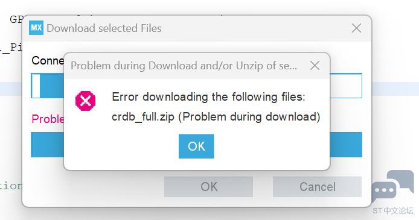

意法半导体公司推出的自动生成项目模板的软件。

 **Java 官网下载：** [下载地址](https://www.java.com/zh_CN/download/windows-64bit.jsp) 

**CubeMX 官网下载：** [下载地址](https://www.st.com/stm32cubemx)

请自行攻略下载教程。

下载完成后如果创建新文件出现如下错误：

请使用手机热点连接电脑重试。

**芯片支持包下载：**[下载地址](https://www.keil.arm.com/devices/?q=stm32G4&vendor-search=)

在使用CubMX构建工程模板之前需要先导入相应系列的固件库。

固件库是什么，是干嘛的？

> 这个库是一个固件包，它包含了一系列的例程、数据结构和宏，涵盖了STM32外设的功能，包括设备驱动程序的描述以及为每个外设配套的一组例子。该固件库允许在用户应用中使用任何设备，而不需要深入研究每个外设的规格。

固件库包含的文件：

- 启动文件
- 时钟配置文件
- 内核文件
- 片上外设相关文件
- 头文件配置文件：
- 存放中断服务函数的c文件：

详情可参考：[初识固件库，固件库应该是什么样子](https://www.cnblogs.com/yizhangyichi/p/16137716.html)

而我们使用`keil`构建项目时需要导入芯片支持包，它的作用是什么和这里使用的固件库又有什么区别？

芯片支持包的定义

>CMSIS-Pack defines a standardized way to deliver software components, device parameters and board support information and code. Adopted by leading semiconductor companies, embedded software and tools vendors across the Arm architecture, CMSIS-Packs increase productivity across the industry by encouraging code reuse and enabling proactive software component deployment with online updates and dependencies checking.

stm32 的 system View Description (SVD) 文件是一个专用于 STM32 微控制器的元数据文件，它包含了该芯片的所有外设、寄存器结构、地址映射以及详细的特性描述。这个文件对于开发工具如 Keil MDK 、 stm32cubeMX 等至关重要，因为它帮助软件开发者获取硬件设备的信息，以便在编写驱动程序、配置GPIO口、了解中断向量表等内容时能够准确地理解和操作硬件。SVD 文件使得软件能够在初始化阶段自动识别并配置 STM32 的硬件资源，简化了代码编写过程，并有助于提高代码的移植性和调试效率。通过导入 SVD 文件，IDE可以自动生成对应的驱动模板，极大地加快了嵌入式系统的开发速度。

简单来说固件库是搭建项目所必须的组成部分，而芯片支持包是给IDE看的“数据手册”包含了芯片的详细信息，使开发环境能够识别芯片。

