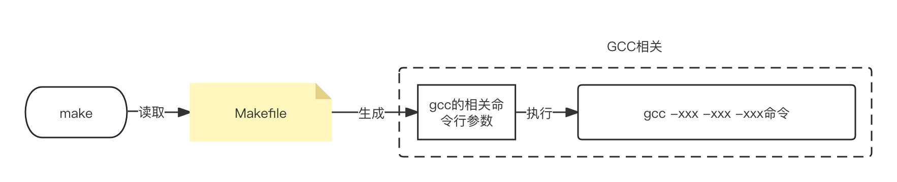
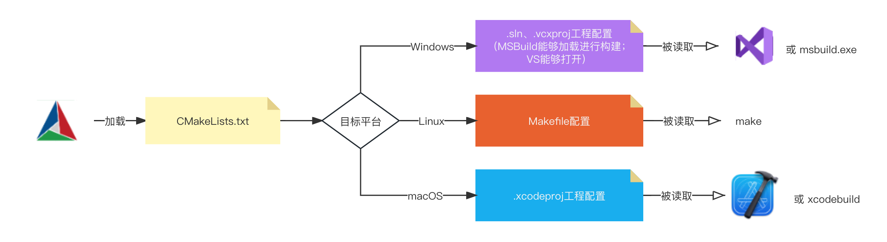
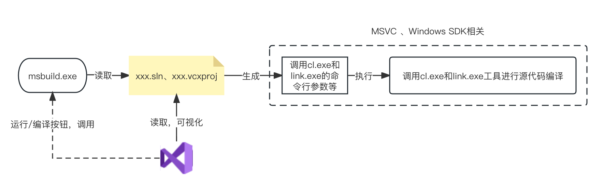

# 构建工具

### Make&Cmake

#### 简介：

有价值的程序通常是由许多源文件，头文件组成的大工程，（~~单个文件编写的程序大多都没有太大价值~~），当你编译这样的大工程时，如何使用编译器按照依赖关系依次编译源文件并链接就成了一个让人头疼的问题。这时候人们想到能不能有一个程序代替人去指挥编译器完成项目的编译，于是便有了`make`，人们只需要将需要编译的程序的依赖写到`makefile`这个文本文件当中（当然这是要遵循特定语法的），`make`便会根据这个文件去指挥编译生成可执行文件。



然而对于大项目来说手动去编写`makefile`依旧是个麻烦的事情，同时对于相同的源文件在不同的平台上编译需要调用不同的编译器，如果每一次更改平台都需要重新编写`makefile`那实在是令人头疼。于是人们编写了`Cmake`程序根据不同平台生成`makefile`以供`make`调用（~~没错偷懒是人类进步的阶梯~~），当然`Cmake`生成`makefile`需要根据`makelist.txt`这个文本文件，但是这个文本文件又需要人去手动编写。是不是感觉有点套娃的意味？但是这样做并不是毫无意义，`makelist.txt`只需要编写一次就可以在不同的平台上使用，同时它使用了更高级的语法使得依赖关系的编写更加简洁有利于维护。



msbuild和xcodemake分别是Windows和Mac平台上的构建系统起到的作用类似



参考博客：[zhen's blog](https://zhen.blog/2023/09/12/2023-09-12-C与CPP常见编译工具链与构建系统简介/)


#### make基础使用：

makefile文件是由一条一条规则组成的，make根据规则去调度编译器，规则的基本格式如下：

```
<target> : <prerequisites> 
[tab]  <commands>
```

规则由三部分组成，**目标，前提条件，命令**，而规则的作用就是如果目标文件比依赖文件（前提条件是由一系列文件组成的）更旧（这个旧是指生成文件时产生的时间戳更早）或者目标文件不存在时就执行命令。同时make并不是按照规则编写的顺序来执行规则的，它在开始执行前会检查依赖文件是否有其他依赖依次追溯到源头再执行规则，也就是说如果make在检查前提条件时会检查其中依赖文件的前提条件，在保证所有依赖文件的规则都执行过后才会回来执行目标文件的命令。

例子：

```
#规则格式：
#目标： 依赖1 依赖2
#   命令
CC = gcc #可以使用变量来替换命令中的字符，下面命令中的gcc都被CC替换

all: my_program  
my_program: main.o utils.o  
    $(CC) -o my_program main.o utils.o  
main.o: main.c  
    $(CC) -c main.c  
utils.o: utils.c utils.h  
    $(CC) -c utils.c  
clean:          
    rm -f my_program *.o
```

在规则中**目标是必须的而依赖和命令并不是（两者存在一个即可）**，例如上例中的`clean`就是没有没有依赖同时也不是个文件，它仅仅是一个操作的名字属于“伪目标”是用来删除对象文件的。（如果目录中有一个叫clean的文件则make就不会执行命令，因为它认为clean“文件”已经存在就不必要执行命令，这时可以使用`.PHONY: clean`来声明clean是个伪命令）

详细可参考：[Make 命令教程](https://www.ruanyifeng.com/blog/2015/02/make.html)

#### Cmake基础使用：

对于下面这样的项目：

```
MyProject/  
│  
├── CMakeLists.txt  
├── src/  
│   ├── main.cpp  
│   └── mylib.cpp  
├── include/  
│   └── mylib.h
```

首先你需要在源文件所在位置编写`CMakeLists.txt`

```
cmake_minimum_required(VERSION 3.10)   # 设置项目名称和版本   
project(MyProject VERSION 1.0)   # 指定 C++ 标准   

set(CMAKE_CXX_STANDARD 14)   set(CMAKE_CXX_STANDARD_REQUIRED True)   # 添加 include 目录，set()还可以用来设置变量  

include_directories(include)   # 添加库   

add_library(mylib src/mylib.cpp)   # 添加可执行文件   
add_executable(MyExecutable src/main.cpp)   # 链接库到可执行文件   

target_link_libraries(MyExecutable PRIVATE mylib)  
```

然后在源文件目录下创建`build`目录执行下面命令：

```
cmake -G"MinGW Makefiles" .. #-G这里用于指定编译器如果不指定就会使用平台默认的编译器

cmake --build . #使用这个命令或者下面的命令来构建可执行程序
make
```


其他教程：[一个CMake 案例](https://zhuanlan.zhihu.com/p/500002865)    [Cmake教程](https://subingwen.cn/cmake/CMake-primer)

