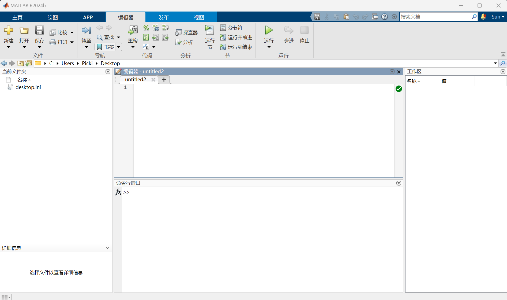

### 简介

MATLAB是一门脚本语言特别适合做一些数值计算 ，同时也能进行仿真。

### 界面介绍

MATLAB打开界面如图：



主要有以下界面：

- 选项卡：功能如图

- 编辑器：在这里编写matlab脚本并保存为.m文件

- 命令行窗口：相当于matlab终端，执行输入的指令

- 工作区：显示当前的变量，双击查看变量的值

- 当前文件夹：显示当前工作目录下都有哪些文件，确保运行的文件在当前工作文件夹下


MATLAB2023a以后支持新UI，能够配置暗色主题具体实现法方如下：

正版直接在获得更多app中搜索`new desktop for matlab`下载安装即可，破解版参考下面两篇博客。

[破解版MATLAB设置深色模式 - 哔哩哔哩](https://www.bilibili.com/opus/854920387099623443?jump_opus=1)

[matlab2023版深色模式开启方法 - 哔哩哔哩](https://www.bilibili.com/opus/886472754460622850?spm_id_from=333.1387.0.0)

### 基础语法

你可以在命令行窗输入任意语句，按下Enter就会返回运算结果，如果不行想显示结果也可以语句后面加分号，如果想要一次执行较多命令可以在编辑器中编写命令行脚本然后运行，MATLAB使用`%`用来注释语句。

常用命令

- clc / clear：清除命令行界面/清除工作区
- save <filename>：将当前工作区的变量保存为filename.mat文件
- load<filename>：将当前文件夹下的filename.mat文件中的变量导入工作区
- who/whos：查看当前工作区有哪些变量
- format：控制屏幕的显示格式，例如：`format short`表示显示四位小数（默认）
- plot( x, y)：以x为自变量，y为因变量画图


条件语句

```matlab
%if语句
if <expression>
.....
[elseif<expression>]
.....
[else]
.....
end

%switch语句
switch <switch_expression>
   case <case_expression>
      ...
   case <case_expression>
      ...
      ...
   otherwise
	  ...
end
```


循环语句

```matlab
%while语句
while <expression>
   ...
end

%for语句
for index = values
   ...
end
```

values有以下形式：

1. initval：endval：将index变量从initval到endval递增1，并重复执行程序语句，直到index大于endval为止。
2. initval：step：endval：每次迭代将索引值增加step的值，如果step为负，则将索引的值减小。

3. valArray：在每次迭代时从数组valArray的后续列创建列向量索引。例如，在第一次迭代中，index = valArray（：，1）。该循环最多执行n次，其中n是valel的列数，由numel（valArray，1，:)给定。输入valArray可以是任何MATLAB数据类型，包括字符串，单元格数组或结构。


函数

```MATLAB
function [out1,out2, ..., outN] = myfun(in1,in2,in3, ..., inN)
<statement>
end
% out1 ...outN 为函数返回值
% myfun 为函数名
% in1 ...in2 为函数参数
```

eg:

```matlab
function max = mymax(n1, n2, n3, n4, n5)

%此函数用于计算
%输入五个数字
max =  n1;
if(n2 > max)
   max = n2;
end
if(n3 > max)
   max = n3;
end
if(n4 > max)
   max = n4;
end
if(n5 > max)
   max = n5;
end
%将此函数放入与函数名相同的文件中保存
%使用 <help 函数名> 命令matlab会自动解释该函数
```

PS.保存函数的文件应与函数同名，并且在使用函数时确保函数文件和执行文件处于同一路径下。

向量与矩阵操作

```matlab
array = [a1, a2,...,an]		%定义一个n维向量
matrix = [a11, a12,...a1m;...an1,...,anm]	%定义一个n*m的矩阵
```

`:`号操作

```matlab

```


### 特殊的常量

|  名称   |              意义              |
| :-----: | :----------------------------: |
| **ans** |        最近计算的答案。        |
| **eps** |           浮点精度。           |
| **i,j** |         虚数单位√-1。          |
| **Inf** |             无穷。             |
| **NaN** | 未定义的数值结果（不是数字）。 |
| **pi**  |               π                |


### 变量

MATLAB中变量在声明时不必特别指出数据类型，因为解释器会自行为变量指定数据类型从而分配合适的存储空间，但是可以显式的指出变量的数据类型。

| 序号 |                        数据类型和说明                        |
| :--- | :----------------------------------------------------------: |
| 1    |                   **int8**：8位有符号整数                    |
| 2    |                   **uint8**：8位无符号整数                   |
| 3    |                  **int16**：16位有符号整数                   |
| 4    |                  **uint16**：16位无符号整数                  |
| 5    |                  **int32**：32位有符号整数                   |
| 6    |                  **uint32**：32位无符号整数                  |
| 7    |                  **int64**：64位有符号整数                   |
| 8    |                  **uint64**：64位无符号整数                  |
| 9    |                  **single**：单精度数值数据                  |
| 10   |                  **double**：双精度数值数据                  |
| 11   |         **logical**：逻辑值1或0，分别表示true和false         |
| 12   |          **char**：字符数据（字符串存储为字符向量）          |
| 13   | **cell array**：索引单元格数组，每个单元格能够存储不同维度和数据类型的数组 |
| 14   | **structure**：类似于C的结构，每个结构都具有能够存储不同维度和数据类型的数组的命名字段 |
| 15   |             **function handle**：指向函数的指针              |
| 16   |          **user classes**：从用户定义的类构造的对象          |
| 17   |             **java classes**：从Java类构造的对象             |

在默认情况下，MATLAB将所有数值存储为双精度浮点数。如果给变量赋值字符串使用以下方式：

1. 使用字符向量：

   ```matlab
   myString = 'Hello, MATLAB!';  
   ```

2. 使用字符串数组（从MATLAB R2016b开始引入）：

   ```matlab
   myString = "Hello, MATLAB!";  
   ```

3. 将多个字符串赋值给一个字符串数组：

   ```matlab
   myStrings = ["Hello", "world", "from", }
   ```


可以使用`is`函数检查变量的数据类型，如果判断符合函数的返回值为1反之为0.

1. **`isnumeric`**: 判断一个变量是否是数字类型。
2. **`ischar`**: 判断一个变量是否是字符数组（字符串）。
3. **`iscell`**: 判断一个变量是否是单元数组。
4. **`isstruct`**: 判断一个变量是否是结构体。
5. **`isempty`**: 判断一个数组是否为空。

### 运算符

算数运算符：

| 序号 |                         运算符和说明                         |
| :--- | :----------------------------------------------------------: |
| 1    | **+**加法或一元加号。A+B将存储在变量A和B中的值相加。A和B必须具有相同的大小，除非其中一个是标量。标量可以添加到任何大小的矩阵中。 |
| 2    | **-**减法或一元减法。A-B从A中减去B的值。A和B必须具有相同的大小，除非其中一个是标量。标量可以从任何大小的矩阵中减去。 |
| 3    | *****矩阵乘法。C=A*B是矩阵A和B的线性代数积。更准确地说，对于非标量A和B，A的列数必须等于B的行数。标量可以与任意大小的矩阵相乘。 |
| 4    | **.\* **数组乘法。A.*B是数组A和B的逐元素乘积。A和B必须具有相同的大小，除非其中一个是标量。 |
| 5    | **/**斜杠或矩阵右除法。B/A与B*inv(A)大致相同。更准确地说, B/A = (A'\B')'. |
| 6    | **./ **数组右除法。A./B是元素A(i,j)/B(i,j)的矩阵。A和B必须具有相同的大小，除非其中一个是标量。 |
| 7    | **\ **反斜杠或矩阵左除法。如果A是方阵，则A\B与inv(A)*B大致相同，只是计算方式不同。如果A是一个n乘n的矩阵，而B是一个包含n个分量的列向量，或者是一个包含多个这样的列的矩阵，那么X=A\B是方程AX=B的解。如果A的比例严重或几乎是单数，则会显示一条警告消息。 |
| 8    | **.\ **数组左除法。A.\B是元素B(i,j)/A(i,j)的矩阵。A和B必须具有相同的大小，除非其中一个是标量。 |
| 9    | **^**矩阵幂。如果p是标量，那么X^p是p的幂。如果p是整数，则通过重复平方计算幂。如果整数是负数，则X先倒数。对于p的其他值，计算涉及特征值和特征向量，因此如果[V，D]=eig(X)，那么X^p=V*D.^p/V。 |
| 10   | **.^**数组幂。A.^B是元素A(i,j)为B(i,j)次方的矩阵。A和B必须具有相同的大小，除非其中一个是标量。 |
| 11   | **'**矩阵转置。A'是A的线性代数转置。对于复矩阵，这是复共轭转置。 |
| 12   | **.'**数组转置 a’是 a 的数组转置。对于复杂的矩阵，这不涉及共轭。 |

逻辑运算符：

和C语言基本一致，除了不等于的符号为`~=`