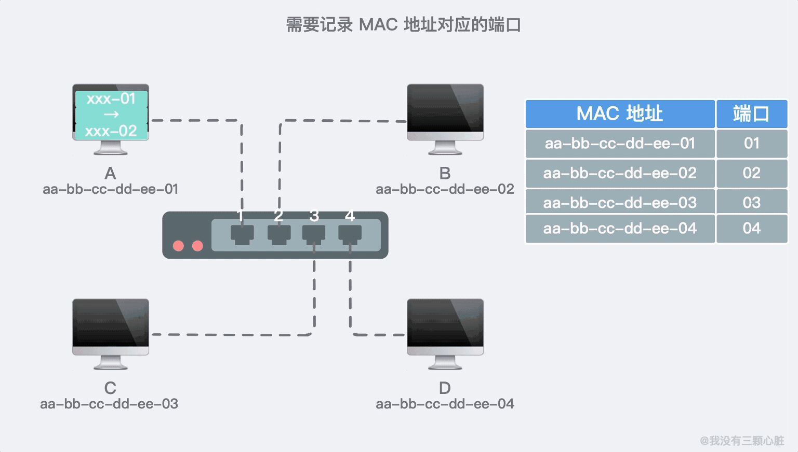
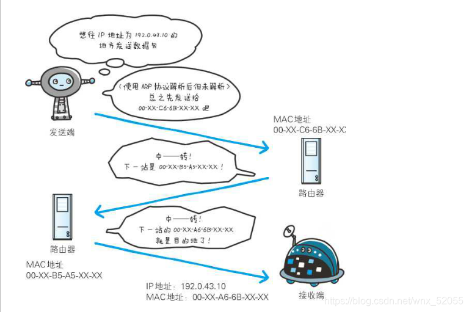

## 前言：

当你拥有一台电脑时，你可以在上面开辟一个自己的世界，但是这个世界只有你一个人未免有些孤单，你无法向他人分享你的世界，也看不到其他人精彩的世界。这个时候就需要计算机网络的出现了，它通过一系列的手段把所有接入网络的设备连接起来，让不同的设备之间可以跨越千里相互传递数据，使计算机的世界里不再有孤岛！
正式开始之前还要声明（叠甲ing），计算机网络是相当复杂的，这里我只是将一个浅显的认识分享，具体的的细节如果感兴趣，可以自行深入了解学习，如果有错误和理解不当的地方也请向我指出，我们一起进步。

## 网络：

广义上的网络就是点和线的连接，而在这里就可以把每一台计算机（当然不局限于计算机，也可以是手机等设备）看作一个点，将不同的计算机通过一定手段连接起来就形成了网络。当然最简单的连接方法就是把不同的计算机用数据线连起来，这样的连接方式对于两三台电脑还好，但如果是全世界的电脑用这样的方式来连接，你敢想像这将是多么复杂和臃肿的网络。

所以现代的计算机网络的是根据精心策划所实现的一种复杂的而有效的结构，而我们也就需要了解以下部分：

### 地址：

当你在网络中需要向特定目标发送消息时，首先你就必须知道它的地址（不然你往哪里发送消息，总不可能广播让所有设备都知道吧）这样你才找到它并给它发送消息（第一个作用），同时目标也需要是知道你的地址从而知道是谁给它发送的消息（第二个作用），从而做出反应。所以地址在网络的作用是让别人知道你是谁找到你在哪（两个作用），下面是两种地址。

**IP地址和MAC地址：**

MAC地址：

MAC地址是每一个网络设备在出厂时给予的12个十六进制数，它是一个物理地址包含了制造时间和制造商等信息，具有全球唯一性。

IP地址：

IP地址是每台计算机在网络中的唯一标识，它是 IP 协议提供的一种统一的地址格式，为互联网上的每一个网络和每一台主机分配一个逻辑地址，以此来屏蔽物理地址的差异。

**可以看到IP地址和MAC地址都具有全球唯一性，那为什么要有两个地址呢？只用一个不行吗？**

答案当然是不行，**首先MAC地址就像是人的身份证**，如果说我在路上捡到了你的身份证，我可以知道你是谁多大甚至是出生在哪里，但是我却无法知道你现在的位置，自然就找不到你，所以说MAC地址只能行使地址的第一个作用让别人知道你是谁而无法找到你。**而IP地址就像是家庭住址**，如果我知道你的家庭住址，我就能找到你所在的城市，小区，楼栋自然就能找到你。
那么我不要MAC地址只要IP地址不就行了，答案还是不行。有两个原因,第一是历史原因MAC地址出现的比IP地址早，第二是在实际的个过程中两个地址是相互帮助起作用的在网络上，通信的双方通常是经过多台计算机和网络设备中转才能连接到对方。而在进行中转时，会利用下一站中转设备的 MAC 地址来搜索下一个中转目标。
综上所述MAC地址就像是身份证号与生俱来不可更改，IP地址就是家庭住址具有唯一性但是可以更改，两者是相辅相成的。

### 局域网和广域网：

**局域网（Local Area Network，LAN）**

是指在某一区域内由多台计算机互联成的计算机组。一般是方圆几千米以内。局域网可以实现文件管理、应用软件共享、打印机共享、工作组内的日程安排、电子邮件和传真通信服务等功能。**局域网是封闭型的**，可以由办公室内的两台计算机组成，也可以由一个公司内的上千台计算机组成。

**广域网 （Wide Area Network，WAN）**

是一种跨越大的、地域性的计算机网络的集合。**在一个区域范围里超过[集线器](https://baike.baidu.com/item/%E9%9B%86%E7%BA%BF%E5%99%A8/0?fromModule=lemma_inlink)所连接的距离时，必须要通过[路由器](https://baike.baidu.com/item/%E8%B7%AF%E7%94%B1%E5%99%A8/108294?fromModule=lemma_inlink)来连接，这种网上类型称为广域网**。通常跨越省、市，甚至一个国家。广域网包括大大小小不同的子网，子网可以是局域网，也可以是小型的广域网。

**局域网和广域网的区别**

局域网是在某一区域内的，而广域网要跨越较大的地域，那么如何来界定这个区域呢？例如，一家大型公司的总公司位于北京，而分公司遍布全国各地，如果该公司将所有的分公司都通过网络联接在一起，那么一个分公司就是一个局域网，而整个总公司网络就是一个广域网。

简单理解局域网就是小范围内计算机连接起来的私人网络（家庭，公司等），而广域网就是大的范围内由不同的局域网和更小的广域网组成的公网，而大和小的概念是相对而言的。

**ps.名词解释**

互联网（internet），英文小写字母开头，中文采用意译；它泛指由多个网络连接起来形成的网络，例如公司办公网就是一种互联网，它连接了多个办公楼的网络；

因特网（Internet）是专有名词，所以英文大写开头，中文采用音译；它特指目前最大的互联网，它把全球的网络连接了起来；

### 交换器，网关，路由器

**1.第一步交换器**

假定你现在有一屋子的计算机，你想把他们连接起来形成一个局域网你会怎么做？是像开始我们提到的那样用线把他们连起来吗？如果这样做恐怕屋子会被乱七八糟的线路塞满。

这个时候我们考虑通过一个构建一个“中枢”来集中接收信息，再根据信息里目的地的MAC地址来发送给目标设备，这个中枢就是交换器。

**交换器工作原理：**

交换机拥有一条高带宽的背部总线和内部交换矩阵。交换机的所有的端口都挂接在这条背 部总线上，当控制电路收到数据包以后，处理端口会查找内存中的地址对照表以确定目的MAC（网卡的硬件地址）的NIC（网卡）挂接在哪个端口上，通过内部 交换矩阵迅速将数据包传送到目的端口。目的MAC若不存在，交换机才广播到所有的端口，接收端口回应后交换机会“学习”新的地址，并把它添加入内部地址表 中。

**2.第二步网关**

通过交换器你就可以把你的所有计算机有序的连接起来，从而搭建起一个属于你的局域网。那么问题又来了，如果你想把你的局域网和其他人的网络连接起来你又该怎么做呢？倘若每一台计算机都和其他网络的交换器连线，这样的话本来规整的网络右边的凌乱了，这个时候你就需要网关了。

### 网关：

英文名称为Gateway，又称网间连接器、协议转换器。网关实现网络互连，是最复杂的网络互连设备，仅用于两个高层协议不同的网络互连，负责在网络之间传递数据。网关既可以用于广域网互连，也可以用于局域网互连。

网关就像是局域网之间的传话员，如果A网里的A1计算机想向B网里的B1计算机发送消息，那他就要向A网的网关发送请求，由A网关传话给B网关，然后B网关在把消息传递给B1。

**3.第三步路由器**

问题又双叒叕来了，现在你已经能够通过网关把你的局域网和隔壁房间的局域网连接了，但如果要有很多的局域网连接在一起，这时你的网关不知道改把话传给谁该怎么办。这个时候路由器就派上用场了，路由器会根据目标地址的ip帮你寻找合适的路径。

当网关把数据发给路由器，它会在自己的路由表（Routing Table）中执行路由查询，寻找匹配该报文的目的IP地址的路由条目（或者说路由表项），如果找到匹配的路由条目，路由器便按照该条目所指示的出接口及下一跳IP地址转发该报文；如果没有子任何路由条目匹配该目的IP地址，则意味着路由器没有相关的路由信息可用于指导报文转发，因此该报文会被丢弃，上述行为就是路由。

每一台具备路由功能的设备都会维护**路由表**，路由表相当于路由器的地图，得益于这张地图，路由器才能够正确的转发IP报文。而路由的来源方式主要有**静态路由，直连路由，和动态路由协议**。

通过路由器便可以找到目标IP所在的网络，从而发送你想要传递的信息，通过三个步骤你已经搭建好了你的局域网，并将其和其他网络连接起来形成了互联网。但实际上很多现在的家用路由器已经把上述三部分的功能集成在了一起，所以你家用的网络就只有一个路由器。

**ps.路由器的 WAN 口和 LAN 口的区别**

现在的宽带路由器实际上是路由 + 交换机的一体结构，我们可以把它当成是两台设备。 WAN：接外部 IP 地址用，通常指的是出口，转发来自内部 LAN 接口的 IP 数据包。 LAN：接内部 IP 地址用，LAN 内部是交换机。我们可以不连接 WAN 口，把路由器当做普通交换机来使用。

### Wi-Fi和以太网

1.Wi-Fi其实是一个商标，代指的是一个创建于[IEEE 802.11](https://baike.baidu.com/item/IEEE%20802.11/8447947?fromModule=lemma_inlink)标准的无线局域网技术。

2.以太网是一种计算机局域网技术。[IEEE](https://baike.baidu.com/item/IEEE/150905?fromModule=lemma_inlink)组织的[IEEE 802](https://baike.baidu.com/item/IEEE%20802/6808672?fromModule=lemma_inlink).3标准制定了以太网的[技术标准](https://baike.baidu.com/item/%E6%8A%80%E6%9C%AF%E6%A0%87%E5%87%86/237984?fromModule=lemma_inlink)，它以太网是应用最普遍的[局域网技术](https://baike.baidu.com/item/%E5%B1%80%E5%9F%9F%E7%BD%91%E6%8A%80%E6%9C%AF/2597024?fromModule=lemma_inlink)。

这两个都是局域网技术，用于局域网内部设备的连接，只不过Wi-Fi是属于无线连接，而以太网则是有线连接。例如我们的家庭网络就是通过Wi-Fi连接起来的无线局域网（WLAN）。

关于Wi-Fi和以太网还有很多技术标准这里就不展开了，有兴趣可以自行了解。

